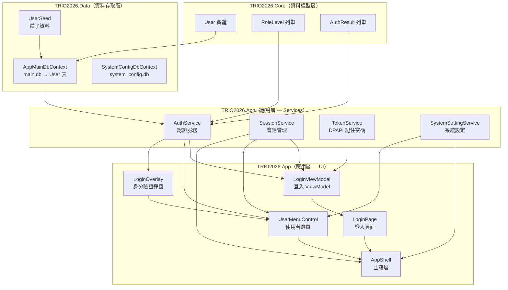
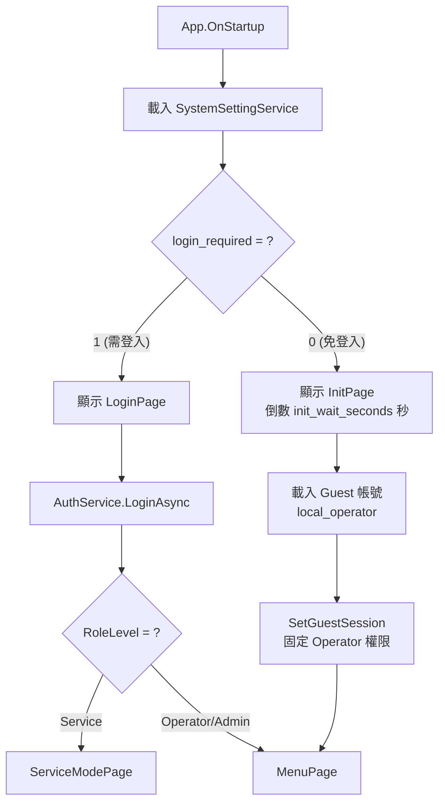
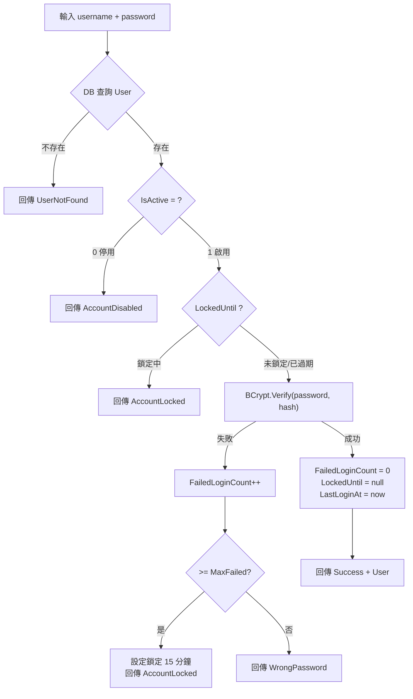

# TRIO2026 帳號系統（Account）設計整理

> 製作者: Office of William

---

## 架構總覽



---

## 1. 資料模型層（TRIO2026.Core）

### 1.1 User 實體

| 分類 | 欄位 | 型別 | 說明 |
|------|------|------|------|
| **身分** | `Id` | int | 主鍵 |
| | `Username` | string | 登入帳號（唯一索引） |
| | `DisplayName` | string? | 顯示名稱 |
| | `EmployeeId` | string? | 員工編號（索引） |
| | `Email` | string? | 聯絡信箱 |
| | `Department` | string? | 部門/科別 |
| **安全** | `PasswordHash` | string | BCrypt 密碼雜湊 |
| | `RoleLevel` | int | 角色等級（索引），預設 1 |
| | `IsActive` | int | 0=停用, 1=啟用（索引） |
| | `FailedLoginCount` | int | 連續失敗次數 |
| | `LockedUntil` | string? | 鎖定到期時間 (ISO8601) |
| | `PasswordChangedAt` | string? | 密碼最後變更時間 |
| | `ForcePasswordChange` | int | 強制下次登入變更密碼 |
| | `PasswordExpiryDays` | int | 密碼效期天數（0=永不過期） |
| **時間** | `LastLoginAt` | string? | 最後登入時間 |
| | `CreatedAt` | string | 建立時間 |
| | `CreatedBy` | string | 建立者 |
| | `UpdatedAt` | string? | 最後更新時間 |
| | `UpdatedBy` | string? | 最後更新者 |
| **其他** | `AvatarImage` | byte[]? | 使用者頭像 (PNG) |
| | `Notes` | string? | 管理備註 |
| | `LanguagePreference` | string? | 個人語系偏好 |

> [!NOTE]
> 所有時間欄位使用 ISO8601 字串格式而非 DateTime，這是為了 SQLite 的跨平台相容性。

**檔案位置**: [User.cs](file:///d:/TRIO2026/src/TRIO2026.Core/Entities/User.cs)

---

### 1.2 RoleLevel 列舉

```
Operator = 1    操作員 — 基本操作權限
Service  = 2    Service 工程師 — 系統設定 + 進階維護
Admin    = 3    管理員 — 全部權限（含帳號管理）
```

**權限規則**: 數值越大權限越高，以 `>=` 比較判斷。

**檔案位置**: [RoleLevel.cs](file:///d:/TRIO2026/src/TRIO2026.Core/Enums/RoleLevel.cs)

---

### 1.3 AuthResult 列舉

| 值 | 說明 |
|----|------|
| `Success` | 登入成功 |
| `UserNotFound` | 使用者不存在 |
| `WrongPassword` | 密碼錯誤 |
| `AccountDisabled` | 帳號已停用 |
| `AccountLocked` | 帳號已鎖定（失敗次數過多） |

**檔案位置**: [AuthResult.cs](file:///d:/TRIO2026/src/TRIO2026.Core/Enums/AuthResult.cs)

---

## 2. 種子資料（UserSeed）

| Id | Username | RoleLevel | 用途 |
|----|----------|-----------|------|
| 1 | `admin` | 3 (Admin) | 系統管理員 |
| 2 | `service` | 2 (Service) | Service 工程師 |
| 3 | `operator` | 1 (Operator) | 操作員 |
| 100 | `local_operator` | 1 (Operator) | 免登入模式專用帳號（無密碼） |

> [!IMPORTANT]
> **資安設計**: 密碼不寫在程式碼中，從外部 `Database/seed_credentials.json` 讀取。DbInitializer 執行後會自動刪除該檔案。

**檔案位置**: [UserSeed.cs](file:///d:/TRIO2026/src/TRIO2026.Data/Seeding/UserSeed.cs)

---

## 3. 服務層（TRIO2026.App/Services）

### 3.1 AuthService — 認證服務

| 方法 | 說明 |
|------|------|
| `LoginAsync(username, password)` | 驗證帳密，回傳 `(AuthResult, User?)` |
| `HashPassword(password)` | BCrypt 雜湊（workFactor=12） |
| `GetAllUsersAsync()` | 取得所有啟用的使用者（下拉選單用） |
| `UpdateLanguagePreferenceAsync(userId, langCode)` | 更新使用者語系偏好 |

**安全機制**:
- 最大失敗次數：**5 次**
- 鎖定時間：**15 分鐘**
- 鎖定過期自動解除
- 每次調用前清除 EF Change Tracker（確保讀到最新 DB 資料）

**DI 註冊**: `Transient`（每次注入建立新實例）

**檔案位置**: [AuthService.cs](file:///d:/TRIO2026/src/TRIO2026.App/Services/AuthService.cs)

---

### 3.2 SessionService — 會話管理

| 屬性/方法 | 說明 |
|-----------|------|
| `CurrentUser` | 當前登入使用者 |
| `IsAuthenticated` | 是否已認證 |
| `IsGuestMode` | 是否為免登入模式 |
| `CurrentRole` | 當前角色等級（RoleLevel 列舉） |
| `SessionChanged` | 會話變更事件 |
| `SetCurrentUser(user)` | 設定登入使用者 |
| `ClearSession()` | 清除會話（登出） |
| `SetGuestSession(guestUser, displayName)` | 設定免登入的 Guest Session |
| `HasPermission(required)` | 檢查權限等級 |

**DI 註冊**: `Singleton`

**檔案位置**: [SessionService.cs](file:///d:/TRIO2026/src/TRIO2026.App/Services/SessionService.cs)

---

### 3.3 TokenService — 記住密碼

| 方法 | 說明 |
|------|------|
| `SaveRememberedCredentials(username, password)` | DPAPI 加密並儲存 |
| `LoadRememberedCredentials()` | DPAPI 解密並載入 |
| `ClearRememberedCredentials()` | 清除 Token 檔案 |

**儲存位置**: `%LocalAppData%/TRIO2026/remembered_token.dat`
**加密方式**: Windows DPAPI (`DataProtectionScope.CurrentUser`)

> [!CAUTION]
> Token 綁定到 Windows 使用者帳號，其他帳號或其他機器無法解密。

**DI 註冊**: `Singleton`

**檔案位置**: [TokenService.cs](file:///d:/TRIO2026/src/TRIO2026.App/Services/TokenService.cs)

---

### 3.4 SystemSettingService — 帳號相關設定

以下為 `system_config.db` 中與 Account 直接相關的設定項：

| Category | Key | 類型 | 預設 | 說明 |
|----------|-----|------|------|------|
| `Auth` | `login_required` | bool | `0` | 是否需要帳號密碼登入 |
| `Auth` | `init_wait_seconds` | int | `2` | Init 畫面等待秒數 |
| `Auth` | `default_role_level` | int | `1` | 免登入時預設角色等級 |
| `Auth` | `guest_account_username` | string | `local_operator` | 免登入帳號 |
| `Auth` | `guest_account_display_name` | string | `Local Operator` | 免登入顯示名稱 |
| `LoginUI` | `show_user_dropdown` | bool | `0` | 登入頁是否顯示使用者下拉清單 |
| `LoginUI` | `remember_password_enabled` | bool | `1` | 是否允許記住密碼 |
| `LoginUI` | `max_failed_attempts` | int | `5` | 最大連續失敗次數 |
| `LoginUI` | `lockout_minutes` | int | `15` | 帳號鎖定時間（分鐘） |
| `LoginUI` | `session_timeout_minutes` | int | `30` | Session 閒置逾時（0=不逾時） |
| `AppClose` | `button_enabled` | bool | `0` | 關閉按鈕是否顯示 |
| `AppClose` | `esc_key_enabled` | bool | `1` | ESC 鍵關閉是否啟用 |
| `AppClose` | `alt_f4_enabled` | bool | `0` | Alt+F4 關閉是否啟用 |

**檔案位置**: [SystemSettingService.cs](file:///d:/TRIO2026/src/TRIO2026.App/Services/SystemSettingService.cs)

---

## 4. UI 層

### 4.1 LoginPage — 登入頁面

**用途**: 啟動時的帳號密碼輸入頁面（當 `login_required=1` 時顯示）

| 元件 | 說明 |
|------|------|
| `UsernameBox` | 帳號輸入框 |
| `PasswordBox` | 密碼輸入框 |
| `RememberMe` | 記住密碼核取方塊 |
| `CloseButton` | 關閉按鈕（受 DB `button_enabled` 控制） |

**LoginViewModel** 功能:
- 帳密驗證（呼叫 `AuthService.LoginAsync`）
- 自動載入記住的密碼（`TokenService`）
- 登入失敗錯誤訊息 + 卡片抖動動畫
- 登入成功後切換使用者語系偏好
- 事件日誌記錄（成功/失敗）

**檔案位置**: [LoginPage.xaml.cs](file:///d:/TRIO2026/src/TRIO2026.App/Views/Pages/LoginPage.xaml.cs) ｜ [LoginViewModel.cs](file:///d:/TRIO2026/src/TRIO2026.App/ViewModels/LoginViewModel.cs)

---

### 4.2 LoginOverlay — 身分驗證彈窗

**用途**: 在應用程式內部需要身分確認時彈出的 Overlay（例如：關閉 App、進入 Service Mode）

| 方法 | 說明 |
|------|------|
| `ShowAsync(title, subtitle)` | 顯示 Overlay，回傳 `LoginOverlayResult` |
| `ShowError(message)` | 顯示錯誤訊息並清除密碼 |

- 採用 `TaskCompletionSource` 模式，調用端使用 `await` 等待結果
- 進場/退場動畫（Scale + Opacity）
- 呼叫端負責驗證 credentials（Overlay 本身不驗證）

**檔案位置**: [LoginOverlay.xaml](file:///d:/TRIO2026/src/TRIO2026.App/Controls/LoginOverlay.xaml) ｜ [LoginOverlay.xaml.cs](file:///d:/TRIO2026/src/TRIO2026.App/Controls/LoginOverlay.xaml.cs)

---

### 4.3 UserMenuControl — 使用者選單

**用途**: 所有頁面共用的右上角使用者圖示 + 選單 Overlay

| 功能 | 說明 |
|------|------|
| 使用者資訊顯示 | 顯示名稱 + 角色等級 |
| HOME 按鈕 | 返回主畫面（根據角色導向不同頁面） |
| 語系切換 | 登入模式寫入帳號偏好；免登入模式寫入系統預設 |
| Service Mode | 免登入模式下，透過 LoginOverlay 驗證後提權進入 |
| 登出/關閉 | 登入模式→登出；免登入模式→驗證後關閉 |
| 自動關閉 | DB 可配置秒數，滑鼠移動重置計時 |

**選單行為矩陣**:

| 條件 | HOME | Service Mode | 登出/關閉 |
|------|------|-------------|----------|
| 免登入 (Guest) | → MenuPage | ✅ 顯示 | 驗證後關閉 App |
| 登入 (Operator) | → MenuPage | ❌ 隱藏 | 確認後登出 → LoginPage |
| 登入 (Service) | ❌ 隱藏 | ❌ 隱藏 | 三選一：登出/登出並關閉/取消 |
| 登入 (Admin) | → MenuPage | ❌ 隱藏 | 三選一：登出/登出並關閉/取消 |

**檔案位置**: [UserMenuControl.xaml.cs](file:///d:/TRIO2026/src/TRIO2026.App/Controls/UserMenuControl.xaml.cs)

---

## 5. 啟動流程



---

## 6. 認證流程（AuthService.LoginAsync）



---

## 7. 安全機制總結

| 機制 | 實作方式 |
|------|---------|
| 密碼儲存 | BCrypt 雜湊（workFactor=12），禁止明碼 |
| 帳號鎖定 | 連續 5 次失敗 → 鎖定 15 分鐘 |
| 種子密碼 | 外部 JSON 檔案注入，用後刪除 |
| 記住密碼 | Windows DPAPI 加密，綁定 Windows 帳號 |
| 關閉控制 | ESC / Alt+F4 / 關閉按鈕 均受 DB 設定控制 |
| 事件日誌 | 所有登入/登出/提權操作均記錄至 EventLog |

---

## 8. 檔案索引

| 層級 | 檔案 | 說明 |
|------|------|------|
| **Core** | [User.cs](file:///d:/TRIO2026/src/TRIO2026.Core/Entities/User.cs) | User 實體定義 |
| **Core** | [RoleLevel.cs](file:///d:/TRIO2026/src/TRIO2026.Core/Enums/RoleLevel.cs) | 角色等級列舉 |
| **Core** | [AuthResult.cs](file:///d:/TRIO2026/src/TRIO2026.Core/Enums/AuthResult.cs) | 認證結果列舉 |
| **Data** | [AppMainDbContext.cs](file:///d:/TRIO2026/src/TRIO2026.Data/Contexts/AppMainDbContext.cs) | main.db DbContext |
| **Data** | [UserSeed.cs](file:///d:/TRIO2026/src/TRIO2026.Data/Seeding/UserSeed.cs) | 種子資料 |
| **App** | [AuthService.cs](file:///d:/TRIO2026/src/TRIO2026.App/Services/AuthService.cs) | 認證服務 |
| **App** | [SessionService.cs](file:///d:/TRIO2026/src/TRIO2026.App/Services/SessionService.cs) | 會話管理 |
| **App** | [TokenService.cs](file:///d:/TRIO2026/src/TRIO2026.App/Services/TokenService.cs) | DPAPI Token |
| **App** | [SystemSettingService.cs](file:///d:/TRIO2026/src/TRIO2026.App/Services/SystemSettingService.cs) | 系統設定 |
| **App** | [LoginViewModel.cs](file:///d:/TRIO2026/src/TRIO2026.App/ViewModels/LoginViewModel.cs) | 登入 ViewModel |
| **App** | [LoginPage.xaml.cs](file:///d:/TRIO2026/src/TRIO2026.App/Views/Pages/LoginPage.xaml.cs) | 登入頁面 |
| **App** | [LoginOverlay.xaml](file:///d:/TRIO2026/src/TRIO2026.App/Controls/LoginOverlay.xaml) | 身分驗證 Overlay |
| **App** | [UserMenuControl.xaml.cs](file:///d:/TRIO2026/src/TRIO2026.App/Controls/UserMenuControl.xaml.cs) | 使用者選單 |
| **App** | [AppShell.xaml.cs](file:///d:/TRIO2026/src/TRIO2026.App/Views/AppShell.xaml.cs) | 主殼層（頁面導航） |
