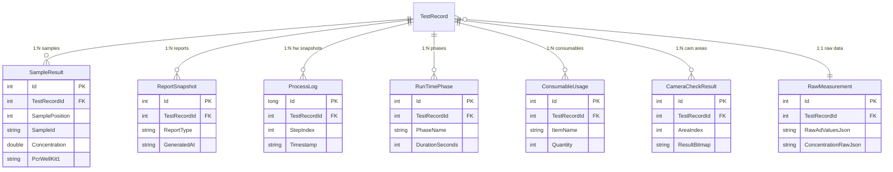
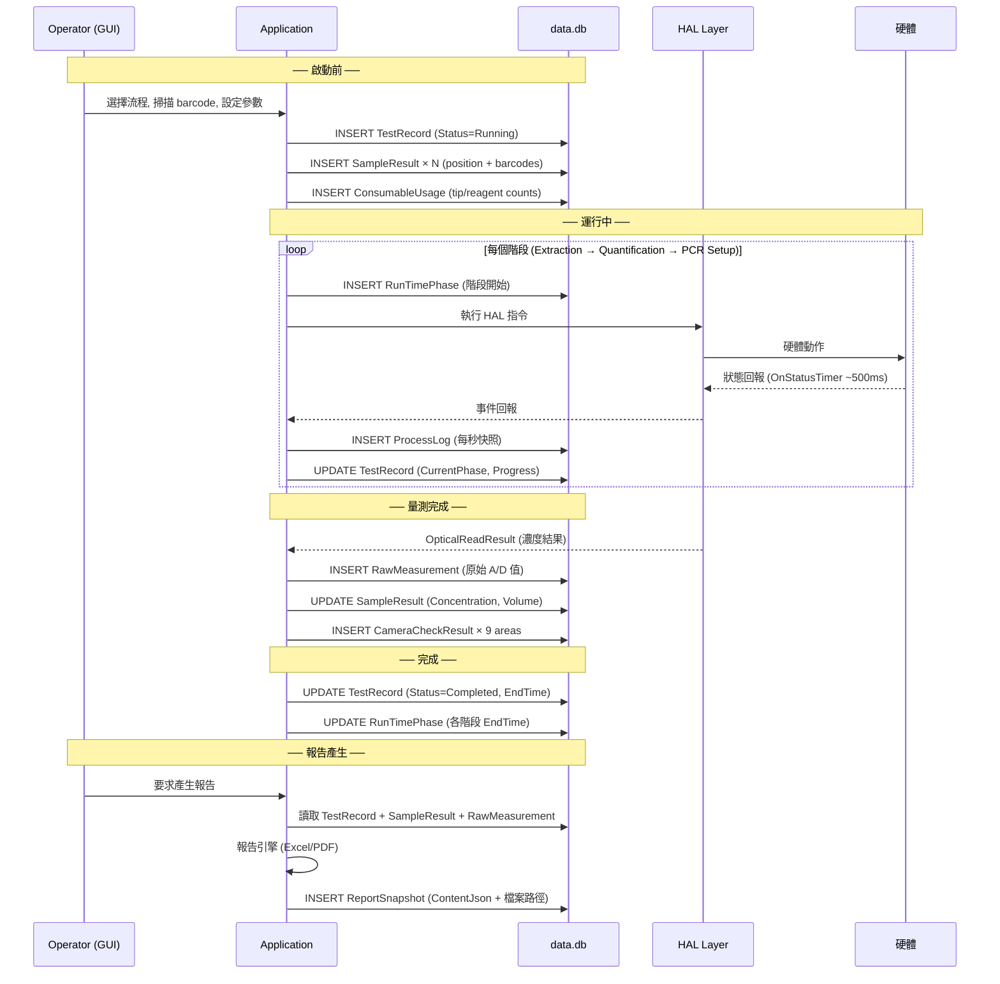

# TRIO2026 Assay Run — DB Schema 設計

> 製作者: Office of William
> 最後更新: 2026-06-11

本文件針對「**二代機執行一次 Assay Run 時**」所有需存入 DB 的資料進行完整的 schema 設計。
以您提出的九大分類為架構，對應到各表（Table）設計。

---

## 整體關聯圖



---

## 按九大分類對應表設計

### ① User 的操作設定 → `TestRecord`（擴充）

**已有欄位** + 需新增的欄位：

| 欄位 | 類型 | 說明 | 狀態 |
|------|------|------|------|
| `OperatorUserId` | int? | 操作員 ID | ✅ 已有 |
| `OperatorUsername` | string? | 操作員帳號快照 | ✅ 已有 |
| `RoleLevel` | int? | 角色等級 | ✅ 已有 |
| `FlowName` | string | 流程名稱 | ✅ 已有 |
| `ReportType` | string? | IntelliPlex / Custom | ✅ 已有 |
| `ProductCode` | string? | 產品編碼 | ✅ 已有 |
| `ExtractionProgram` | string? | 萃取程式 | ✅ 已有 |
| `ExtractionKitLotNo` | string? | 試劑盒批號 | ✅ 已有 |
| `SampleCount` | int? | 樣本數 | ✅ 已有 |
| `SampleBitmap` | string? | 樣本啟用位圖（hex） | 🔲 **新增** |
| `ReagentCount` | int? | 試劑組數 | 🔲 **新增** |
| `ReagentInfoJson` | string? | 試劑 QR Code 解析後（JSON） | 🔲 **新增** |
| `OptSampleVolume` | double? | 光學檢測取樣體積(μL) | 🔲 **新增** |
| `FunctionFlags` | string? | 萃取/定量/稀釋/配液 旗標 JSON | 🔲 **新增** |
| `FlowDefinitionJson` | string? | 執行的 flow 完整定義快照 | 🔲 **新增** |
| `InstallationUuid` | string? | 設備 UUID | 🔲 **新增** |

---

### ② 時間運行資訊 → `TestRecord` + `RunTimePhase`（新表）

**TestRecord 已有**:

| 欄位 | 說明 | 狀態 |
|------|------|------|
| `StartTime` | ISO 8601 | ✅ 已有 |
| `EndTime` | ISO 8601 | ✅ 已有 |

**新表 `RunTimePhase`**（各階段耗時）:

```
CREATE TABLE RunTimePhase (
    Id              INTEGER PRIMARY KEY AUTOINCREMENT,
    TestRecordId    INTEGER NOT NULL REFERENCES TestRecord(Id) ON DELETE CASCADE,
    PhaseName       TEXT    NOT NULL,    -- 'Extraction' / 'Quantification' / 'PCRSetup' / 'Total'
    StartTime       TEXT,               -- ISO 8601
    EndTime         TEXT,               -- ISO 8601
    DurationSeconds INTEGER NOT NULL,   -- 耗時（秒）
    CreatedAt       TEXT    NOT NULL     -- 紀錄時間
);
CREATE INDEX IX_RunTimePhase_TestRecordId ON RunTimePhase(TestRecordId);
```

> [!NOTE]
> 一代機 runinfo 中的 `[RunTime]` 僅記錄 `Quantification_time` 和 `PCR_time`。
> 二代機擴充為多段式紀錄，每個階段獨立一筆。

---

### ③ 當前狀態 → `TestRecord.Status` + `TestRecord.CurrentPhase`

| 欄位 | 類型 | 說明 | 狀態 |
|------|------|------|------|
| `Status` | string | Running / Completed / Error / Aborted | ✅ 已有 |
| `CurrentPhase` | string? | 當前正在執行的階段名稱 | 🔲 **新增** |
| `ProgressPercent` | int? | 整體進度百分比 (0-100) | 🔲 **新增** |
| `CurrentStep` | int? | 當前步驟序號 | 🔲 **新增** |
| `TotalSteps` | int? | 總步驟數 | 🔲 **新增** |
| `ErrorCode` | string? | 錯誤碼 | ✅ 已有 |
| `ErrorMessage` | string? | 錯誤訊息 | ✅ 已有 |

> [!TIP]
> `Status`、`CurrentPhase`、`ProgressPercent` 在運行中會被持續更新。
> 若應用異常中斷，下次啟動可透過 `Status=Running` 但 `EndTime=null` 偵測到未完成的運行。

---

### ④ 資訊更新時間 → `TestRecord` 時間戳群

| 欄位 | 類型 | 說明 | 狀態 |
|------|------|------|------|
| `CreatedAt` | string | 記錄建立時間 | 🔲 **新增** |
| `UpdatedAt` | string | 最後更新時間 | 🔲 **新增** |
| `StartTime` | string | 實驗開始 | ✅ 已有 |
| `EndTime` | string? | 實驗結束 | ✅ 已有 |

---

### ⑤ 最終結果 → `SampleResult`（微調）

**已有欄位** + 調整：

| 欄位 | 類型 | 說明 | 狀態 |
|------|------|------|------|
| `SamplePosition` | int? | 孔位（1-24） | ✅ 已有 |
| `SampleId` | string? | 使用者輸入 | ✅ 已有 |
| `SampleBarcode` | string? | 條碼掃描值 | ✅ 已有 |
| `ElutionTubeId` | string? | 洗脫管 ID | ✅ 已有 |
| `Concentration` | double? | 濃度 ng/μL | ✅ 已有 |
| `ConcentrationDisplay` | string? | 顯示文字 ("> 50.00") | ✅ 已有 |
| `UtilizedElutedVolume` | double? | 使用體積 μL | ✅ 已有 |
| `PcrWellKit1~4` | string? | PCR 孔位 | ✅ 已有 |
| `QualityFlag` | string? | Pass/Fail/Recheck | ✅ 已有 |
| `SampleType` | string? | NC / PC / Ctrl1 / Ctrl2 / Sample | 🔲 **新增** |
| `SourcePosition` | int? | 對應 arg0 原始索引 | 🔲 **新增** |

---

### ⑥ 實驗數據（原始量測） → `RawMeasurement`（新表）

一代機的 `[DATA] arg0~arg6` — 硬體回傳的原始數據，二代機對應來自 HAL `OpticalReadResult` 或 Modbus 回傳。

```
CREATE TABLE RawMeasurement (
    Id                  INTEGER PRIMARY KEY AUTOINCREMENT,
    TestRecordId        INTEGER NOT NULL UNIQUE REFERENCES TestRecord(Id) ON DELETE CASCADE,
    
    -- 一代機 arg0~arg6 對應（32 值 × 7 組 = 224 個 uint16）
    RawAdValuesJson     TEXT,      -- arg0: 各孔螢光 A/D 值 [15342,7901,...]
    RawAdValues2Json    TEXT,      -- arg1: 通常同 arg0
    ConcentrationRawJson TEXT,     -- arg2: 各孔濃度×100 [4747,2304,...]
    VolumePrimary Json  TEXT,      -- arg3: 第一次取樣體積×100
    Arg4Json            TEXT,      -- arg4: 備用
    VolumeSecondaryJson TEXT,      -- arg5: 第二次取樣體積×100
    Arg6Json            TEXT,      -- arg6: 備用

    -- 標準品
    S1AdValue           INTEGER,   -- S1 A/D 值 = arg0[30]
    S2AdValue           INTEGER,   -- S2 A/D 值 = arg0[31]
    S1Concentration     REAL,      -- S1 濃度 = arg2[30]/100
    S2Concentration     REAL,      -- S2 濃度 = arg2[31]/100

    -- 光學校正
    CalibrationCurveJson TEXT,     -- fitcvs 校正參數快照
    CalibrationTableJson TEXT,     -- adjtb 校正表快照
    
    CreatedAt           TEXT NOT NULL
);
```

> [!IMPORTANT]
> 此表與 TestRecord 為 **1:1** 關係。
> 將原始數據獨立出來的原因：避免 TestRecord 過於膨脹、方便大量查詢不需載入原始數據。

---

### ⑦ 最終實驗數據（產生報告） → `ReportSnapshot`（微調）

已有設計基本完整，微調：

| 欄位 | 類型 | 說明 | 狀態 |
|------|------|------|------|
| `ReportType` | string | IntelliPlex / Custom | ✅ 已有 |
| `GeneratedAt` | string | ISO 8601 | ✅ 已有 |
| `GeneratedByUserId` | int? | 產生者 | ✅ 已有 |
| `GeneratedByUsername` | string? | 帳號快照 | ✅ 已有 |
| `ContentJson` | string? | 完整報表資料 JSON | ✅ 已有 |
| `ExcelFilePath` | string? | Excel 路徑 | ✅ 已有 |
| `PdfFilePath` | string? | PDF 路徑 | ✅ 已有 |
| `PdfBlob` | byte[]? | PDF 二進位 | ✅ 已有 |
| `FormatVersion` | string? | 報表格式版本號 | 🔲 **新增** |
| `ChecksumSha256` | string? | 報表完整性驗證碼 | 🔲 **新增** |

---

### ⑧ 運行紀錄 (硬體/Sensor) → `ProcessLog`（新表）

對應一代機的 `processinfo.ini`，每個時間點的硬體狀態快照。

```
CREATE TABLE ProcessLog (
    Id              INTEGER PRIMARY KEY AUTOINCREMENT,
    TestRecordId    INTEGER NOT NULL REFERENCES TestRecord(Id) ON DELETE CASCADE,
    StepIndex       INTEGER NOT NULL,   -- 步驟序號（0-based）
    Timestamp       TEXT    NOT NULL,    -- 記錄時間 ISO 8601
    
    -- 機器狀態
    InitStatus      INTEGER,            -- 初始化狀態
    RunStatus       INTEGER,            -- 運行狀態
    CurrentStep     INTEGER,            -- 當前步數
    TotalSteps      INTEGER,            -- 總步數
    CurrentSection  INTEGER,            -- 當前段
    TotalRunTimeSec INTEGER,            -- 總運行時間(秒)
    
    -- 溫控
    Temperature1    REAL,               -- 萃取區溫度 (°C)
    Temperature2    REAL,               -- 試劑座溫度 (°C)
    
    -- 感測器
    PressureValue   INTEGER,            -- 壓力值
    LiquidLevel     REAL,               -- 液位高度
    UvRemainingSec  INTEGER,            -- UV 剩餘時間(秒)
    
    -- I/O 狀態
    IoOutput        TEXT,               -- 開關輸出 (binary string)
    IoInput         TEXT,               -- 檢測輸入 (binary string)
    
    -- 馬達軸位置 (μm/10)
    MotorStatusBits TEXT,               -- 電機運行狀態位元
    PipetteArmState TEXT,               -- 移液臂狀態 (hex)
    LidMotorPos     REAL,               -- 翻蓋電機位置
    AxisPx          REAL,               -- X 軸位置
    AxisY0          REAL,               -- Y0 軸位置
    AxisY1          REAL,               -- Y1 軸位置
    AxisZ0          REAL,               -- Z0 軸位置
    AxisPiston      REAL,               -- 活塞位置
    AxisPy          REAL,               -- PY 軸位置

    -- 流程與錯誤
    EngineerStep    INTEGER,            -- 工程步驟碼
    FlowContent     TEXT,               -- 當前流程內容
    FaultCodeMain   TEXT,               -- 主故障碼 (hex)
    FaultCodeSub    TEXT,               -- 輔故障碼 (hex)

    -- 攝像頭/條碼
    CameraReady     INTEGER,            -- 攝像頭到位
    BarcodeStatus   INTEGER,            -- 一維碼狀態
    CameraProgress  TEXT,               -- 識別進度 (hex)
    WellIndex       INTEGER,            -- 移入孔位
    
    -- 暫存器 (保留擴充)
    RegistersJson   TEXT,               -- 額外暫存器值 (JSON)
    RawPacketHex    TEXT                -- 原始封包備份 (hex)
);

CREATE INDEX IX_ProcessLog_TestRecordId ON ProcessLog(TestRecordId);
CREATE INDEX IX_ProcessLog_TestRecord_Step ON ProcessLog(TestRecordId, StepIndex);
```

> [!WARNING]
> 一次 Assay 可能產生 **500~2000+ 筆** ProcessLog。
> 設計考量：
> - 使用 `StepIndex` 而非只靠時間戳排序
> - 保留 `RawPacketHex` 供原始封包回溯
> - 二代機格式待韌體確認，`RegistersJson` 作為擴充欄位

---

### ⑨ 其他需要紀錄的資訊

#### 9a. `ConsumableUsage`（耗材追蹤 — 新表）

```
CREATE TABLE ConsumableUsage (
    Id              INTEGER PRIMARY KEY AUTOINCREMENT,
    TestRecordId    INTEGER NOT NULL REFERENCES TestRecord(Id) ON DELETE CASCADE,
    ItemName        TEXT    NOT NULL,    -- 'Tip50uL' / 'Tip200uL' / 'ReagStrip' / 'WashBuffer' / 'QubitTube' / 'PCRPlate'
    Quantity        INTEGER NOT NULL,    -- 用量
    Detail          TEXT,               -- 細節 JSON (如 reag0="1,1,1,0,0,0")
    CreatedAt       TEXT    NOT NULL
);
CREATE INDEX IX_ConsumableUsage_TestRecordId ON ConsumableUsage(TestRecordId);
```

#### 9b. `CameraCheckResult`（光學偵測結果 — 新表）

```
CREATE TABLE CameraCheckResult (
    Id              INTEGER PRIMARY KEY AUTOINCREMENT,
    TestRecordId    INTEGER NOT NULL REFERENCES TestRecord(Id) ON DELETE CASCADE,
    AreaIndex       INTEGER NOT NULL,    -- 1~9, 對應 CAM_AREA1~9
    ResultBitmap    TEXT    NOT NULL,    -- hex 值 (如 "3ffffffffffffffff3ffffc")
    DecodedBits     TEXT,               -- 展開後的 0/1 字串
    WellCount       INTEGER,            -- 該區域孔位數（如 96）
    Description     TEXT,               -- 區域說明
    CreatedAt       TEXT    NOT NULL
);
CREATE INDEX IX_CameraCheckResult_TestRecordId ON CameraCheckResult(TestRecordId);
```

#### 9c. 已有但需注意的相關表

| 表名 | DB | 用途 | 與 Assay 的關係 |
|------|-----|------|----------------|
| `SystemEvent` | system_event.db | UI操作/系統事件 | 透過 `CorrelationId` 關聯 RunId |
| `CommunicationLog` | data.db | Modbus 通訊記錄 | 透過 `TestRecordId` 關聯 |
| `OperationLog` | log.db | 操作紀錄 | 一般系統 log |

---

## 完整生命週期：一次 Assay Run 的資料流



---

## 表格數量統計

| 一次 Assay Run 產生的紀錄數 | 估計筆數 |
|--------------------------|---------|
| TestRecord | 1 |
| SampleResult | 6~24 (樣本) + 2 (NC/PC) |
| RawMeasurement | 1 |
| RunTimePhase | 3~4 (各階段) |
| ProcessLog | 500~2000+ |
| ConsumableUsage | 5~8 (各類耗材) |
| CameraCheckResult | 1~9 (各偵測區域) |
| ReportSnapshot | 1~2 (Excel + PDF) |
| **合計** | **~520~2050 筆** |

> [!NOTE]
> 絕大部分為 `ProcessLog`（硬體快照）。若考慮 DB 效能，可評估：
> 1. ProcessLog 使用批次寫入（每 10 筆一次 transaction）
> 2. 超過 N 個月的 ProcessLog 可歸檔（移至 archive 表或壓縮匯出）
