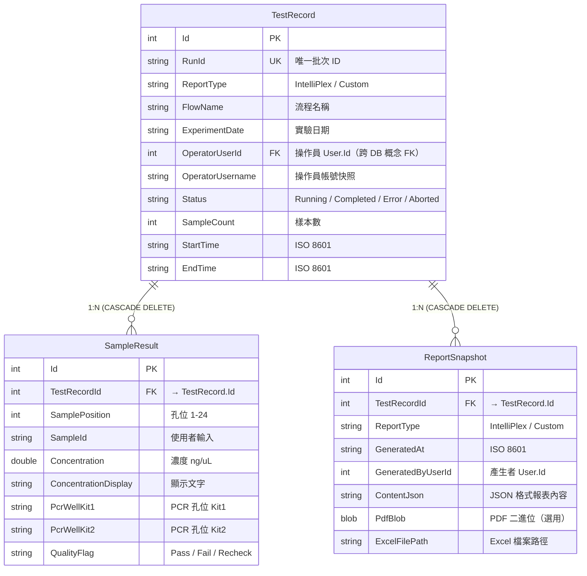
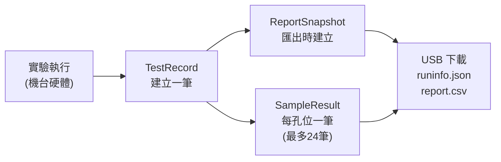

# data.db 三張表關係說明

## ER 關係圖

---

## 關係說明

### TestRecord → SampleResult（1:N）

| 項目 | 說明 |
|------|------|
| FK | `SampleResult.TestRecordId` → `TestRecord.Id` |
| 刪除行為 | **CASCADE DELETE** — 刪除 TestRecord 時自動刪除所有子 SampleResult |
| 數量比例 | 每次實驗最多 **24 筆**（對應機台 24 孔位） |
| 用途 | 記錄每個樣本的濃度量測結果、PCR 孔位分配 |

### TestRecord → ReportSnapshot（1:N）

| 項目 | 說明 |
|------|------|
| FK | `ReportSnapshot.TestRecordId` → `TestRecord.Id` |
| 刪除行為 | **CASCADE DELETE** |
| 數量比例 | 通常 **0-2 筆**（Excel 和/或 PDF 各一份） |
| 用途 | 報表匯出快照，支援 JSON 重建、PDF 二進位、Excel 檔案路徑 |

### 跨 DB 概念 FK（不設實體 FK）

- `TestRecord.OperatorUserId` → `config.db` 的 `User.Id`
- `ReportSnapshot.GeneratedByUserId` → `config.db` 的 `User.Id`

> [!NOTE]
> 因 `data.db` 和 `config.db` 是分離的 SQLite 檔案，無法建立跨 DB 外鍵。
> 欄位以快照方式（`OperatorUsername`、`GeneratedByUsername`）保留帳號記錄，即使帳號日後刪除也不影響歷史資料。

---

## 索引設計

| 表 | 索引欄位 | 類型 |
|----|---------|------|
| TestRecord | `RunId` | **UNIQUE** |
| TestRecord | `OperatorUserId` | 一般 |
| TestRecord | `OperatorUsername` | 一般 |
| TestRecord | `ExperimentDate` | 一般 |
| TestRecord | `ReportType` | 一般 |
| ReportSnapshot | `GeneratedByUserId` | 一般 |

---

## 數據流向

