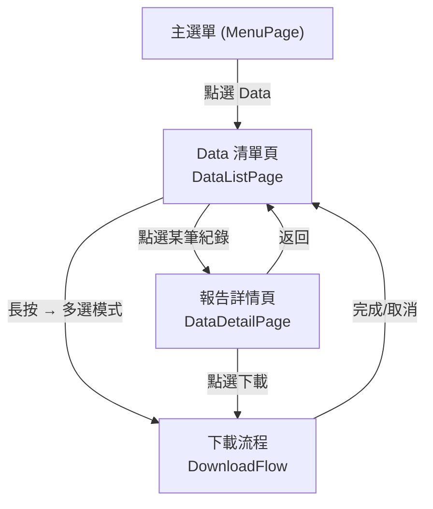
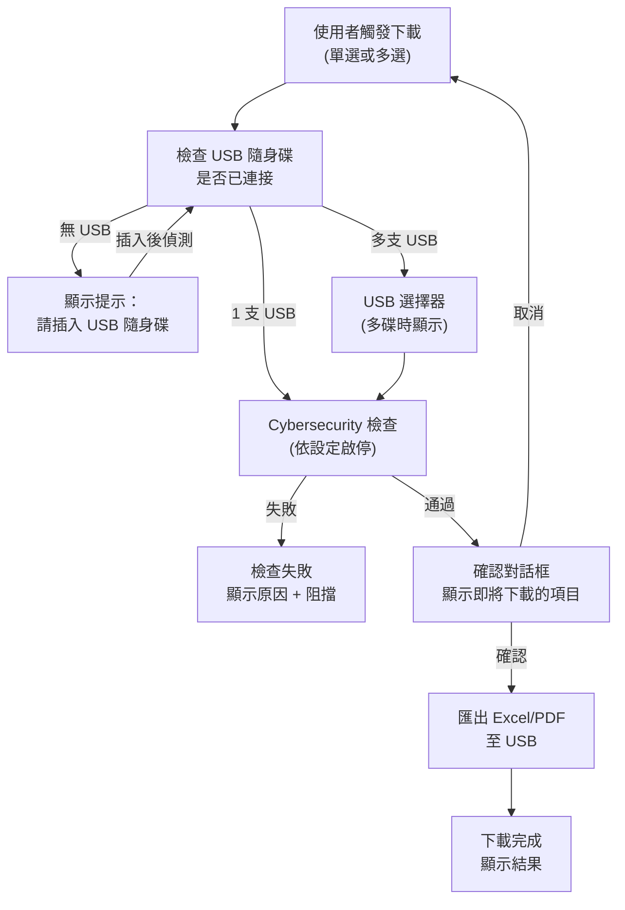

# TRIO2026 Data 頁面 — UI/UX 規劃

> 製作者: Office of William
> 最後更新: 2026-06-12

---

## 一、硬體條件與設計約束

| 條件 | 值 |
|------|-----|
| 面板尺寸 | 7 吋直式 (Portrait) |
| 解析度 | 600 × 1024 (預估) |
| 操作方式 | 電阻式/電容式觸控，可能戴手套 |
| 最小觸控目標 | 48×48 dp（符合 WCAG 2.5.5） |
| hover 效果 | ❌ 禁用 |
| 字體最小值 | 14px（正文）、18px（標題） |

---

## 二、權限模型

| 角色 | RoleLevel | 可見資料 | 可操作 |
|------|-----------|---------|--------|
| Operator | 1 | **僅自己** 的 TestRecord | 查閱、下載 |
| Service | 2 | **僅自己** 的 TestRecord | 查閱、下載 |
| Admin | 3 | **所有人** 的 TestRecord | 查閱、下載、篩選 |
| guest | 1 (特殊) | ❌ 不顯示 Data 頁面入口 | 無 |
| local_operator | 1 (特殊) | ❌ 不顯示 Data 頁面入口 | 無 |

> [!IMPORTANT]
> guest 與 local_operator 帳號不得進入 Data 頁面（不分配測試資料）。
> 理由：免登入帳號無法建立有效的資料所有權關係。

---

## 三、頁面架構（三層式導覽）



---

## 四、第一層：Data 清單頁 (DataListPage)

### 4.1 頁面佈局 (600×1024)

```
┌─────────────────────────────────┐ ← 0px
│  ◀ Data Records          🔍    │ ← 頂部列 (60px)
│  顯示: 我的紀錄 ▼  (Admin專用) │ ← 篩選列 (Admin: 44px / 其他: 0)
├─────────────────────────────────┤
│ ┌─────────────────────────────┐ │
│ │ ☐ ◉IntelliPlex  2026/03/17 │ │ ← 卡片 Row 1
│ │   6 samples · Completed     │ │
│ │   operator                  │ │ ← Admin 模式顯示操作員
│ └─────────────────────────────┘ │
│ ┌─────────────────────────────┐ │
│ │ ☐ ◉Custom       2026/03/16 │ │ ← 卡片 Row 2
│ │   4 samples · Completed     │ │
│ └─────────────────────────────┘ │
│ ┌─────────────────────────────┐ │
│ │ ☐ ◉Custom       2026/03/10 │ │ ← 卡片 Row 3
│ │   12 samples · Error        │ │
│ └─────────────────────────────┘ │
│          ... 可滾動 ...          │
│                                 │
├─────────────────────────────────┤
│    [ 下載選取項目 (0) ]          │ ← 底部操作列 (64px)
│                                 │   多選模式才顯示
└─────────────────────────────────┘
```

### 4.2 卡片設計（每筆 TestRecord）

每張卡片高度約 **80~90px**，在不展開的情況下呈現：

| 資訊 | 位置 | 來源 | 說明 |
|------|------|------|------|
| 勾選框 | 左側 | — | 多選模式顯示，單選模式隱藏 |
| 報告類型圓標 | 勾選框右側 | `ReportType` | 色碼區分：IntelliPlex=藍、Custom=橙 |
| 實驗日期 | 右上 | `ExperimentDate` | 如 2026/03/17 |
| 樣本數 + 狀態 | 第二行 | `SampleCount` + `Status` | "6 samples · Completed" |
| 操作員 | 第三行 | `OperatorUsername` | **僅 Admin 模式顯示** |
| 萃取程式 | 第二行末尾 | `ExtractionProgram` | 截斷顯示，供快速識別 |

> [!TIP]
> **人因工程考量**：
> - 卡片間距 8px，確保手指不易誤觸
> - 點擊卡片任意位置 → 進入詳情
> - 長按卡片 → 進入多選模式（勾選框出現）

### 4.3 頂部功能

| 元素 | 功能 |
|------|------|
| ◀ 按鈕 | 返回主選單 |
| 標題 | "Data Records" (多語系) |
| 🔍 按鈕 | 展開搜尋/日期篩選面板 |

### 4.4 篩選面板（點擊 🔍 後展開）

```
┌─────────────────────────────────┐
│  日期範圍: [起始▼] ~ [結束▼]    │
│  報告類型: [全部▼]              │
│  狀態:     [全部▼]              │
│  [重設]              [套用]     │
└─────────────────────────────────┘
```

- 日期選擇器用**滾輪式**（觸控友善，不用鍵盤）
- Admin 額外顯示「操作員」篩選下拉

### 4.5 Admin 專用：資料範圍切換

Admin 登入時，篩選列顯示下拉選單：
- **我的紀錄**（預設）
- **全部紀錄**
- **依操作員** → 展開操作員清單

---

## 五、第二層：報告詳情頁 (DataDetailPage)

### 5.1 佈局

```
┌─────────────────────────────────┐
│  ◀ Report Detail       [下載]   │ ← 頂部列
├─────────────────────────────────┤
│                                 │
│  ◉ IntelliPlex Report          │ ← 報告類型 + 色碼
│  2026/03/17 13:55              │ ← 完成日期時間
│  Status: Completed ✓           │
│                                 │
│ ─── 實驗設定 ─────────────────  │ ← Section Header
│  程式名稱    QC Dilution Test   │
│  Kit 批號    26275878           │
│  洗脫體積    N/A                │
│  PCR Plate   N/A                │
│  S1 A/D      1190               │
│  S2 A/D      16110              │
│                                 │
│ ─── 樣本結果 ─────────────────  │ ← Section Header
│ ┌───┬─────────┬───────┬──────┐ │
│ │Pos│Conc     │Vol    │Well  │ │ ← 表頭
│ ├───┼─────────┼───────┼──────┤ │
│ │ 1 │ 47.47   │ 4.00  │ A1   │ │
│ │ 2 │ 23.04   │ 4.00  │ B1   │ │
│ │ 3 │ 14.26   │ 5.00  │ C1   │ │
│ │...│ ...     │ ...   │ ...  │ │
│ │NC │  —      │  —    │ N/A  │ │
│ │PC │  —      │  —    │ N/A  │ │
│ └───┴─────────┴───────┴──────┘ │
│                                 │
│ ─── 操作紀錄 ─────────────────  │ ← Section Header
│  操作員      operator           │
│  RunId       20260317_135504    │
│                                 │
└─────────────────────────────────┘
```

> [!NOTE]
> 整頁可垂直滾動。各 Section 使用摺疊式 Header（預設展開）。
> 觸控最佳化：Section Header 可點擊收合/展開。

---

## 六、下載流程 (DownloadFlow)

### 6.1 流程圖



### 6.2 USB 選擇器（多碟場景）

```
┌─────────────────────────────────┐
│     選擇目標 USB 隨身碟          │
├─────────────────────────────────┤
│                                 │
│  ┌───────────────────────────┐  │
│  │  🔌 E:                    │  │ ← 卡片 (80px 高)
│  │  Kingston DataTraveler     │  │
│  │  29.3 GB · exFAT          │  │
│  └───────────────────────────┘  │
│                                 │
│  ┌───────────────────────────┐  │
│  │  🔌 F:                    │  │
│  │  SanDisk Ultra Fit         │  │
│  │  14.7 GB · FAT32          │  │
│  └───────────────────────────┘  │
│                                 │
├─────────────────────────────────┤
│  [取消]                [確認]   │ ← 64px
└─────────────────────────────────┘
```

- 每張 USB 卡片顯示：磁碟代號、裝置名稱、容量、檔案系統
- 取自現有 `UsbSecurityService._activeDevices`
- 只列出 Removable 類型
- 已選中卡片高亮邊框（無 hover 效果，純 press/selected 狀態）

### 6.3 Cybersecurity 檢查

整合現有 `UsbSecurityService` 的安全機制：

| 檢查項目 | 來源 | 失敗動作 |
|---------|------|---------|
| 使用者已登入 | `SessionService.IsAuthenticated` | 阻擋 |
| 非 Guest 模式 | `SessionService.IsGuestLogin` | 阻擋 |
| 畫面未鎖定 | `SessionService.IsLocked` | 阻擋 |
| USB 已格式化 | `UsbSecurityService` | 提示格式化 |
| 內容掃描通過 | `UsbContentScanEnabled` | 警告 |

### 6.4 匯出格式

| 格式 | 說明 |
|------|------|
| Excel (.xlsx) | 沿用一代機格式（IntelliPlex / Custom） |
| PDF (.pdf) | 未來擴充，暫不實作 |

匯出目錄結構：
```
USB:\trio_data\
  └── {RunId}_log\
      ├── report.xlsx
      └── runinfo.json    ← TestRecord + SampleResult 的 JSON 匯出
```

---

## 七、多語系 Key 規劃

| Key | zh-TW | en |
|-----|-------|-----|
| `data_page_title` | 數據紀錄 | Data Records |
| `data_filter_my` | 我的紀錄 | My Records |
| `data_filter_all` | 全部紀錄 | All Records |
| `data_filter_by_user` | 依操作員 | By Operator |
| `data_samples` | 個樣本 | samples |
| `data_download` | 下載選取項目 | Download Selected |
| `data_detail_title` | 報告詳情 | Report Detail |
| `data_detail_setting` | 實驗設定 | Experiment Settings |
| `data_detail_results` | 樣本結果 | Sample Results |
| `data_detail_audit` | 操作紀錄 | Audit Trail |
| `data_usb_select` | 選擇 USB | Select USB Drive |
| `data_usb_none` | 請插入 USB 隨身碟 | Please insert USB drive |
| `data_download_confirm` | 確認下載 {0} 筆紀錄？ | Download {0} records? |
| `data_download_done` | 下載完成 | Download Complete |
| `data_download_fail` | 下載失敗 | Download Failed |
| `data_cyber_blocked` | 安全檢查未通過 | Security Check Failed |
| `data_no_records` | 尚無紀錄 | No Records Found |

---

## 八、測試資料分配

現有 User 帳號（排除 service/guest/local_operator）：

| User | Id | Role | 分配 TestRecord |
|------|----|------|----------------|
| admin | 1 | Admin | 8 筆 |
| operator | 3 | Operator | 30 筆 |

> [!IMPORTANT]
> **分配策略**：
> - 38 筆 TestRecord 以 **operator:30 / admin:8** 比例分配
> - 讓 operator 有足夠的資料量測試滾動、篩選
> - Admin 登入後能看到全部 38 筆（含 operator 的 30 筆）

---

## 九、實作檔案清單

### 新增

| 檔案 | 說明 |
|------|------|
| `Views/Pages/DataListPage.xaml` | 清單頁 XAML |
| `Views/Pages/DataListPage.xaml.cs` | 清單頁 Code-behind |
| `Views/Pages/DataDetailPage.xaml` | 詳情頁 XAML |
| `Views/Pages/DataDetailPage.xaml.cs` | 詳情頁 Code-behind |
| `Views/Controls/UsbDriveSelector.xaml` | USB 選擇器控件 |
| `Views/Controls/UsbDriveSelector.xaml.cs` | USB 選擇器 Code-behind |
| `Services/DataExportService.cs` | 匯出邏輯（DB→Excel） |

### 修改

| 檔案 | 修改內容 |
|------|---------|
| `Views/AppShell.xaml.cs` | 註冊 Data 頁面路由 |
| `Views/Pages/MenuPage.xaml` | 新增 Data 按鈕 |
| `Data/Contexts/DataDbContext.cs` | 新增 RawMeasurement DbSet |
| `Core/Entities/TestRecord.cs` | 擴充新欄位 |
| `Data/Seeding/LocalizedStringSeed.cs` | 新增多語系 Key |
| `tools/TestDataSeeder/seed_from_excel.py` | 分配 OperatorUserId |

---

## 十、開發順序建議

1. **更新測試資料** — 為 TestRecord 分配 OperatorUserId
2. **DataListPage** — 清單頁（含權限篩選、卡片、多選）
3. **DataDetailPage** — 詳情頁（展開所有欄位）
4. **USB 選擇器** — 多碟選擇控件
5. **DataExportService** — DB→Excel 匯出引擎
6. **下載流程整合** — Cybersecurity + USB + 匯出

---

*請檢閱後告知是否需要調整，或可以開始實作。*
