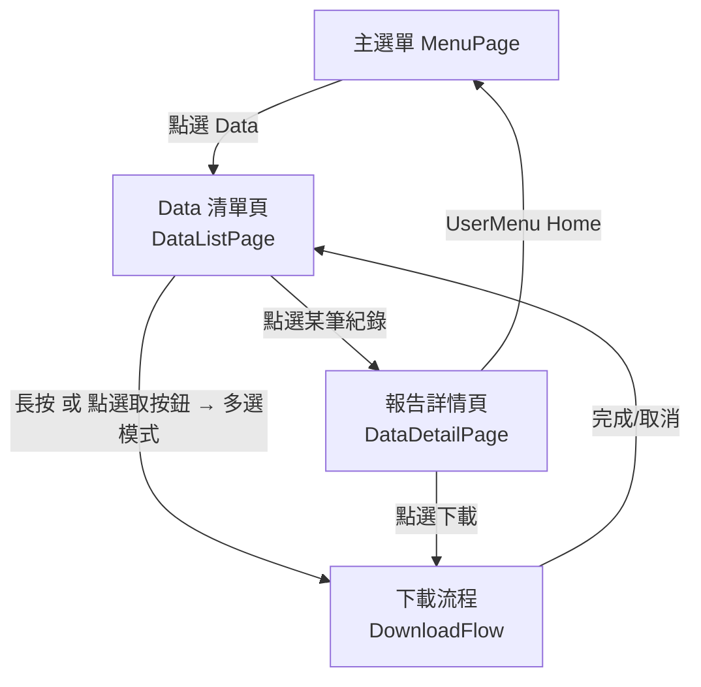
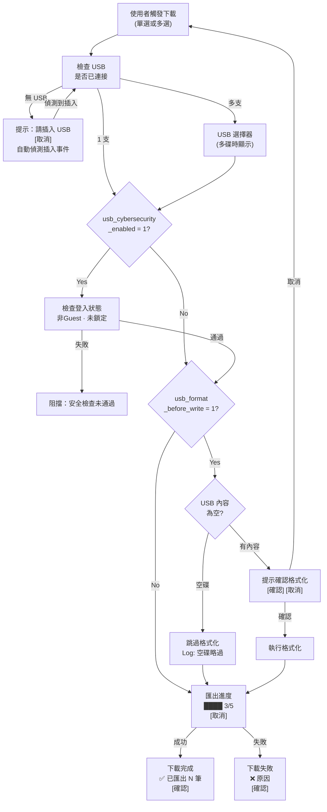

# TRIO2026 Data 頁面 — 實作規劃 v3

> 製作者: Office of William
> 最後更新: 2026-06-12
> 版本: v3（整合 Session Timeout / Admin 代理解鎖 / USB 拔除防護）

---

## 一、硬體條件與設計約束

| 條件 | 值 |
|------|-----|
| 面板尺寸 | 7 吋直式 (Portrait) |
| 設計基準解析度 | **600 × 960**（`AppShell.xaml` Viewbox） |
| 操作方式 | 電阻式/電容式觸控，可能戴手套 |
| 最小觸控目標 | 48×48 dp（符合 WCAG 2.5.5） |
| hover 效果 | ❌ **禁用**（僅 IsPressed 觸發） |
| 字體最小值 | 14px（正文）、18px（標題） |

---

## 二、導覽方式

透過右上角 **`UserMenuControl`**（`ShowHomeButton="True"`）返回 MenuPage。
**不使用** ◀ 返回按鈕（遵循現有 UvDecontamination / AccountManagement 頁面的統一模式）。

入口：MenuPage 的 `📊 Data` 按鈕（`OnDataClick`，已存在於 MenuPage.xaml L119）。

---

## 三、權限模型

| 角色 | RoleLevel | 可見資料 | 可操作 |
|------|-----------|---------|--------|
| Operator | 1 | **僅自己** 的 TestRecord | 查閱、下載 |
| Service | 2 | **僅自己** 的 TestRecord | 查閱、下載 |
| Admin | 3 | **所有人** 的 TestRecord | 查閱、下載、篩選 |
| guest | 1 (特殊) | ❌ 不顯示 Data 入口 | 無 |
| local_operator | 1 (特殊) | ❌ 不顯示 Data 入口 | 無 |

---

## 四、頁面架構（三層式導覽）



---

## 五、第一層：Data 清單頁 (DataListPage)

### 5.1 三種版面配置

由 SystemConfig 控制：
```
Category: "DataPage"
Key:      "data_list_layout"
Value:    "card" | "compact" | "table"
```

使用者可透過頂部列的切換按鈕即時切換，切換後存回 DB。

---

#### 5.1.1 Card 模式（預設）— 一屏 ~8 筆

```
┌─────────────────────────────────┐
│  Data Records    [▦] [選取] 🔍 │ ← 頂部列 60px
│  顯示: 全部紀錄 ▼               │ ← Admin 專屬篩選列 44px
├─────────────────────────────────┤
│ ┌─────────────────────────────┐ │
│ │ 🔵IntelliPlex    2026/03/17│ │  ← ❶報告類型 ❷日期
│ │ 6 samples · Completed       │ │  ← ❸樣本數+狀態
│ │ QC Dilution Test  operator  │ │  ← ❹萃取程式 ❺操作員(Admin)
│ └─────────────────────────────┘ │
│ ┌─────────────────────────────┐ │
│ │ 🟠Custom         2026/03/10│ │
│ │ 12 samples · Error ⚠        │ │  ← 異常狀態醒目標示
│ │ 83015 FFPE DNA    operator  │ │
│ └─────────────────────────────┘ │
│          ... 可滾動 ...          │
├─────────────────────────────────┤
│    [ 下載選取項目 (0) ]          │ ← 底部列 64px（多選模式才顯示）
└─────────────────────────────────┘
```

每張卡片 80~90px 高，間距 8px。

---

#### 5.1.2 Compact 模式 — 一屏 ~16 筆

```
┌─────────────────────────────────┐
│ 🔵 03/17  6smp  Completed  op. │ ← 44~48px 高
│ 🟠 03/10 12smp  Error ⚠    op. │
│ 🟠 03/16  4smp  Aborted    op. │
│ ...                             │
└─────────────────────────────────┘
```

單行顯示：類型色碼 + 日期 + 樣本數 + 狀態 + 操作員（Admin）

---

#### 5.1.3 Table 模式 — 多欄表格，橫向可滑動

```
┌──────┬──────────┬────┬──────────┬────────┐
│ Type │ Date     │Smp │ Status   │Program │ ← 固定表頭
├──────┼──────────┼────┼──────────┼────────┤
│ 🔵   │ 03/17   │  6 │Completed │QC Dil..│
│ 🟠   │ 03/10   │ 12 │Error ⚠   │83015.. │
│ ...  │         │    │          │        │
└──────┴──────────┴────┴──────────┴────────┘
```

橫向可滑動以容納更多欄位（Kit 批號、PCR Plate ID 等）。

---

### 5.2 卡片/列顯示欄位

| # | 資訊 | Operator | Admin |
|---|------|----------|-------|
| 1 | 報告類型色碼 | ✅ | ✅ |
| 2 | 實驗日期 | ✅ | ✅ |
| 3 | 樣本數 | ✅ | ✅ |
| 4 | 狀態 | ✅ | ✅ |
| 5 | 萃取程式 | ✅ | ✅ |
| 6 | **操作員名稱** | — | ✅ |

### 5.3 篩選面板（點擊 🔍 展開）

**Operator — 4 個 filter：**

| # | Filter | 來源欄位 | 操作方式 |
|---|--------|---------|---------|
| 1 | 日期範圍 | `ExperimentDate` / `EndTime` | 起始~結束（滾輪選擇器） |
| 2 | 報告類型 | `ReportType` | 下拉：全部 / IntelliPlex / Custom |
| 3 | 狀態 | `Status` | 下拉：全部 / Completed / Error / Aborted |
| 4 | 萃取程式 | `ExtractionProgram` | 下拉（動態抓不重複值） |

**Admin — 額外 2 個 filter（共 6 個）：**

| # | Filter | 說明 |
|---|--------|------|
| 5 | 資料範圍 | 我的紀錄 / 全部紀錄 |
| 6 | 依操作員 | 操作員下拉清單 |

### 5.4 排序

| 排序方式 | 預設 |
|---------|------|
| 日期（新→舊） | ✅ |
| 日期（舊→新） | |
| 樣本數（多→少） | |

### 5.5 多選模式

兩種方式進入多選：
1. **長按**任一卡片 → 進入多選模式（勾選框出現）
2. 點擊頂部列的 **「選取」按鈕** → 進入多選模式

---

## 六、第二層：報告詳情頁 (DataDetailPage)

整頁可垂直滾動。各 Section 使用摺疊式 Header（預設展開，可點擊收合/展開）。

```
┌─────────────────────────────────┐
│  Report Detail          [下載]  │ ← 頂部列 + UserMenuControl
├─────────────────────────────────┤
│                                 │
│  ◉ IntelliPlex Report          │ ← 報告類型 + 色碼
│  2026/03/17 13:55              │ ← 完成日期時間
│  Status: Completed ✓           │
│                                 │
│ ─── 實驗設定 ──────── [▼收合]   │ ← Section Header（可點擊）
│  程式名稱    QC Dilution Test   │
│  Kit 批號    26275878           │
│  洗脫體積    N/A                │
│  PCR Plate   N/A                │
│  S1 A/D      1190               │
│  S2 A/D      16110              │
│                                 │
│ ─── 樣本結果 ──────── [▼收合]   │
│ ┌───┬─────────┬───────┬──────┐ │
│ │Pos│Conc     │Vol    │Well  │ │
│ ├───┼─────────┼───────┼──────┤ │
│ │ 1 │ 47.47   │ 4.00  │ A1   │ │
│ │ 2 │ 23.04   │ 4.00  │ B1   │ │
│ │NC │  —      │  —    │ N/A  │ │
│ └───┴─────────┴───────┴──────┘ │
│                                 │
│ ─── 操作紀錄 ──────── [▼收合]   │
│  操作員      operator           │
│  RunId       20260317_135504    │
│                                 │
└─────────────────────────────────┘
```

---

## 七、下載流程 (DownloadFlow)

### 7.1 完整流程圖



### 7.2 各步驟 UI 設計

#### (A) 無 USB 提示

```
┌─────────────────────────────────┐
│            🔌                   │
│     請插入 USB 隨身碟            │
│         [ 取消 ]                │
└─────────────────────────────────┘
```
- 插入 USB → `UsbSecurityService.OnDeviceInserted` 自動觸發下一步
- 取消 → 返回清單頁

#### (B) USB 選擇器（多碟）

```
┌─────────────────────────────────┐
│     選擇目標 USB 隨身碟          │
├─────────────────────────────────┤
│  ┌───────────────────────────┐  │
│  │  🔌 E:                    │  │ ← 80px 高
│  │  Kingston DataTraveler     │  │
│  │  29.3 GB · exFAT          │  │
│  └───────────────────────────┘  │
│  ┌───────────────────────────┐  │
│  │  🔌 F:                    │  │
│  │  SanDisk Ultra Fit         │  │
│  │  14.7 GB · FAT32          │  │
│  └───────────────────────────┘  │
├─────────────────────────────────┤
│  [取消]                [確認]   │
└─────────────────────────────────┘
```
- 僅列 Removable 類型
- 已選中卡片高亮邊框（IsPressed/IsSelected 狀態，無 hover）
- 資料來自 `UsbSecurityService._activeDevices`

#### (C) 匯出進度

```
┌─────────────────────────────────┐
│       匯出中...                  │
│   ████████████░░░░  3 / 5       │
│   正在產生: 20260317_135504      │
│        [ 取消 ]                 │
└─────────────────────────────────┘
```
- 進度以**筆數**為單位
- 格式化階段顯示：「準備 USB 中...」
- 取消 → 中止剩餘匯出（已寫入的保留）

#### (D) 完成/失敗

```
成功:                              失敗:
┌─────────────────────┐            ┌─────────────────────┐
│        ✅           │            │        ❌           │
│   下載完成           │            │   下載失敗           │
│   已匯出 3 筆至 E:\  │            │   USB 空間不足       │
│   trio_data\...     │            │   需: 2.1MB/可用:0.3 │
│     [ 確認 ]        │            │     [ 確認 ]        │
└─────────────────────┘            └─────────────────────┘
```

### 7.3 安全檢查邏輯

> [!IMPORTANT]
> `usb_content_scan_enabled` **不參與下載流程**。
> 該設定僅用於 USB→電腦 的讀取/匯入場景。

```
usb_cybersecurity_enabled = 0 → 跳過所有檢查
usb_cybersecurity_enabled = 1 → 
    ├── 檢查：已登入 ✓
    ├── 檢查：非 Guest ✓
    └── 檢查：未鎖定 ✓

usb_format_before_write = 0 → 不格式化
usb_format_before_write = 1 →
    ├── USB 為空 → PASS（Log 記錄：空碟略過格式化）
    └── USB 有內容 → 提示確認格式化
```

### 7.4 匯出目錄結構

```
USB:\trio_data\
  └── {RunId}\
      ├── report.xlsx        ← 沿用一代機 Excel 格式
      └── runinfo.json       ← TestRecord + SampleResult JSON
```

---

## 八、多語系 Key 規劃

| Key | zh-TW | en |
|-----|-------|-----|
| `data_page_title` | 數據紀錄 | Data Records |
| `data_filter_my` | 我的紀錄 | My Records |
| `data_filter_all` | 全部紀錄 | All Records |
| `data_filter_by_user` | 依操作員 | By Operator |
| `data_filter_date_range` | 日期範圍 | Date Range |
| `data_filter_report_type` | 報告類型 | Report Type |
| `data_filter_status` | 狀態 | Status |
| `data_filter_program` | 萃取程式 | Program |
| `data_filter_all_option` | 全部 | All |
| `data_filter_apply` | 套用 | Apply |
| `data_filter_reset` | 重設 | Reset |
| `data_samples` | 個樣本 | samples |
| `data_select` | 選取 | Select |
| `data_cancel_select` | 取消選取 | Cancel |
| `data_download` | 下載選取項目 | Download Selected |
| `data_detail_title` | 報告詳情 | Report Detail |
| `data_detail_setting` | 實驗設定 | Experiment Settings |
| `data_detail_results` | 樣本結果 | Sample Results |
| `data_detail_audit` | 操作紀錄 | Audit Trail |
| `data_usb_select` | 選擇 USB | Select USB Drive |
| `data_usb_none` | 請插入 USB 隨身碟 | Please insert USB drive |
| `data_usb_preparing` | 準備 USB 中... | Preparing USB... |
| `data_exporting` | 匯出中... | Exporting... |
| `data_exporting_current` | 正在產生 | Generating |
| `data_download_confirm` | 確認下載 {0} 筆紀錄？ | Download {0} records? |
| `data_download_done` | 下載完成 | Download Complete |
| `data_download_done_msg` | 已匯出 {0} 筆報告至 {1} | Exported {0} reports to {1} |
| `data_download_fail` | 下載失敗 | Download Failed |
| `data_download_fail_space` | USB 空間不足 | Insufficient USB space |
| `data_cyber_blocked` | 安全檢查未通過 | Security Check Failed |
| `data_format_skipped` | USB 為空，略過格式化 | USB empty, format skipped |
| `data_format_confirm` | USB 有既有內容，格式化後將清除 | USB has content, format will erase all data |
| `data_no_records` | 尚無紀錄 | No Records Found |
| `data_layout_card` | 卡片 | Card |
| `data_layout_compact` | 緊湊 | Compact |
| `data_layout_table` | 表格 | Table |

---

## 九、SystemConfig 新增設定

| Category | Key | Default | Description |
|----------|-----|---------|-------------|
| `DataPage` | `data_list_layout` | `card` | 清單頁版面配置：card / compact / table |

---

## 十、測試資料

已完成（`tools/TestDataSeeder/test_data.db`）：

| 項目 | 數量 |
|------|------|
| TestRecord | 38 筆（operator:30 / admin:8） |
| SampleResult | 231 筆 |
| RawMeasurement | 38 筆 |
| ReportSnapshot | 38 筆 |
| Completed | 35 筆 |
| Error | 2 筆（ERR-3001, ERR-4002） |
| Aborted | 1 筆 |

---

## 十一、實作要求

> [!IMPORTANT]
> **多語系**：所有 UI 文字必須透過 `LocalizationService` 取得，不可硬編碼字串。
> **程式碼埋點**：每個決策點必須透過 `EventLogService` 記錄，含操作員、USB 資訊、決策結果。

---

## 十二、實作檔案清單

### 新增

| 檔案 | 說明 |
|------|------|
| `Views/Pages/DataListPage.xaml` | 清單頁 XAML（三種版面配置） |
| `Views/Pages/DataListPage.xaml.cs` | 清單頁 Code-behind |
| `Views/Pages/DataDetailPage.xaml` | 詳情頁 XAML |
| `Views/Pages/DataDetailPage.xaml.cs` | 詳情頁 Code-behind |
| `Views/Controls/UsbDriveSelector.xaml` | USB 選擇器控件 |
| `Views/Controls/UsbDriveSelector.xaml.cs` | USB 選擇器 Code-behind |
| `Services/DataExportService.cs` | 匯出邏輯（DB→Excel） |

### 修改

| 檔案 | 修改內容 |
|------|---------|
| `Views/AppShell.xaml.cs` | 註冊 Data 頁面路由 |
| `Views/Pages/MenuPage.xaml.cs` | `OnDataClick` 導航至 DataListPage |
| `Data/Contexts/DataDbContext.cs` | 新增 RawMeasurement DbSet |
| `Core/Entities/TestRecord.cs` | 擴充新欄位 |
| `Data/Seeding/LocalizedStringSeed.cs` | 新增多語系 Key |
| `Data/Seeding/SystemSettingSeed.cs` | 新增 DataPage category |

---

## 十三、開發順序

1. **SystemConfig + 多語系種子** — 新增設定 + i18n key
2. **DataListPage** — 三種版面（Card → Compact → Table）
3. **DataDetailPage** — 詳情展開頁
4. **UsbDriveSelector** — 多碟選擇控件
5. **DataExportService** — DB→Excel 匯出引擎
6. **下載流程整合** — USB偵測 + Cybersecurity + 格式化 + 進度 + 完成/失敗
