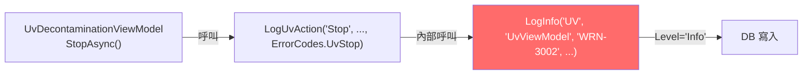

# EventLog 埋點審查分析

> 製作者: Office of William  
> 日期: 2026-05-22

---

## 問題 1：哪些行為需要補上 ErrorId？

### 現狀分析

查看 [EventLogExtensions.cs](file:///d:/TRIO2026/src/TRIO2026.App/Services/EventLogExtensions.cs)，以下方法在寫入日誌時傳入 `errorId: null`：

| 方法 | errorId | 寫入範例 |
|------|---------|----------|
| `LogButtonClick` | ❌ `null` | `Button Click` / `Element=IntelliPlex` |
| `LogMenuAction` | ❌ `null` | `Menu Open` |
| `LogInput` | ❌ `null` | `Input` / `Field=xxx` |

而以下方法已正確帶入 ErrorId：

| 方法 | errorId | 範例 |
|------|---------|------|
| `LogNavigation` | ✅ `INF-6001` | 頁面導航 |
| `LogAuth` | ✅ `INF-2002` / `WRN-2001` / `INF-2003` | 登入/登出 |
| `LogUvAction` | ✅ 由呼叫端傳入 | UV 操作 |

### 結論：**建議不需要補 ErrorId**

> [!NOTE]
> **理由：ErrorId 的設計用途是「end user 可據此回報給 CFS/客服人員進行初步評估」**（見 [SystemEvent.cs:9-10](file:///d:/TRIO2026/src/TRIO2026.Core/Entities/SystemEvent.cs#L9-L10)）。
> 
> `Menu Open`、`Button Click`、`Input` 這類純 UI 操作追蹤事件：
> - **不是使用者需要回報的事件**（使用者不會因為「點了按鈕」而需要聯繫客服）
> - **不需要技術團隊進行初步評估**（這些是正常操作，非異常行為）
> - **用途是稽核追蹤（Audit Trail）**，而非錯誤追蹤

但如果您的合規或稽核需求要求**每筆事件都必須有可查詢代碼**，那可以新增一組 7xxx 系列：

```
INF-7001  UI Button Click   （按鈕點擊）
INF-7002  Menu Open/Close    （選單開關）
INF-7003  User Input         （輸入欄位）
INF-7004  Password Changed   （密碼變更成功）
INF-7005  Account Created    （帳號建立）
INF-7006  Account Deleted    （帳號刪除）
INF-7007  Account Lock/Unlock（帳號鎖定/解鎖）
```

> [!IMPORTANT]
> **請確認：是否需要為純 UI 操作追蹤事件分配 ErrorId？** 如果合規要求每筆記錄必須有代碼，我將新增 7xxx 系列。否則維持 `null` 即可。

---

## 問題 2：`EventCode` 欄位名稱是否需要修正？

### 現狀

DB 表中有兩個容易混淆的欄位：

| 欄位名 | Entity 屬性 | 用途 | 目前狀態 |
|--------|-------------|------|----------|
| `ErrorId` | `SystemEvent.ErrorId` | 事件代碼（如 `INF-2002`, `WRN-3002`）— 用於 CFS 回報 | ✅ 有使用 |
| `EventCode` | `SystemEvent.EventCode` | 原設計為事件代碼（如 `UV_START`, `DOOR_OPEN`） | ❌ **完全未使用**（所有記錄均為 null） |

### 問題

1. **`ErrorId` 這個名稱容易誤導** — 它並非只用於 "Error"，`INF-1004`（App Startup）也是 `ErrorId`，但這顯然不是 "Error"
2. **`EventCode` 欄位從未被填值** — 在所有工廠方法中，`eventCode` 參數從未被任何呼叫端傳入

### 建議方案

> [!WARNING]
> 以下涉及 DB Schema 變更，需要 Migration。

**方案 A：重新命名（推薦）**

| 目前 | 建議改為 | 理由 |
|------|---------|------|
| `ErrorId` | `EventId` | 更通用，涵蓋 INF/WRN/ERR 三種前綴 |
| `EventCode` | 刪除或保留為 `ActionCode` | 從未使用，可刪除以減少混淆 |

**方案 B：保留名稱，僅更新文件**

如果不想做 DB 變更，可以在 Entity 的 XML 文件中加強說明：

```csharp
/// <summary>
/// 事件代碼 — 涵蓋 INF（資訊）/ WRN（警告）/ ERR（錯誤）三種層級
/// 例：INF-2002（登入成功）、WRN-3002（UV 手動停止）、ERR-1001（未預期錯誤）
/// ⚠ 雖名為 "ErrorId"，實際為通用事件識別碼，非僅限錯誤事件
/// </summary>
public string? ErrorId { get; set; }
```

> [!IMPORTANT]
> **請選擇方案：**
> - **A** — 重新命名欄位（需 Migration，但語意更精準）
> - **B** — 保留名稱、更新文件（零風險，但查 SQL 時仍會混淆）

---

## 問題 3：UV Stop 的 Level 與 ErrorId 矛盾

### 問題記錄

```
806  2026-05-20T07:45:01  WRN-3002  Info  UV  UvViewModel  UV Stop  RemainingSeconds=894
569  2026-05-20T05:22:53  WRN-3002  Info  UV  UvViewModel  UV Stop  RemainingSeconds=58
```

- `ErrorId = WRN-3002` → 前綴 `WRN` 暗示這是一個 **Warning**
- `Level = Info` → 實際寫入時卻用 `LogInfo`

### 根因分析



問題出在 [LogUvAction](file:///d:/TRIO2026/src/TRIO2026.App/Services/EventLogExtensions.cs#L75-L80) 方法：

```csharp
public static void LogUvAction(this EventLogService? service,
    string action, string? detail = null, string? errorId = null)
{
    service?.LogInfo("UV", "UvViewModel", errorId,   // ← 永遠用 LogInfo
        $"UV {action}", detail);
}
```

**它永遠呼叫 `LogInfo`**，不管 `errorId` 前綴是 `WRN` 還是 `ERR`。

### 修正方案

修改 `LogUvAction` 方法，根據 `errorId` 前綴自動選擇正確的 Level：

```csharp
public static void LogUvAction(this EventLogService? service,
    string action, string? detail = null, string? errorId = null)
{
    var message = $"UV {action}";
    var level = errorId?.StartsWith("ERR") == true ? "Error"
              : errorId?.StartsWith("WRN") == true ? "Warning"
              : "Info";

    switch (level)
    {
        case "Error":
            service?.LogError("UV", "UvViewModel", errorId, message, detail);
            break;
        case "Warning":
            service?.LogWarning("UV", "UvViewModel", errorId, message, detail);
            break;
        default:
            service?.LogInfo("UV", "UvViewModel", errorId, message, detail);
            break;
    }
}
```

修正後 UV Stop 的記錄會變成：
```
WRN-3002  Warning  UV  UvViewModel  UV Stop  RemainingSeconds=894
```

> [!TIP]
> 另一個思考方向：**UV Stop（手動停止）是否真的算 Warning？**
>
> - 如果使用者主動按 STOP 是「正常操作」→ 改為 `INF-3002` + `Info`
> - 如果使用者主動按 STOP 代表「非預期中斷，應被關注」→ 維持 `WRN-3002` + 修正 Level 為 `Warning`
>
> 建議維持 `WRN-3002 + Warning`，因為 UV 提前手動停止意味著照射未完成（`RemainingSeconds > 0`），值得被標記關注。

---

## 總結

| # | 問題 | 建議 | 需要程式修改？ |
|---|------|------|:-:|
| 1 | UI 操作缺少 ErrorId | **可不補**（稽核追蹤不需要事件代碼）；若合規要求則新增 7xxx 系列 | 視需求 |
| 2 | `ErrorId` / `EventCode` 欄位名稱混淆 | **方案 A**（重新命名）或 **方案 B**（更新文件） | 視選擇 |
| 3 | UV Stop Level 矛盾 | **必須修正** — `LogUvAction` 應根據 errorId 前綴自動選擇 Level | ✅ 是 |
