# TRIO2026 軟體架構評估：HAL 層定位與 Sniper 介面規劃

---

## 一、整體系統分層

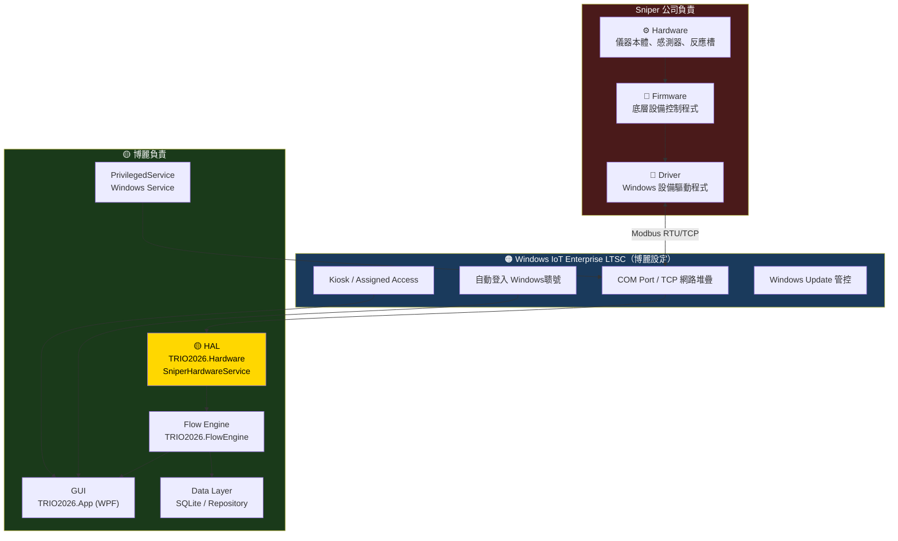

---

## 二、責任邊界明確化

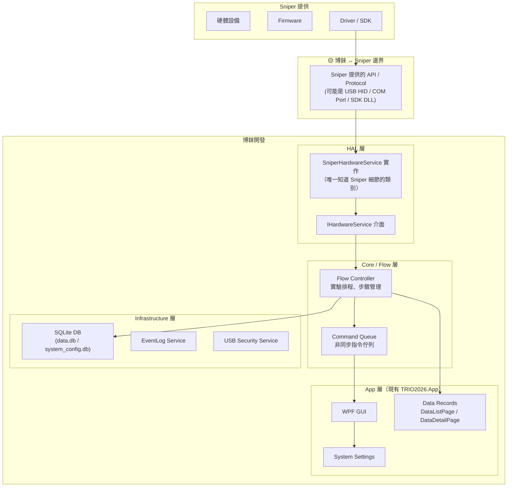

---

## 三、HAL 的定位分析

### HAL 應該放在哪裡？

```
┌─────────────────────────────────────────────────────────┐
│                    TRIO2026 Solution                     │
│                                                          │
│  TRIO2026.App          (GUI, 現有)                       │
│  TRIO2026.Core         (Enums, ErrorCodes, 現有)         │
│  TRIO2026.Data         (DB, Repository, 現有)            │
│  TRIO2026.PrivilegedService  (USB 特權, 現有)            │
│                                                          │
│  ──── 建議新增 ────                                      │
│  TRIO2026.Hardware     ← HAL 層主體                      │
│  TRIO2026.FlowEngine   ← 流程控制層                      │
└─────────────────────────────────────────────────────────┘
```

### HAL 層的職責

| 職責 | 說明 |
|------|------|
| **封裝 Sniper 通訊細節** | 所有 SDK/Protocol 呼叫集中在此 |
| **提供穩定介面** | 上層只依賴 `IHardwareService`，不接觸 Sniper |
| **硬體狀態管理** | 連線、斷線、錯誤恢復 |
| **事件發佈** | 溫度、進度、完成等事件推送給 Flow 層 |
| **Mock 支援** | 提供 `MockHardwareService` 供無硬體開發/測試 |

---

## 四、與 Sniper 通訊窗口設計

```mermaid
graph LR
    subgraph HAL["TRIO2026.Hardware (HAL)"]
        IFACE["IHardwareService"]
        REAL["SniperHardwareService\n(Real)"]
        MOCK["MockHardwareService\n(開發/測試用)"]
        IFACE --> REAL
        IFACE --> MOCK
    end

    subgraph COMM["通訊協議：Modbus"]  
        OPT1["Modbus RTU\n(RS-232 / RS-485 串列)"]  
        OPT2["Modbus TCP\n(乙太網路)"]  
    end

    REAL --> OPT1
    REAL --> OPT2
```

> ✅ **協議確認**：使用 **Modbus** 通訊（RTU 或 TCP，待 Sniper 確認物理層）。  
> HAL 內部的 `SniperHardwareService` 封裝所有 Modbus 讀寫細節，對外介面 `IHardwareService` 不變。

---

## 三-B、Modbus 通訊架構詳解

### Modbus RTU vs TCP 選擇

| 項目 | Modbus RTU | Modbus TCP |
|------|-----------|------------|
| **物理層** | RS-232 / RS-485 (COM Port) | 乙太網路 (RJ45) |
| **速度** | 9600~115200 baud | 快（局域網速度） |
| **佈線** | 需串列線，距離遠 | 標準網線，靈活 |
| **工業場景** | 傳統工控設備常見 | 較新設備趨勢 |
| **Windows 驅動** | 需 COM Port（USB 轉接常見） | 標準 TCP/IP，免驅動 |
| **推薦場景** | Sniper 舊設計延續 | 未來擴充性更好 |

### HAL 內部 Modbus 通訊流程

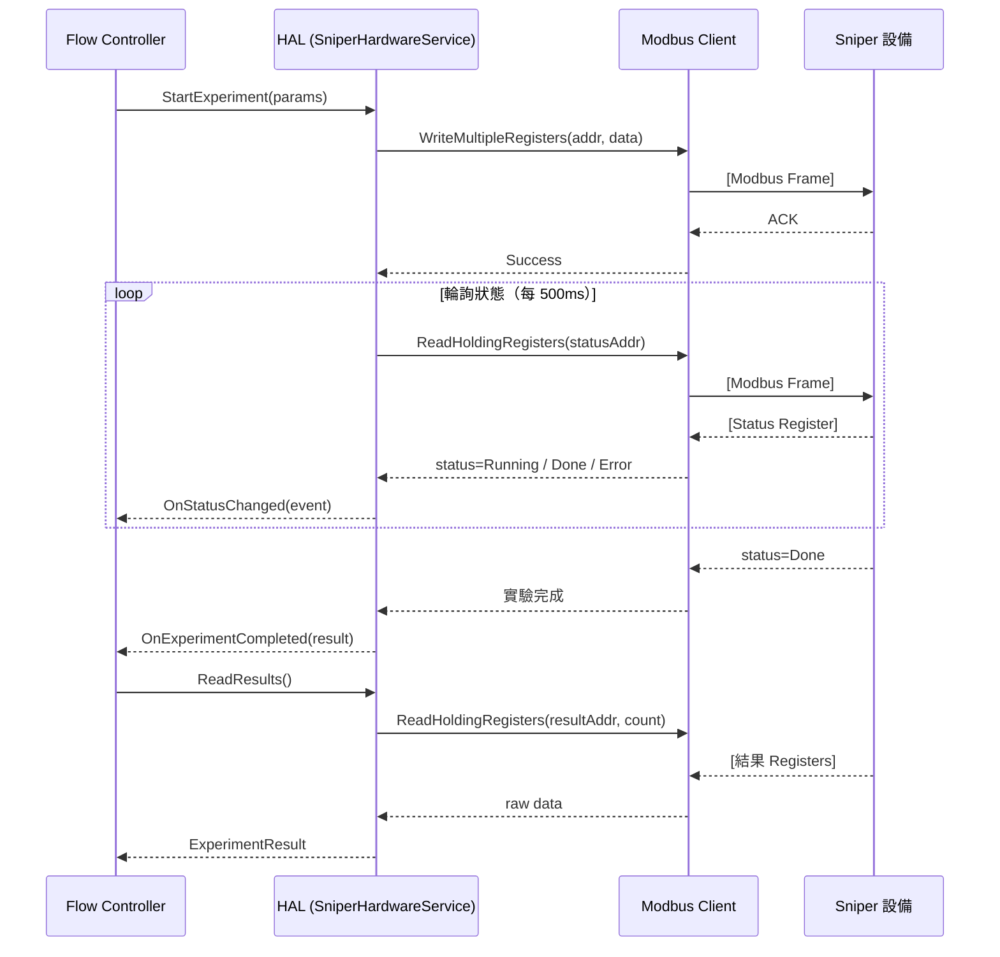

### Register Map 設計原則

```
建議與 Sniper 協議定義的 Register 區塊結構：

┌─────────────────────────────────────────────────┐
│  Address Range   │ 用途                          │
├─────────────────────────────────────────────────┤
│  0x0000 ~ 0x00FF │ 設備狀態（唯讀）              │
│    0x0000        │   Device Status               │
│    0x0001        │   Error Code                  │
│    0x0002        │   Current Step                │
│    0x0003        │   Progress (0~100)            │
├─────────────────────────────────────────────────┤
│  0x0100 ~ 0x01FF │ 控制指令（讀寫）              │
│    0x0100        │   Command Register            │
│    0x0101~0x01FF │   Parameters                  │
├─────────────────────────────────────────────────┤
│  0x0200 ~ 0x02FF │ 實驗設定（讀寫）              │
├─────────────────────────────────────────────────┤
│  0x0300 ~ 0x03FF │ 結果資料（唯讀）              │
└─────────────────────────────────────────────────┘

⚠️ 實際 Register Map 以 Sniper 提供的文件為準
```

### 建議 NuGet 套件

| 套件 | 說明 |
|------|------|
| **NModbus4** | .NET Modbus 客戶端，支援 RTU + TCP，穩定老牌 |
| **EasyModbus** | 輕量，同時支援 RTU/TCP，適合快速整合 |
| **FluentModbus** | 現代非同步 API，支援 .NET 8，推薦 |

---

## 五、對現有 TRIO2026 專案的影響評估

### 現狀（已建立）

```
TRIO2026.App ─── 純 GUI，無硬體邏輯
TRIO2026.Core ── Enums, ErrorCodes
TRIO2026.Data ── SQLite, Repository
PrivilegedService ─ USB 格式化
```

### 加入 HAL 後的依賴方向

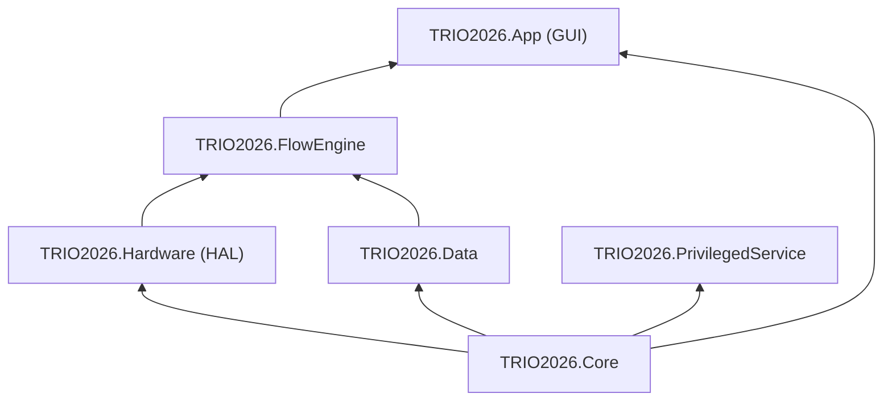

**原則：依賴方向向下，GUI 不直接操作硬體。**

---

## 六、漸進開發路徑

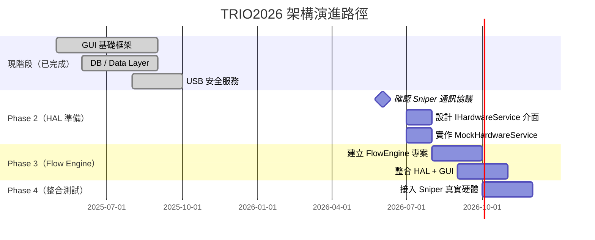

---

## 七、開放問題（需要決策）

| # | 問題 | 影響範圍 |
|---|------|----------|
| 1 | Sniper 使用 **Modbus RTU**（串列）還是 **Modbus TCP**（網路）？ | 決定 HAL 物理層連線方式 |
| 2 | Sniper 能否提供完整的 **Register Map 文件**？ | HAL 實作的核心依賴 |
| 3 | 硬體狀態是**輪詢（Polling）**還是 Modbus **Exception Coil** 通知？ | 決定輪詢頻率與 CPU 佔用 |
| 4 | 是否需要支援**同時連接多台設備**？ | 影響 HAL 設計複雜度 |
| 5 | GUI 是否需要顯示**即時硬體狀態**（溫度/進度/步驟）？ | 影響 App 層的事件推送設計 |
| 6 | FlowEngine 是否需要**獨立程序**（類似 PrivilegedService）？ | 影響程序間通訊設計 |


---

## 八、HAL 的本質定義

### HAL 是軟體還是硬體？

```
HAL = Hardware Abstraction Layer
    = 純軟體程式，運行在 Windows 上
    = 位於「應用程式」和「硬體/Firmware」之間
    不屬於硬體，也不屬於 Firmware
```

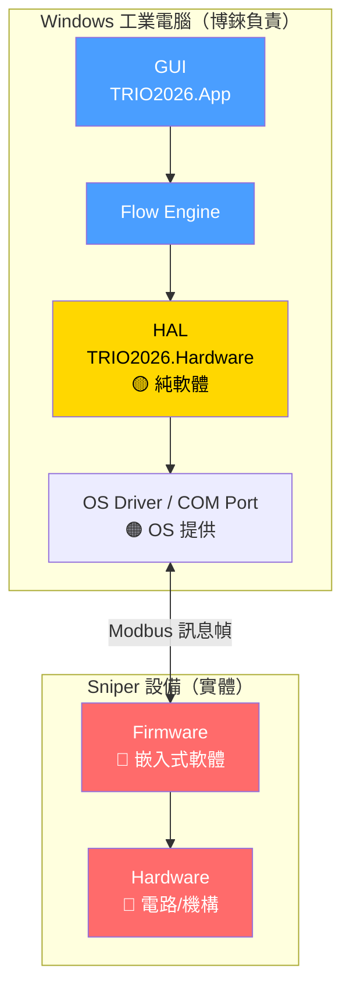

### 各層責任對照

| 層次 | 本質 | 責任歸屬 | 語言 |
|------|------|----------|------|
| **Hardware** | 電路板、馬達、試管槽 | Sniper | 磁鐵 |
| **Firmware** | 設備內嵌入的控制程式 | Sniper | C / 組合語言 |
| **Driver** | Windows 認識設備的驅動程式 | OS 提供 (COM Port) | C |
| **HAL** 🟡 | 封裝硬體細節的軟體層 | **博錸** | **C#** |
| **Flow Engine** | 實驗流程控制 | 博錸 | C# |
| **GUI** | 使用者介面 | 博錸 | C# / WPF |

---

## 九、HAL 與 Firmware 的關係

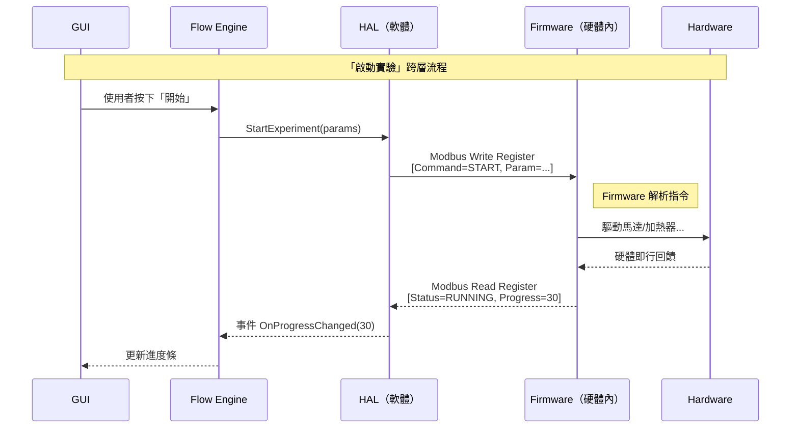

### 關鍵關係：HAL 與 Firmware 的「契約」

```
HAL 和 Firmware 之間只共享一件事：
        Register Map 協議文件

博錸定義「我要做什麼」 → IHardwareService 介面
Firmware 對應實作「怎麼做」 → Register 讀寫
HAL 對應對接「如何說」 → Modbus 指令結構

只要 Register Map 不變，就童叟無欺——兩邊不影響對方。
```

| 一方變更 | 另一方影響 |
|---------|-----------|
| Firmware 內部演算法更新 | HAL **不需改動**（Register 介面不變） |
| HAL 程式碼重構 | Firmware **不需改動** |
| Register Map 變更 | **兩邊都要改** — 這是唯一的耦合點 |

---

## 十、GUI 與 HAL 需要溝通的項目

> GUI 不直接跟 HAL 說話，都透過 **Flow Engine** 中轉。
> 以下清單為「業務語言」的需求，實際拆複由 Flow 和 HAL 分擔。

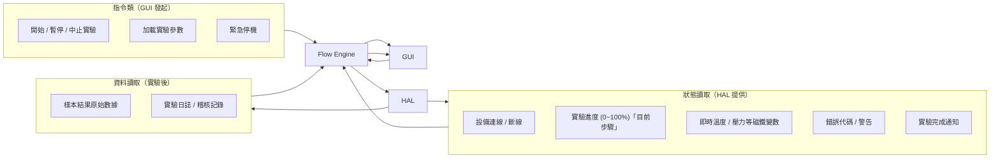

### 具體項目對照表

| 類別 | GUI 的需求 | 對應 HAL 操作 | Modbus 方式 |
|------|------------|---------------|-------------|
| **指令** | 啟動實驗 | StartExperiment() | Write Register: CMD=START |
| **指令** | 暫停實驗 | PauseExperiment() | Write Register: CMD=PAUSE |
| **指令** | 中止實驗 | AbortExperiment() | Write Register: CMD=ABORT |
| **指令** | 緊急停機 | EmergencyStop() | Write Coil: ESTOP=1 |
| **狀態** | 設備是否連線 | IsConnected | Ping / Read Status Reg |
| **狀態** | 實驗進度 | Progress (0~100) | Read Register: 0x0003 |
| **狀態** | 目前步驟名稱 | CurrentStep | Read Register: 0x0002 |
| **狀態** | 錯誤資訊 | LastError | Read Register: 0x0001 |
| **磁鐵變數** | 溫度（若有） | GetTemperature() | Read Register: TBD |
| **結果** | 樣本網格變光度 | ReadSampleResults() | Read Registers: 0x0300~ |
| **設定** | 載入實驗參數 | LoadProtocol(params) | Write Registers: 0x0200~ |

### GUI 跟 HAL 說話的正確方式

```
✘ 錯誤：GUI 直接呼叫 Modbus
   DataListPage.xaml.cs 裡面擺 ModbusClient.WriteRegister()

✔ 正確：GUI 只跟業務層說話
   GUI 呼叫 flowEngine.StartExperiment(protocol)
       ↓
   Flow Engine 處理業務邏輯（驗證/排程/日誌）
       ↓
   HAL 處理協議細節 (Modbus 指令結構)
       ↓
   Firmware 執行硬體動作
```

---

## 十一、OS 層規劃

### OS 在整個架構中的位置

```
Sniper 設備 ←→ COM Port/TCP (由 OS 提供)
                              ↓
              Windows IoT Enterprise LTSC ←—「博麗設定」
                    │
          ┌──────────│──────────┐
          │         Kiosk 模式      │
          │   ↓                    │
          │   TRIO2026.App (WPF)   │
          │   PrivilegedService     │
          │   HAL / FlowEngine      │
          └────────────────────┘
```

### 已完成的 OS 層工作

| 已完成 | 對應 OS 功能 |
|---------|-------------|
| `PrivilegedService.exe` | **Windows Service** — 以 SYSTEM 身份執行，解決 USB 格式化提權 |
| Named Pipe IPC | App ↔ Service 跟程序間通訊 |
| USB Security Service | 呼叫 OS 的 `DriveInfo` / `Directory` API |
| Login Required 設定 | 模擬 Kiosk 行為（免登入 Guest 模式）|
| `部署到隨身碟.bat` | 部署打包手動腳本 |

### 尚未規劃的 OS 層項目

| 項目 | 建議方案 | 優先度 |
|------|----------|--------|
| **Kiosk 模式** | Windows Assigned Access 單 App 模式 | 🔴 高 |
| **開機自動啟動 App** | 工作排程器 Task Scheduler 觸發 | 🔴 高 |
| **COM Port 號碼穩定** | 設備管理員固定號碼，或 `system_settings` 可設定 | 🔴 高（Modbus 需要） |
| **Windows Update 管理** | 停用自動重開機 | 🟡 中 |
| **自動登入 Windows 帳號** | Autologin 設定（搭配 Kiosk） | 🟡 中 |
| **部署自動化** | 改善 `.bat` 加入 Task Scheduler 設定 | 🟢 低 |

### OS 規格建議

| 項目 | 建議 | 原因 |
|------|------|------|
| **版本** | Windows 10 IoT Enterprise LTSC 2021 | 長期支援，無強制更新，Kiosk 功能完整 |
| **架構** | x64 | .NET 8 WPF 需求 |
| **Kiosk** | Assigned Access 單 App 模式 | 防止使用者誤操作 |
| **Update** | 停用自動重開機 | 避免實驗中斷 |
| **登入** | 自動登入 Windows 帳號 | 搭配 Kiosk 模式，不顯示 Windows 登入畫面 |
| **使用者管理** | TRIO2026 App 內部管理 | 不依賴 Windows 帳號切換 |

### Kiosk 展開後的開機流程

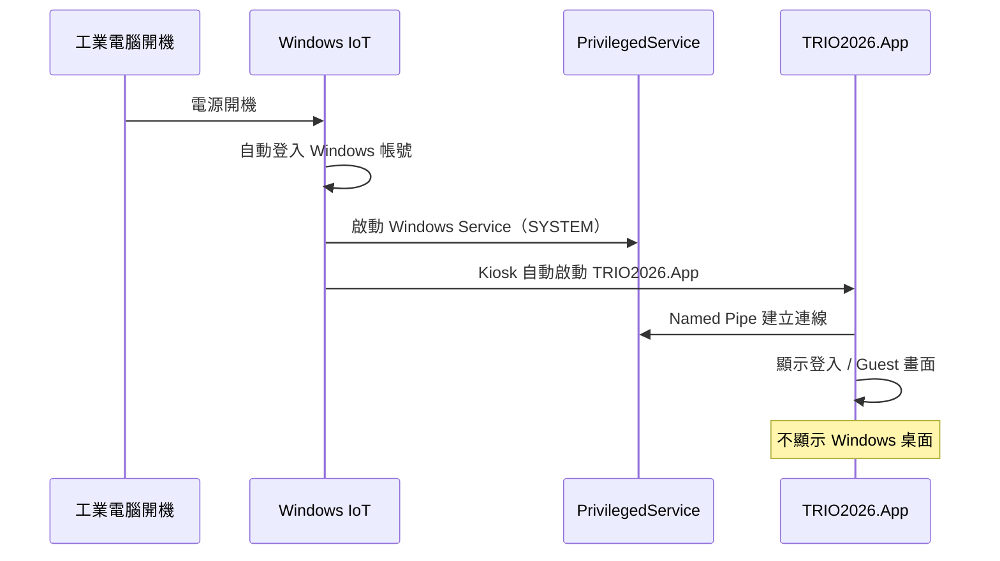

---

## 十二、博錸軟體內部資料流動

### 整體資料流全景

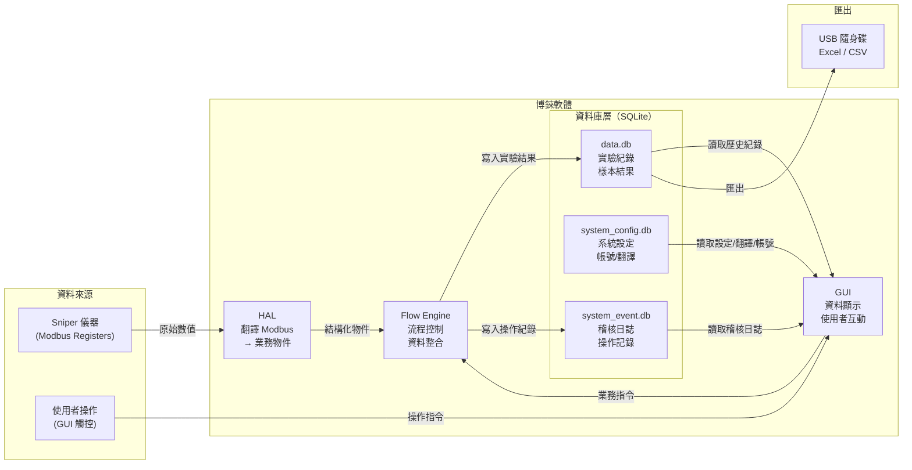

---

### 五條主要資料流

#### 流 1：實驗結果流（最核心）

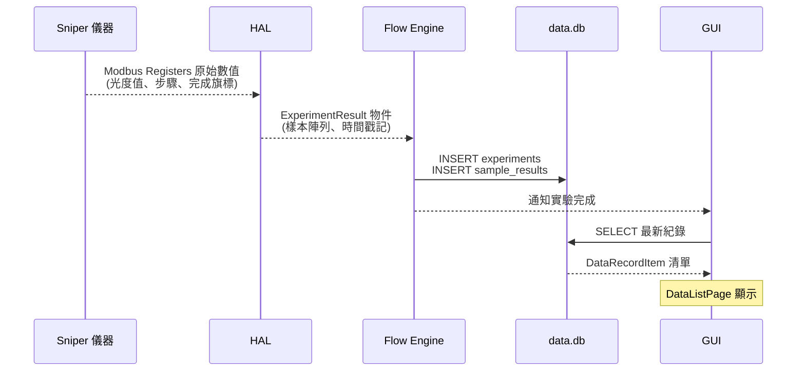

#### 流 2：即時狀態流（實驗進行中）

```
Sniper 儀器                              GUI
  │                                       │
  │  每 500ms Modbus Poll                 │
  │ ←────────── HAL ──────────────        │
  │             │ OnProgressChanged(45)   │
  │             └────── Flow Engine ─────→│
  │                                       │ 更新進度條
  │                                       │ 顯示當前步驟
  │                                       │ 顯示即時溫度
```

#### 流 3：設定流（App 啟動 & 運行中）

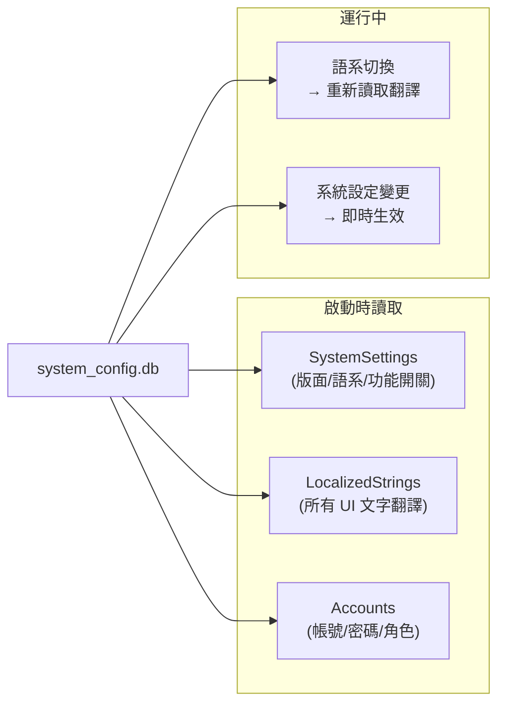

#### 流 4：稽核日誌流（持續寫入）

```
所有層都可寫入 EventLog
─────────────────────────────────────────
GUI 層：  使用者點擊按鈕 → LogButtonClick()
          登入/登出      → LogAuth()
Flow 層： 實驗開始/結束  → LogInfo()
          實驗中止       → LogWarning()
HAL 層：  設備連線/斷線  → LogInfo()
          硬體錯誤       → LogError()
OS/USB：  USB 掃描結果  → LogWarning()
          格式化操作     → LogInfo()
─────────────────────────────────────────
全部寫入 → system_event.db
```

#### 流 5：匯出流（USB 下載）

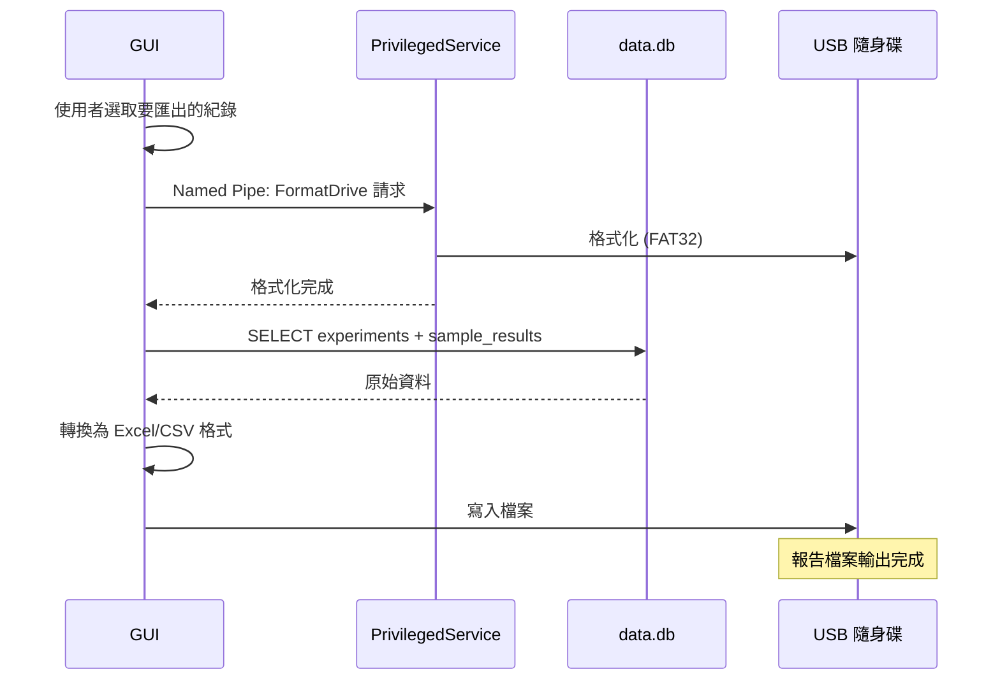

---

### 資料庫職責分工

| 資料庫 | 存放內容 | 讀取者 | 寫入者 |
|--------|----------|--------|--------|
| **data.db** | 實驗紀錄、樣本結果 | GUI (DataListPage/DetailPage) | Flow Engine（實驗完成後） |
| **system_config.db** | 系統設定、帳號、翻譯字串 | GUI (全部頁面) | 管理員透過 GUI 設定 |
| **system_event.db** | 稽核日誌、操作記錄 | GUI (稽核頁面) | 所有層（EventLogService） |

### 資料流中各層的角色

| 層次 | 對資料的職責 |
|------|-------------|
| **HAL** | 把 Modbus 原始數值（整數）翻譯成業務物件（`ExperimentResult`） |
| **Flow Engine** | 決定資料什麼時候、用什麼格式寫入 DB；協調多個資料流的時序 |
| **GUI** | 只讀取，不直接修改業務資料；透過 Flow Engine 間接觸發寫入 |
| **EventLogService** | 跨越所有層的橫切關注點，每個重要操作都寫入 event log |
| **Repository** | DB 存取的唯一入口，Flow Engine 和 GUI 都透過 Repository 操作 DB |

---

*製作者: Office of William*
