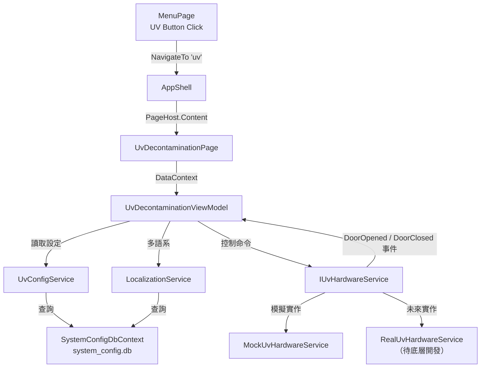

# UV Decontamination 功能實施計劃

UV 消毒功能允許使用者從主選單進入 UV 頁面，選擇照射時間（透過左右方向鍵），啟動 UV 燈後進行倒數計時。過程中若門板開啟則暫停運行並顯示警示，門板關閉後恢復繼續。倒數結束後顯示完成提示，返回初始狀態。

> [!IMPORTANT]
> 目前無底層硬體通訊函式，本計劃將**實作完整 UI 邏輯**並**預留通訊介面（Interface）**，待底層實作完成後直接替換注入即可。

---

## 檔案架構澄清

本專案已從多 Window 架構遷移至 **AppShell（單一 Window）+ Pages（UserControl 頁面切換）** 架構。

| 狀態 | 路徑 | 檔案 | 說明 |
|------|------|------|------|
| ✅ **Active** | `Views/AppShell.xaml` | AppShell | 單一 Window 殼層，所有頁面在此切換 |
| ✅ **Active** | `Views/Pages/InitPage.xaml` | InitPage | 初始化倒數頁面 |
| ✅ **Active** | `Views/Pages/LoginPage.xaml` | LoginPage | 登入頁面 |
| ✅ **Active** | `Views/Pages/MenuPage.xaml` | MenuPage | 主選單頁面 |
| ✅ **NEW** | `Views/Pages/UvDecontaminationPage.xaml` | UvDecontaminationPage | **本次新增** — UV 消毒頁面 |
| ⚠️ **Deprecated** | `Views/MainWindow.xaml` | MainWindow | 已由 MenuPage 取代，已標記 `[Obsolete]` |
| ⚠️ **Deprecated** | `Views/LoginWindow.xaml` | LoginWindow | 已由 LoginPage 取代，已標記 `[Obsolete]` |
| ⚠️ **Deprecated** | `Views/InitWindow.xaml` | InitWindow | 已由 InitPage 取代，已標記 `[Obsolete]` |

> [!NOTE]
> **所有新功能頁面一律建立在 `Views/Pages/` 目錄下**，以 `UserControl` 形式實作，透過 `AppShell.NavigateTo()` 切換。
> 三個 Deprecated 的 Window 檔案已在本次加上 `[Obsolete]` 標記。

---

## User Review Required

> [!WARNING]
> **門板中斷機制**：目前規劃以 `IUvHardwareService` 介面的 `DoorOpened` / `DoorClosed` 事件來模擬。實際整合時需確認底層 sensor 事件的觸發方式（GPIO interrupt / Modbus polling / 串口通訊）。目前硬體及韌體層架構尚未確定，先以此行為設計，保留變更彈性。

---

## 已確認的設計決策

| # | 決策項目 | 結論 |
|---|---------|------|
| 1 | 門板警示自動消失 | ✅ 門板關閉後警示自動消失並恢復倒數，無需手動確認。保留變更彈性 |
| 2 | UV 啟動期間畫面鎖定 | ✅ 倒數期間鎖定畫面，僅 Stop 按鈕可用。Stop 後按鈕恢復為 Start，才能透過右上角 icon 返回 HOME |
| 3 | DB 設計 | ✅ 採用獨立 `system_config.db`，含 `UvTimerOption` + `LocalizedString` 表 |
| 4 | 硬體通訊 | 底層架構待定，先以 `IUvHardwareService` 介面 + Mock 實作，保留彈性 |

## 已解決的 Open Questions

| # | 問題 | 結論 |
|---|------|------|
| 1 | UV 時間選項上限 | 由 DB 值決定可啟用哪些時間，無硬編碼上限 |
| 2 | 倒數期間畫面鎖定 | 需要鎖定，僅 Stop 按鈕可用 |
| 3 | 門板警示自動消失 | 門板關閉後警示消失，程式繼續執行倒數 |
| 4 | 底層通訊協議 | 預設會使用 Modbus，保留修改彈性 |

---

## Proposed Changes

整體架構依循現有專案結構（`TRIO2026.Core` → `TRIO2026.Data` → `TRIO2026.App`），採用 **MVVM 模式**，以 ViewModel 管理狀態、View 負責顯示、Service 處理業務邏輯。



---

### Component 1: 資料庫層 ✅ 已完成

> [!IMPORTANT]
> UV 與多語系資料存放於**獨立的 `system_config.db`**（`SystemConfigDbContext`），與舊有 `trio240plus_*.db` 完全隔離，不影響現有 login/init/main 功能。

**資料庫分離架構：**

| DB 檔案 | Context | 內容 | 狀態 |
|---------|---------|------|------|
| `trio240plus_config.db` | ConfigDbContext | SystemConfig, CommandDefinition | 🔒 不變動 |
| `trio240plus_main.db` | MainDbContext | UserAccount, FlowMapping 等 | 🔒 不變動 |
| `trio240plus_data.db` | DataDbContext | TestRecord 等 | 🔒 不變動 |
| `trio240plus_log.db` | LogDbContext | OperationLog 等 | 🔒 不變動 |
| **`system_config.db`** | **SystemConfigDbContext** | **UvTimerOption, LocalizedString** | ✅ 新增 |

#### [NEW] [UvTimerOption.cs](file:///d:/TRIO2026/src/TRIO2026.Core/Entities/UvTimerOption.cs) ✅

| 欄位 | 類型 | 說明 |
|------|------|------|
| `Id` | int (PK, Auto) | 主鍵 |
| `DurationSeconds` | int (UNIQUE) | 照射秒數 (900=15分鐘) |
| `DisplayLabel` | string | UI 顯示文字 ("15:00") |
| `IsEnabled` | int (0/1) | 是否在 UI 上顯示 |
| `IsDefault` | int (0/1) | 是否為預設選項（僅一筆為 1） |
| `SortOrder` | int | 左右切換順序 |
| `Description` | string? | 管理備註 |

#### [NEW] [LocalizedString.cs](file:///d:/TRIO2026/src/TRIO2026.Core/Entities/LocalizedString.cs) ✅

| 欄位 | 類型 | 說明 |
|------|------|------|
| `Id` | int (PK, Auto) | 主鍵 |
| `Module` | string | 功能模組 ("Common", "UV", "Login") |
| `ResourceKey` | string | 資源鍵值 ("Title", "Start") |
| `LanguageCode` | string | 語系代碼 ("en", "zh-TW", "zh-CN", "ja") |
| `Value` | string | 翻譯文字 |
| `Description` | string? | 備註 |

UNIQUE(Module, ResourceKey, LanguageCode) + 索引: LanguageCode, (Module, LanguageCode)

#### 已建立的檔案 ✅
- [SystemConfigDbContext.cs](file:///d:/TRIO2026/src/TRIO2026.Data/Contexts/SystemConfigDbContext.cs)
- [UvTimerOptionSeed.cs](file:///d:/TRIO2026/src/TRIO2026.Data/Seeding/UvTimerOptionSeed.cs)
- [LocalizedStringSeed.cs](file:///d:/TRIO2026/src/TRIO2026.Data/Seeding/LocalizedStringSeed.cs) — DB 初始資料載入器，僅首次執行
- [DatabaseInitializer.cs](file:///d:/TRIO2026/src/TRIO2026.Data/Extensions/DatabaseInitializer.cs) — 新增 `InitializeSystemConfigDbAsync()`
- [DesignTimeDbContextFactory.cs](file:///d:/TRIO2026/src/TRIO2026.Data/DesignTimeDbContextFactory.cs) — 新增 SystemConfigDbContextFactory
- [App.xaml.cs](file:///d:/TRIO2026/src/TRIO2026.App/App.xaml.cs) — DI 註冊 + Migration
- Migration: `SystemConfig/20260514025600_InitialCreate`
- 舊 DB 備份: `Database/.backups/20260514_105500/`

---

### Component 2: 通訊介面層 (TRIO2026.Core)

#### [NEW] IUvHardwareService.cs
- **路徑**: `d:\TRIO2026\src\TRIO2026.Core\Interfaces\IUvHardwareService.cs`
- 定義底層 UV 燈控制與門板感測的抽象介面
- 預設將使用 Modbus 通訊，但介面設計與協議無關，保留變更彈性

```csharp
public interface IUvHardwareService
{
    /// <summary>啟動 UV 燈</summary>
    Task<bool> StartUvLampAsync();

    /// <summary>停止 UV 燈</summary>
    Task<bool> StopUvLampAsync();

    /// <summary>門板開啟事件（底層 sensor 中斷通知 UI）</summary>
    event EventHandler? DoorOpened;

    /// <summary>門板關閉事件（底層 sensor 通知門板已關閉，可恢復 UV）</summary>
    event EventHandler? DoorClosed;
}
```

---

### Component 3: 服務層 (TRIO2026.App)

#### [NEW] UvConfigService.cs
- **路徑**: `d:\TRIO2026\src\TRIO2026.App\Services\UvConfigService.cs`
- 從 `SystemConfigDbContext` 讀取 UV 配置，提供：
  - `List<UvTimerOption> GetEnabledOptions()` — 取得已啟用的時間選項（依 SortOrder 排序）
  - `UvTimerOption GetDefaultOption()` — 取得預設選項

#### [NEW] LocalizationService.cs
- **路徑**: `d:\TRIO2026\src\TRIO2026.App\Services\LocalizationService.cs`
- DB 驅動的多語系服務，從 `SystemConfigDbContext.LocalizedString` 讀取翻譯
- 實作 `INotifyPropertyChanged`，語系切換時通知所有 XAML 綁定即時更新
- 提供 `this[string key]` 索引器供 XAML Binding 使用
- `SwitchLanguage(string langCode)` — 切換語系並重新載入

#### [NEW] MockUvHardwareService.cs
- **路徑**: `d:\TRIO2026\src\TRIO2026.App\Services\MockUvHardwareService.cs`
- 實作 `IUvHardwareService` 的模擬版本：
  - `StartUvLampAsync()` → 回傳 `true`，僅記錄日誌
  - `StopUvLampAsync()` → 回傳 `true`，僅記錄日誌
  - 提供 `SimulateDoorOpen()` / `SimulateDoorClose()` 方法供開發測試使用

---

### Component 4: ViewModel 層 (TRIO2026.App)

#### [NEW] UvDecontaminationViewModel.cs
- **路徑**: `d:\TRIO2026\src\TRIO2026.App\ViewModels\UvDecontaminationViewModel.cs`
- 繼承 `ViewModelBase`，負責所有 UV 頁面的業務邏輯

**核心屬性：**
| 屬性 | 類型 | 說明 |
|------|------|------|
| `TimeOptions` | `List<int>` | 可選時間列表（秒） |
| `SelectedTimeIndex` | `int` | 當前選中的時間索引 |
| `SelectedTimeSeconds` | `int` | 當前選中的秒數（計算屬性） |
| `RemainingSeconds` | `int` | 倒數剩餘秒數 |
| `RemainingDisplay` | `string` | 格式化顯示 `mm:ss` |
| `IsRunning` | `bool` | UV 是否運行中 |
| `IsPaused` | `bool` | 是否因門板開啟暫停 |
| `IsDoorOpen` | `bool` | 門板是否開啟 |

**核心命令/方法：**
| 方法 | 說明 |
|------|------|
| `SelectPrevious()` | 方向鍵左 — 切換上一個時間選項 |
| `SelectNext()` | 方向鍵右 — 切換下一個時間選項 |
| `StartAsync()` | 啟動 UV 燈 + 開始倒數 |
| `Stop()` | 手動停止 UV 燈 + 停止倒數 |
| `OnDoorOpened()` | 門板開啟處理 — 暫停倒數、通知 View 顯示警示 |
| `OnDoorClosed()` | 門板關閉處理 — 恢復倒數、通知 View 關閉警示 |
| `Reset()` | 重置為初始狀態（倒數結束或手動 Stop 後） |

**倒數機制：**
- 使用 `DispatcherTimer`（1 秒間隔），每 tick 遞減 `RemainingSeconds`
- 門板開啟時暫停 Timer，關閉後恢復 Timer
- 倒數歸零時：停止 UV 燈 → 觸發 `CountdownCompleted` 事件

**事件：**
| 事件 | 用途 |
|------|------|
| `CountdownCompleted` | 倒數結束，View 顯示完成提示 |
| `DoorInterrupted` | 門板開啟，View 顯示錯誤 Overlay |
| `DoorResumed` | 門板關閉，View 隱藏錯誤 Overlay |

---

### Component 5: View 層 (TRIO2026.App)

#### [NEW] UvDecontaminationPage.xaml / .xaml.cs
- **路徑**: `d:\TRIO2026\src\TRIO2026.App\Views\Pages\UvDecontaminationPage.xaml`
- **路徑**: `d:\TRIO2026\src\TRIO2026.App\Views\Pages\UvDecontaminationPage.xaml.cs`

**頁面佈局（600×960 設計基準）：**

```
┌──────────────────────────────────────────────┐
│  TRIO 2026        UV Decontamination    🏠   │ ← 頂部列 (80px)
│                                    (HOME)    │   倒數期間 🏠 灰顯/禁用
├──────────────────────────────────────────────┤
│                                              │
│              💡 (UV 圖示)                     │
│                                              │
│       ◀     15:00     ▶                      │ ← 觸控方向鍵 + 時間
│      (觸控按鈕)  (大字)  (觸控按鈕)              │   (未啟動時顯示)
│                                              │
│              14:32                           │ ← 倒數計時顯示
│           (大字 mm:ss)                        │   (啟動後顯示)
│                                              │
│          ┌──────────────┐                    │
│          │    Start     │                    │ ← 藍底白字 Start
│          └──────────────┘                    │   啟動後變紅底 Stop
│                                              │
├──────────────────────────────────────────────┤
│  TRIO2026 v2026.1.0           ● Ready        │ ← 底部列 (40px)
└──────────────────────────────────────────────┘
```

**觸控面板操作設計：**
- ◀ ▶ 按鈕尺寸至少 60×60px，確保手指可輕鬆點擊
- Start/Stop 按鈕 200×50px 以上
- 右上角 🏠 HOME 按鈕在倒數期間灰顯並禁用（`IsEnabled = !IsRunning`）
- 倒數期間隱藏 ◀ ▶ 箭頭，防止誤觸

**互動邏輯：**

1. **初始狀態**：顯示預設時間、藍色 Start 按鈕、左右箭頭可切換時間
2. **啟動後**：
   - 隱藏時間選擇器箭頭
   - 開始倒數顯示 `mm:ss`
   - Start 按鈕變為紅底白字 Stop
3. **倒數結束**：
   - 彈出 OverlayDialog (Information)：「UV light is completed. Please back to HOME screen.」
   - 藍底白字 OK 按鈕
   - 按 OK → 重置為初始狀態
4. **門板開啟**：
   - 暫停倒數
   - 彈出 UvDoorErrorOverlay（全螢幕警示）
5. **門板關閉**：
   - 自動隱藏警示 Overlay
   - 恢復倒數
6. **手動 Stop**：
   - 停止 UV 燈
   - 重置為初始狀態

#### [NEW] UvDoorErrorOverlay.xaml / .xaml.cs
- **路徑**: `d:\TRIO2026\src\TRIO2026.App\Controls\UvDoorErrorOverlay.xaml`
- **路徑**: `d:\TRIO2026\src\TRIO2026.App\Controls\UvDoorErrorOverlay.xaml.cs`

**警示視窗設計：**

```
┌──────────────────────────────────────┐
│        (半透明深色遮罩)                │
│                                      │
│          ╔══════════════╗            │
│          ║              ║            │
│          ║   ❌ (紅底    ║            │ ← 紅底白條紋圓形叉叉圖案
│          ║   白條紋叉叉) ║            │   使用 WPF Path/Canvas 繪製
│          ║              ║            │
│          ║   Error!     ║            │ ← 灰色較大文字
│          ║              ║            │
│          ║ The door is  ║            │ ← 紅色文字
│          ║ open. Please ║            │
│          ║ close the    ║            │
│          ║ door to      ║            │
│          ║ proceed.     ║            │
│          ╚══════════════╝            │
│                                      │
└──────────────────────────────────────┘
```

- 無按鈕：門板關閉後自動消失
- 紅底白條紋叉叉使用 WPF `Canvas` + `Ellipse` + `Line`/`Path` 繪製
- 進場/退場動畫（淡入淡出 + Scale）

---

### Component 6: 導航整合

#### [MODIFY] [AppShell.xaml.cs](file:///d:/TRIO2026/src/TRIO2026.App/Views/AppShell.xaml.cs)
- 在 `NavigateTo()` 新增 `case "uv"` 路由
- 新增 `_uvPage` 欄位與 `CreateUvPage()` 工廠方法
- UV 頁面需要存取 `DialogOverlay`（完成提示用）

#### [MODIFY] [MenuPage.xaml.cs](file:///d:/TRIO2026/src/TRIO2026.App/Views/Pages/MenuPage.xaml.cs)
- `OnUVClick` 事件改為導航至 UV 頁面：
```csharp
private void OnUVClick(object sender, RoutedEventArgs e)
{
    var shell = Window.GetWindow(this) as AppShell;
    shell?.NavigateTo("uv");
}
```

#### [MODIFY] [App.xaml.cs](file:///d:/TRIO2026/src/TRIO2026.App/App.xaml.cs)
- DI 註冊 `UvConfigService`
- DI 註冊 `IUvHardwareService` → `MockUvHardwareService`
- 啟動時載入 `uv` category 配置：`configService.LoadCategoryAsync("uv")`

---

### Component 7: 多語系架構（DB 驅動）

**架構**：所有 UI 字串存放於 `system_config.db` → `LocalizedString` 表，透過 `LocalizationService` 讀取，XAML 使用 Binding 即時渲染。

**支援語系**：`en`（英文）、`zh-TW`（繁體中文）、`zh-CN`（簡體中文）、`ja`（日語）

**XAML 綁定方式**：
```xml
<TextBlock Text="{Binding [UV.Title], Source={x:Static svc:LocalizationService.Instance}}" />
```

語系切換時 `LocalizationService` 觸發 `PropertyChanged`，所有綁定自動更新。

**DB 種子資料**（已建立於 [LocalizedStringSeed.cs](file:///d:/TRIO2026/src/TRIO2026.Data/Seeding/LocalizedStringSeed.cs)）：

| Module | ResourceKey | en | zh-TW | zh-CN | ja |
|--------|------------|----|----|----|----|----|
| Common | OK | OK | 確定 | 确定 | OK |
| Common | Cancel | Cancel | 取消 | 取消 | キャンセル |
| UV | Title | UV Decontamination | UV 消毒 | UV 消毒 | UV 除染 |
| UV | Start | Start | 開始 | 开始 | スタート |
| UV | Stop | Stop | 停止 | 停止 | ストップ |
| UV | CompleteMessage | UV light is completed... | UV 照射完成... | UV 照射完成... | UV照射が完了... |
| UV | DoorErrorMessage | The door is open... | 門板已開啟... | 门板已打开... | ドアが開いています... |

---

## 新增/異動檔案清單

| 操作 | 專案 | 檔案路徑 | 狀態 |
|------|------|---------|------|
| **NEW** | Core | `Entities/UvTimerOption.cs` | ✅ |
| **NEW** | Core | `Entities/LocalizedString.cs` | ✅ |
| **NEW** | Core | `Interfaces/IUvHardwareService.cs` | |
| **NEW** | Data | `Contexts/SystemConfigDbContext.cs` | ✅ |
| **NEW** | Data | `Seeding/UvTimerOptionSeed.cs` | ✅ |
| **NEW** | Data | `Seeding/LocalizedStringSeed.cs` | ✅ |
| **NEW** | App | `Services/UvConfigService.cs` | |
| **NEW** | App | `Services/LocalizationService.cs` | |
| **NEW** | App | `Services/MockUvHardwareService.cs` | |
| **NEW** | App | `ViewModels/UvDecontaminationViewModel.cs` | |
| **NEW** | App | `Views/Pages/UvDecontaminationPage.xaml` | |
| **NEW** | App | `Views/Pages/UvDecontaminationPage.xaml.cs` | |
| **NEW** | App | `Controls/UvDoorErrorOverlay.xaml` | |
| **NEW** | App | `Controls/UvDoorErrorOverlay.xaml.cs` | |
| **MODIFY** | Data | `DesignTimeDbContextFactory.cs` | ✅ |
| **MODIFY** | Data | `Extensions/DatabaseInitializer.cs` | ✅ |
| **MODIFY** | App | `Views/AppShell.xaml.cs` — 新增 UV 路由 | |
| **MODIFY** | App | `Views/Pages/MenuPage.xaml.cs` — UV 按鈕導航 | |
| **MODIFY** | App | `App.xaml.cs` — DI 註冊 + Migration | ✅ |
| **DEPRECATED** | App | `Views/MainWindow.xaml.cs` | ✅ |
| **DEPRECATED** | App | `Views/LoginWindow.xaml.cs` | ✅ |
| **DEPRECATED** | App | `Views/InitWindow.xaml.cs` | ✅ |

---

## Verification Plan

### Automated Tests
1. **建置驗證**：`dotnet build` 確認編譯無錯誤
2. **種子資料驗證**：確認 `UvConfigSeed.GetSeedData()` 回傳正確筆數與格式

### Manual Verification
1. **啟動 App**：從 Menu 點擊 UV 按鈕 → 確認進入 UV 頁面
2. **時間選擇**：左右鍵切換時間選項，確認顯示正確
3. **啟動倒數**：按 Start → 確認倒數開始、按鈕變為紅底 Stop
4. **倒數結束**：等候倒數結束 → 確認彈出完成提示 → 按 OK 返回初始狀態
5. **手動停止**：啟動後按 Stop → 確認倒數停止、返回初始狀態
6. **門板中斷**（使用 Mock 模擬）：啟動後觸發門板開啟 → 確認暫停 + 警示顯示 → 觸發門板關閉 → 確認恢復倒數
7. **返回主選單**：按 Back 按鈕 → 確認回到 MenuPage
