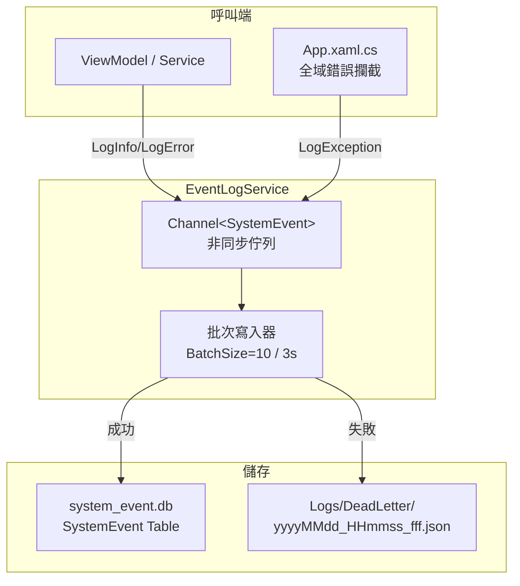

# 系統事件日誌架構 (system_event.db)

建立一套完善的結構化日誌機制，將系統事件寫入獨立的 `system_event.db`，提供完整的問題追蹤能力。DB 無法寫入時自動降級至 Dead Letter 檔案備援。

## User Review Required

> [!IMPORTANT]
> 此日誌系統與現有 `trio240plus_log.db`（OperationLog / CommunicationLog）**完全獨立**。
> 舊有 AuthService 的 `LogOperationAsync` 不會受到影響。

> [!WARNING]
> 建議未來將 AuthService 的 log 呼叫遷移至新的 `EventLogService`，但本次不做此變更，避免破壞既有功能。

## 設計決策

### 1. 為什麼不使用現有的 `trio240plus_log.db`？

| 比較 | `trio240plus_log.db` | `system_event.db`（新） |
|------|---------------------|----------------------|
| 用途 | 使用者操作 + Modbus 通訊 | **系統級事件**（錯誤、狀態、追蹤） |
| 欄位 | 簡單（Level, Category, Action） | 完整（StackTrace, CorrelationId, Tags...） |
| 寫入方式 | 同步 `SaveChangesAsync` | **非同步批次佇列** |
| 失敗處理 | `catch { }` 靜默吞掉 | **Dead Letter 檔案備援** |
| 查詢能力 | 基本 | **支援 CorrelationId 串聯追蹤** |

### 2. 為什麼使用獨立 DB 而非合併到 system_config.db？

- **職責分離**：`system_config.db` 存設定，`system_event.db` 存日誌
- **效能**：高頻寫入不影響低頻配置讀取
- **維護**：日誌 DB 可獨立清理、備份、輪轉

## DB Schema 設計

### SystemEvent 資料表

```sql
CREATE TABLE SystemEvent (
    Id              INTEGER PRIMARY KEY AUTOINCREMENT,
    
    -- 時間與追蹤
    Timestamp       TEXT NOT NULL,              -- ISO8601 UTC 時間戳
    TimestampLocal  TEXT NOT NULL,              -- 本地時間戳（方便人工閱讀）
    CorrelationId   TEXT,                       -- 關聯 ID（追蹤同一操作鏈的多筆日誌）
    
    -- 分類
    Level           TEXT NOT NULL,              -- Trace/Debug/Info/Warning/Error/Fatal
    Category        TEXT NOT NULL,              -- 分類: UV/Login/Navigation/Hardware/System
    Source          TEXT NOT NULL,              -- 來源類別名稱（如 UvDecontaminationViewModel）
    
    -- 內容
    EventCode       TEXT,                       -- 事件代碼（如 UV_START, DOOR_OPEN）
    Message         TEXT NOT NULL,              -- 事件訊息
    Detail          TEXT,                       -- 詳細資訊（JSON 或自由格式）
    
    -- 錯誤追蹤
    ExceptionType   TEXT,                       -- 例外類別名稱
    StackTrace      TEXT,                       -- 完整堆疊追蹤
    InnerException  TEXT,                       -- 內部例外訊息
    
    -- 上下文
    UserName        TEXT,                       -- 當前使用者
    SessionId       TEXT,                       -- Session ID
    Tags            TEXT,                       -- 自訂標籤（JSON array）
    
    -- 環境
    MachineName     TEXT,                       -- 機器名稱
    AppVersion      TEXT                        -- 應用版本
);

-- 效能索引
CREATE INDEX IX_SystemEvent_Timestamp ON SystemEvent(Timestamp);
CREATE INDEX IX_SystemEvent_Level ON SystemEvent(Level);
CREATE INDEX IX_SystemEvent_Category_Source ON SystemEvent(Category, Source);
CREATE INDEX IX_SystemEvent_CorrelationId ON SystemEvent(CorrelationId);
CREATE INDEX IX_SystemEvent_EventCode ON SystemEvent(EventCode);
```

## Proposed Changes

### Core Layer（Entity 定義）

#### [NEW] [SystemEvent.cs](file:///d:/TRIO2026/src/TRIO2026.Core/Entities/SystemEvent.cs)
- `SystemEvent` Entity，完整對應上述 Schema
- 提供 `CreateInfo`/`CreateError` 等靜態工廠方法，簡化建構

---

### Data Layer（DbContext + Migration）

#### [NEW] [EventLogDbContext.cs](file:///d:/TRIO2026/src/TRIO2026.Data/Contexts/EventLogDbContext.cs)
- 管理 `system_event.db`
- 設定表名、索引、必填欄位

#### [MODIFY] [DesignTimeDbContextFactory.cs](file:///d:/TRIO2026/src/TRIO2026.Data/DesignTimeDbContextFactory.cs)
- 新增 `EventLogDbContextFactory` 支援 `dotnet ef migrations add`

#### [MODIFY] [DatabaseInitializer.cs](file:///d:/TRIO2026/src/TRIO2026.Data/Extensions/DatabaseInitializer.cs)
- 新增 `InitializeEventLogDbAsync()` 使用 `MigrateAsync()`

---

### App Layer（EventLogService + Dead Letter）

#### [NEW] [EventLogService.cs](file:///d:/TRIO2026/src/TRIO2026.App/Services/EventLogService.cs)

核心服務，提供：

| 功能 | 說明 |
|------|------|
| **非同步佇列** | `Channel<SystemEvent>` 生產者-消費者模式，寫入不阻塞呼叫端 |
| **批次寫入** | 累積至 `BatchSize`（預設 10）或超時 `FlushInterval`（預設 3 秒）後統一寫入 DB |
| **Dead Letter** | DB 寫入失敗時，將事件序列化為 JSON 存至 `Logs/DeadLetter/{yyyyMMdd_HHmmss_fff}.json` |
| **API 介面** | `LogInfo()` / `LogWarning()` / `LogError()` / `LogFatal()` / `LogException()` |
| **CorrelationId** | 支援 `using (service.BeginScope("操作名稱"))` 自動串聯追蹤 |
| **Graceful Shutdown** | `IDisposable`，App 關閉時 flush 剩餘佇列 |

```csharp
// 使用範例
EventLogService.Instance.LogInfo("UV", "UvDecontaminationViewModel", "UV_START", 
    "UV 照射啟動", detail: "duration=900s");

EventLogService.Instance.LogException("System", "App", ex, 
    "全域未處理例外");
```

---

### App Layer（全域錯誤攔截）

#### [MODIFY] [App.xaml.cs](file:///d:/TRIO2026/src/TRIO2026.App/App.xaml.cs)

```diff
 DispatcherUnhandledException += (s, ex) =>
 {
+    // 寫入結構化日誌
+    EventLogService.Instance?.LogException("System", "App", 
+        ex.Exception, "DispatcherUnhandledException");
+
     MessageBox.Show(
         $"未處理的錯誤:\n\n{ex.Exception.Message}\n\n{ex.Exception.StackTrace}",
         "TRIO2026 錯誤", MessageBoxButton.OK, MessageBoxImage.Error);
     ex.Handled = true;
 };
```

- 新增 DI 註冊 `EventLogDbContext` + `EventLogService`
- 新增 `AppDomain.CurrentDomain.UnhandledException` 攔截

---

### Dead Letter 備援機制

```
D:\TRIO2026\Logs\DeadLetter\
├── 20260514_132719_123.json    ← 寫入失敗的事件
├── 20260514_132720_456.json
└── ...
```

JSON 結構：
```json
{
  "writeError": "database is locked",
  "events": [
    {
      "timestamp": "2026-05-14T05:27:19.123Z",
      "level": "Error",
      "category": "UV",
      "source": "UvDecontaminationViewModel",
      "message": "UV 啟動失敗",
      "stackTrace": "..."
    }
  ]
}
```

命名格式：`{yyyyMMdd}_{HHmmss}_{fff}.json`（年月日\_時分秒\_毫秒）

## 架構圖



## 新增檔案清單

| 路徑 | 用途 | 狀態 |
|------|------|------|
| `Core/Entities/SystemEvent.cs` | Entity 定義 | 待實作 |
| `Data/Contexts/EventLogDbContext.cs` | DbContext | 待實作 |
| `App/Services/EventLogService.cs` | 非同步日誌服務 + Dead Letter | 待實作 |

## 修改檔案清單

| 路徑 | 變更 | 狀態 |
|------|------|------|
| `Data/DesignTimeDbContextFactory.cs` | 新增 `EventLogDbContextFactory` | 待實作 |
| `Data/Extensions/DatabaseInitializer.cs` | 新增 `InitializeEventLogDbAsync()` | 待實作 |
| `App/App.xaml.cs` | DI 註冊 + 全域錯誤攔截整合 | 待實作 |

## Verification Plan

### Automated Tests
1. `dotnet build` 編譯通過
2. `dotnet run --project tools/DbInitializer` 建立 `system_event.db`
3. 啟動 App → 觸發 UV 功能 → 驗證 DB 寫入
4. 模擬 DB 鎖定 → 驗證 Dead Letter 檔案產出

### Manual Verification
- 查詢 `system_event.db` 確認日誌記錄完整
- 檢查 `Logs/DeadLetter/` 目錄是否在正常情況下為空
