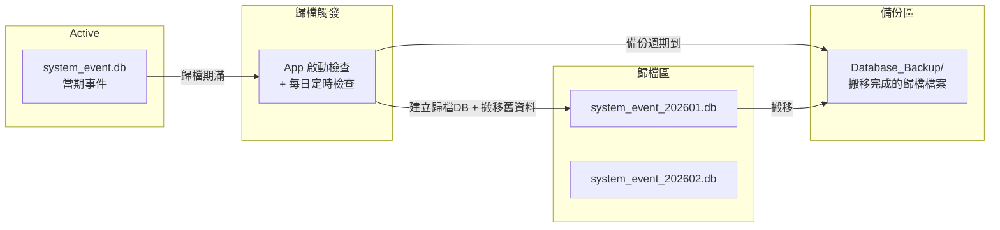

# EventLog 歸檔與備份機制

在 air-gapped 醫療設備環境中，實現 system_event.db 的自動歸檔與檔案搬移，
確保 active DB 體積可控、歷史日誌可追溯。

## 設計概述



## DB 設定項（system_config.db → SystemSetting 表）

| Category | Key | Value | 說明 |
|----------|-----|-------|------|
| EventLog | archive_interval | `monthly` | 歸檔區間：`monthly`(預設) / `weekly` / `quarterly` |
| EventLog | backup_schedule_days | `30` | 幾天執行一次歸檔檔案搬移（預設 30 天） |
| EventLog | last_archive_date | `2026-05-01` | 上次歸檔執行日期（由系統自動更新） |
| EventLog | last_backup_date | `2026-05-01` | 上次備份搬移執行日期（由系統自動更新） |

> [!NOTE]
> `last_archive_date` 和 `last_backup_date` 由系統自動寫入，不需手動設定。

## 歸檔流程

### 1. 歸檔（Archive）— 將舊資料從 active DB 抽出

```
觸發時機：App 啟動 + 每日定時檢查
判斷條件：當前日期 > last_archive_date + archive_interval

步驟：
  1. 計算歸檔區間（例如 2026-01 月的資料）
  2. 建立 system_event_202601.db（使用 MigrateAsync 建表）
  3. 從 active DB 讀取該區間的 SystemEvent
  4. 寫入歸檔 DB
  5. 從 active DB 刪除已歸檔的資料
  6. VACUUM active DB（回收空間）
  7. 更新 last_archive_date
```

### 2. 備份搬移（Backup）— 將歸檔 DB 搬到 Database_Backup

```
觸發時機：歸檔完成後檢查
判斷條件：當前日期 > last_backup_date + backup_schedule_days

步驟：
  1. 掃描 Database/ 下的 system_event_*.db 檔案
  2. 排除當期的歸檔檔案
  3. 搬移至 Database_Backup/ 目錄
  4. 更新 last_backup_date
```

### 最終目錄結構

```
D:\TRIO2026\
├── Database/
│   ├── system_event.db              ← active（當期）
│   ├── system_event_202605.db       ← 本月歸檔（尚未搬移）
│   └── ...其他 DB
└── Database_Backup/
    ├── system_event_202601.db       ← 已搬移的歷史歸檔
    ├── system_event_202602.db
    └── system_event_202603.db
```

## Proposed Changes

### 設定層

#### [MODIFY] [SystemSettingSeed.cs](file:///d:/TRIO2026/src/TRIO2026.Data/Seeding/SystemSettingSeed.cs)
- 新增 4 筆 EventLog 分類設定

#### [MODIFY] [SystemSettingService.cs](file:///d:/TRIO2026/src/TRIO2026.App/Services/SystemSettingService.cs)
- 新增 `ArchiveInterval`、`BackupScheduleDays` 等便利屬性
- 新增 `SetLiveString()` 方法（用於更新 last_archive_date / last_backup_date）

---

### 歸檔服務

#### [NEW] [EventLogArchiveService.cs](file:///d:/TRIO2026/src/TRIO2026.App/Services/EventLogArchiveService.cs)

| 方法 | 說明 |
|------|------|
| `CheckAndArchiveAsync()` | 啟動時 + 定時調用，判斷是否需要歸檔 |
| `ArchivePeriodAsync()` | 將指定區間的事件搬到歸檔 DB |
| `CheckAndBackupAsync()` | 將已歸檔 DB 搬移至 Database_Backup |

---

### 整合

#### [MODIFY] [App.xaml.cs](file:///d:/TRIO2026/src/TRIO2026.App/App.xaml.cs)
- DI 註冊 `EventLogArchiveService`
- 啟動時呼叫 `CheckAndArchiveAsync()`

## Open Questions

> [!IMPORTANT]
> 1. `ErrorDefinition` 對照表是否也需要歸檔？（建議不歸檔，始終保留在 active DB）
> 2. 歸檔的 DB 是否也需要包含 `ErrorDefinition` 表？（建議包含，方便獨立分析）

## Verification Plan

### Automated Tests
1. `dotnet build` 編譯通過
2. `dotnet run --project tools/DbInitializer` 建立 DB + 植入設定
3. 啟動 App → Console 輸出歸檔檢查結果

### Manual Verification
- 手動修改 `last_archive_date` 為過去日期 → 觸發歸檔
- 確認歸檔 DB 生成在 Database/
- 確認 active DB 舊資料已清除
- 確認備份搬移至 Database_Backup/
