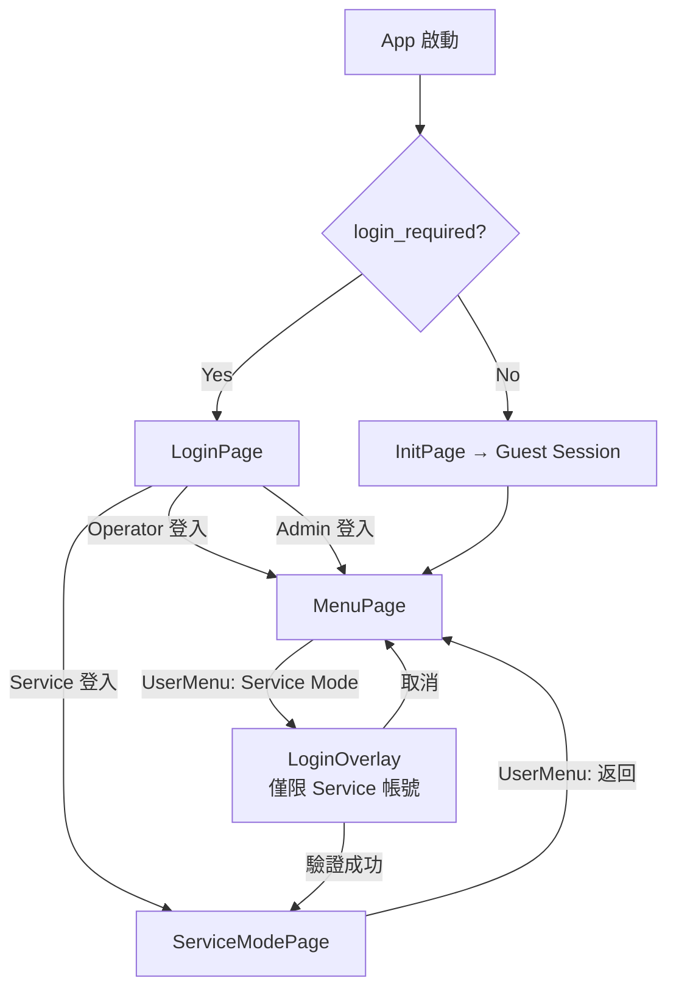

# Guest Account + Service Mode 設計

## 背景

### 問題
- 免登入模式下 `SessionService.SetGuestSession()` 使用 hard code `"Guest"`，無 DB 實體
- 免登入模式下缺乏切換至 Service 角色的機制
- 登入模式下 Service 角色登入後進入 MenuPage，但 Service 應該有獨立頁面

### 需求總覽

| 項目 | 說明 |
|------|------|
| Guest Account | 在 DB 建立免登入專用帳號（Id=100），固定 Operator 權限 |
| 免登入 UI | 右上角僅顯示帳號名稱，不顯示角色等級 |
| Service Mode 切換 | 免登入模式下，UserMenu 新增「🔧 Service Mode」按鈕 |
| Service 登入 | 點擊後彈出 LoginOverlay，僅 Service level 帳號可登入 |
| ServiceModePage | 新建空白頁面，簡單顯示 "Service Mode" 文字（後續再實作功能） |
| 登入模式路由 | 登入模式下 Service 角色登入後也導向 ServiceModePage，不進 MenuPage |

### 導航流程圖



---

## Proposed Changes

### 1. SystemSetting Seed — 新增免登入帳號設定

#### [MODIFY] [SystemSettingSeed.cs](file:///d:/TRIO2026/src/TRIO2026.Data/Seeding/SystemSettingSeed.cs)

在 `Auth` category 新增 2 筆設定：

```csharp
// Id = 18
new()
{
    Id = 18,
    Category = "Auth",
    Key = "guest_account_username",
    Value = "local_operator",
    Description = "免登入模式專用帳號的 username（對應 User 表）",
    Remark = "✅ 已實作 — AppShell.cs 免登入模式從 DB 載入此帳號"
},
// Id = 19
new()
{
    Id = 19,
    Category = "Auth",
    Key = "guest_account_display_name",
    Value = "Local Operator",
    Description = "免登入模式右上角顯示的名稱",
    Remark = "✅ 已實作 — SessionService + UserMenuControl 讀取顯示"
},
```

---

#### [MODIFY] [SystemSettingService.cs](file:///d:/TRIO2026/src/TRIO2026.App/Services/SystemSettingService.cs)

新增 2 個便利屬性：

```csharp
/// <summary>免登入帳號的 username（預設 local_operator）</summary>
public string GuestAccountUsername
    => GetLiveString("Auth", "guest_account_username", "local_operator");

/// <summary>免登入時顯示的名稱（預設 Local Operator）</summary>
public string GuestAccountDisplayName
    => GetLiveString("Auth", "guest_account_display_name", "Local Operator");
```

---

### 2. Guest User Seed

#### [MODIFY] [UserSeed.cs](file:///d:/TRIO2026/src/TRIO2026.Data/Seeding/UserSeed.cs)

新增免登入專用 User（`Id = 100`）。此帳號不需密碼，與 `credentials` 參數無關：

```csharp
new()
{
    Id = 100,
    Username = "local_operator",
    PasswordHash = "",              // 免登入，不需密碼
    RoleLevel = 1,                  // Operator（固定）
    IsActive = 1,
    CreatedAt = now,
    CreatedBy = "SYSTEM",
    DisplayName = "Local Operator",
    ForcePasswordChange = 0,
    Notes = "免登入模式專用帳號。固定 Operator 權限。",
},
```

---

### 3. SessionService 重構

#### [MODIFY] [SessionService.cs](file:///d:/TRIO2026/src/TRIO2026.App/Services/SessionService.cs)

**新增 `IsGuestMode` 旗標** + 修改 `SetGuestSession` 簽章：

```csharp
/// <summary>是否為免登入模式</summary>
public bool IsGuestMode { get; private set; }

/// <summary>免登入模式 — 載入 DB Guest 帳號</summary>
public void SetGuestSession(User guestUser, string displayName)
{
    guestUser.RoleLevel = (int)RoleLevel.Operator;
    guestUser.DisplayName = displayName;
    CurrentUser = guestUser;
    IsGuestMode = true;
    SessionChanged?.Invoke(this, EventArgs.Empty);
}

/// <summary>設定當前使用者（登入成功後呼叫）</summary>
public void SetCurrentUser(User user)
{
    CurrentUser = user;
    IsGuestMode = false;  // 正式登入
    SessionChanged?.Invoke(this, EventArgs.Empty);
}

/// <summary>清除會話（登出）</summary>
public void ClearSession()
{
    CurrentUser = null;
    IsGuestMode = false;
    SessionChanged?.Invoke(this, EventArgs.Empty);
}
```

---

### 4. AppShell 調整

#### [MODIFY] [AppShell.xaml.cs](file:///d:/TRIO2026/src/TRIO2026.App/Views/AppShell.xaml.cs)

**4a.** 注入 `IServiceProvider`，`OnInitCompleted` 改從 DB 載入 Guest User：

```csharp
private void OnInitCompleted(object? sender, EventArgs e)
{
    var guestUser = LoadGuestUser();
    _sessionService.SetGuestSession(guestUser, _systemSettings.GuestAccountDisplayName);
    _menuPage = null;
    NavigateTo("menu");
}

private User LoadGuestUser()
{
    using var scope = _serviceProvider.CreateScope();
    var db = scope.ServiceProvider.GetRequiredService<AppMainDbContext>();
    var username = _systemSettings.GuestAccountUsername;
    return db.Users.FirstOrDefault(u => u.Username == username)
        ?? new User { Id = 0, Username = username, ... };
}
```

**4b.** 新增 `"service"` 頁面路由 + Service 登入導航邏輯：

```csharp
private ServiceModePage? _serviceModePage;

// NavigateTo switch 新增：
case "service":
    _serviceModePage ??= CreateServiceModePage();
    _serviceModePage.RefreshUserDisplay();
    PageHost.Content = _serviceModePage;
    break;

// OnLoginSucceeded 改為根據角色導航：
private void OnLoginSucceeded(object? sender, EventArgs e)
{
    var role = _sessionService.CurrentRole;
    if (role == RoleLevel.Service)
    {
        NavigateTo("service");
    }
    else
    {
        _menuPage = null;
        NavigateTo("menu");
    }
}
```

---

### 5. ServiceModePage（新建）

#### [NEW] [ServiceModePage.xaml](file:///d:/TRIO2026/src/TRIO2026.App/Views/Pages/ServiceModePage.xaml)

簡單的 placeholder 頁面，深色主題，居中顯示 "Service Mode"：

```xml
<UserControl ...>
    <Grid Background="#0D1B2A">
        <!-- UserMenu 共用控件 -->
        <controls:UserMenuControl x:Name="UserMenu" Grid.RowSpan="99"/>
        
        <!-- Service Mode 識別文字 -->
        <StackPanel HorizontalAlignment="Center" VerticalAlignment="Center">
            <TextBlock Text="🔧" FontSize="48" HorizontalAlignment="Center"/>
            <TextBlock Text="Service Mode" FontSize="32" FontWeight="Bold"
                       Foreground="#F0F4F8" HorizontalAlignment="Center" Margin="0,16,0,8"/>
            <TextBlock Text="此頁面功能開發中" FontSize="16"
                       Foreground="#7B8FA8" HorizontalAlignment="Center"/>
        </StackPanel>
    </Grid>
</UserControl>
```

#### [NEW] [ServiceModePage.xaml.cs](file:///d:/TRIO2026/src/TRIO2026.App/Views/Pages/ServiceModePage.xaml.cs)

```csharp
public partial class ServiceModePage : UserControl
{
    public ServiceModePage(SessionService sessionService,
        OverlayDialog dialogOverlay, LoginOverlay loginOverlay,
        AuthService authService, TokenService tokenService,
        SystemSettingService systemSettings)
    {
        InitializeComponent();
        UserMenu.Initialize(sessionService, dialogOverlay, loginOverlay,
            authService, tokenService, systemSettings);
    }

    public void RefreshUserDisplay() => UserMenu.RefreshUserDisplay();
}
```

---

### 6. UserMenuControl — Service Mode 按鈕

#### [MODIFY] [UserMenuControl.xaml](file:///d:/TRIO2026/src/TRIO2026.App/Controls/UserMenuControl.xaml)

**6a.** 移除 hard code 預設值：

```diff
-<TextBlock x:Name="UserNameText" Text="Guest"
+<TextBlock x:Name="UserNameText" Text=""
```

```diff
-<TextBlock x:Name="UserRoleText" Text="Operator"
+<TextBlock x:Name="UserRoleText" Text=""
```

**6b.** 在 `UserMenuOverlay` 的 StackPanel 中，HOME 按鈕之後新增「Service Mode」按鈕（與其他按鈕風格一致）：

```xml
<!-- Service Mode 切換（僅免登入模式可見） -->
<Button x:Name="BtnServiceMode" Click="OnServiceModeClick" Cursor="Hand"
        Visibility="Collapsed">
    <Button.Template>
        <ControlTemplate TargetType="Button">
            <Border x:Name="Bd" Background="Transparent"
                    CornerRadius="8" Padding="14,10">
                <StackPanel Orientation="Horizontal">
                    <TextBlock Text="🔧" FontSize="18" VerticalAlignment="Center"
                               Margin="0,0,10,0"/>
                    <TextBlock Text="{Binding [UserMenu.ServiceMode], Source={x:Static svc:LocalizationService.Instance}}"
                               FontSize="14"
                               Foreground="#F0F4F8" VerticalAlignment="Center"/>
                </StackPanel>
            </Border>
            <ControlTemplate.Triggers>
                <Trigger Property="IsMouseOver" Value="True">
                    <Setter TargetName="Bd" Property="Background" Value="#263B5E"/>
                </Trigger>
            </ControlTemplate.Triggers>
        </ControlTemplate>
    </Button.Template>
</Button>
<Border x:Name="ServiceModeSeparator" Height="1" Background="#2A3D5E" Margin="8,4"
        Visibility="Collapsed"/>
```

---

#### [MODIFY] [UserMenuControl.xaml.cs](file:///d:/TRIO2026/src/TRIO2026.App/Controls/UserMenuControl.xaml.cs)

**6c.** `RefreshUserDisplay()` 增加免登入模式判斷：

```csharp
public void RefreshUserDisplay()
{
    if (_sessionService?.CurrentUser != null)
    {
        var user = _sessionService.CurrentUser;
        UserNameText.Text = user.DisplayName ?? user.Username;

        if (_sessionService.IsGuestMode)
        {
            // 免登入模式：不顯示角色資訊
            UserRoleText.Visibility = Visibility.Collapsed;
        }
        else
        {
            // 登入模式：顯示角色等級
            UserRoleText.Visibility = Visibility.Visible;
            var roleName = user.RoleLevel switch { ... };
            UserRoleText.Text = $"{roleName} (Level {user.RoleLevel})";
        }
    }
}
```

**6d.** `OnUserIconClick()` 中根據 `IsGuestMode` 控制 Service Mode 按鈕可見性：

```csharp
private void OnUserIconClick(object sender, MouseButtonEventArgs e)
{
    e.Handled = true;
    // ... 既有的多語系開關 ...

    // 免登入模式才顯示 Service Mode 切換
    var isGuest = _sessionService?.IsGuestMode ?? false;
    BtnServiceMode.Visibility = isGuest ? Visibility.Visible : Visibility.Collapsed;
    ServiceModeSeparator.Visibility = isGuest ? Visibility.Visible : Visibility.Collapsed;

    ShowOverlay(UserMenuOverlay);
}
```

**6e.** 新增 `OnServiceModeClick` 事件處理 — 彈出 LoginOverlay，僅允許 Service 帳號登入：

```csharp
private async void OnServiceModeClick(object sender, RoutedEventArgs e)
{
    CloseAllOverlays();
    if (_loginOverlay == null || _authService == null || _sessionService == null) return;

    var loc = LocalizationService.Instance;

    while (true)
    {
        var loginResult = await _loginOverlay.ShowAsync(
            loc["UserMenu.ServiceModeTitle"],      // "Service Mode 登入"
            loc["UserMenu.ServiceModeMessage"]);   // "請輸入 Service 帳號密碼"

        if (loginResult.IsCancelled) return;

        var (authResult, user) = await _authService.LoginAsync(
            loginResult.Username, loginResult.Password);

        if (authResult != Core.Enums.AuthResult.Success)
        {
            // 顯示錯誤（複用既有邏輯）
            var errorMsg = authResult switch { ... };
            _loginOverlay.ShowError(errorMsg);
            continue;
        }

        // 驗證角色：僅 Service level 可進入
        if (user!.RoleLevel < (int)Core.Enums.RoleLevel.Service)
        {
            _loginOverlay.ShowError(loc["UserMenu.ServiceModeInsufficientRole"]);
            continue;
        }

        // 登入成功 → 設定會話 → 導航至 ServiceModePage
        _sessionService.SetCurrentUser(user);
        EventLogService.Instance.LogAuth("ServiceModeLogin",
            user.Username, true, $"RoleLevel={user.RoleLevel}");

        var shell = Window.GetWindow(this) as AppShell;
        shell?.NavigateTo("service");
        return;
    }
}
```

---

### 7. 多語系字串

#### [MODIFY] [LocalizedStringSeed.cs](file:///d:/TRIO2026/src/TRIO2026.Data/Seeding/LocalizedStringSeed.cs)

新增 Service Mode 相關多語系字串：

| ResourceKey | en | zh-TW |
|---|---|---|
| UserMenu.ServiceMode | Service Mode | Service Mode |
| UserMenu.ServiceModeTitle | Service Mode Login | Service Mode 登入 |
| UserMenu.ServiceModeMessage | Enter Service credentials | 請輸入 Service 帳號密碼 |
| UserMenu.ServiceModeInsufficientRole | Service or higher role required | 需要 Service 以上角色權限 |

---

## 變更影響範圍

| 檔案 | 層級 | 變更類型 | 說明 |
|------|------|----------|------|
| `SystemSettingSeed.cs` | Data | MODIFY | 新增 2 筆 Auth 設定 |
| `SystemSettingService.cs` | Service | MODIFY | 新增 2 個便利屬性 |
| `UserSeed.cs` | Data | MODIFY | 新增 Guest User (Id=100) |
| `SessionService.cs` | Service | MODIFY | 改 `SetGuestSession` 簽章，新增 `IsGuestMode` |
| `AppShell.xaml.cs` | UI | MODIFY | 注入 `IServiceProvider`，新增 `"service"` 路由，Service 角色導航 |
| `UserMenuControl.xaml` | UI | MODIFY | 移除 hard code，新增 Service Mode 按鈕 |
| `UserMenuControl.xaml.cs` | UI | MODIFY | `RefreshUserDisplay` 條件隱藏角色，新增 `OnServiceModeClick` |
| `ServiceModePage.xaml` | UI | **NEW** | Service Mode placeholder 頁面 |
| `ServiceModePage.xaml.cs` | UI | **NEW** | ServiceModePage code-behind |
| `LocalizedStringSeed.cs` | Data | MODIFY | 新增 4 組多語系字串 |

---

## Open Questions

> [!IMPORTANT]
> **ServiceModePage 的 UserMenu 行為**：在 Service Mode 頁面中，UserMenu 的「返回主畫面」按鈕應該做什麼？
> - **方案 A**：返回 MenuPage 並**恢復為 Guest Session**（退出 Service Mode）
> - **方案 B**：返回 MenuPage 但**保持 Service 身分**
> 
> 建議方案 A（退出 Service Mode 回到 Operator 身分），因為 Service Mode 是臨時性的提權操作。

---

## Verification Plan

### Automated Tests
- 刪除 `main.db` + `system_config.db`，重啟確認 seed 正確（Guest User Id=100、新 SystemSetting）
- 啟動免登入模式，確認右上角顯示 `Local Operator`，無角色文字
- 點擊 UserMenu，確認 Service Mode 按鈕可見
- Service Mode 登入流程：使用 service 帳號登入成功 → 進入 ServiceModePage
- Service Mode 登入流程：使用 operator 帳號 → 顯示權限不足錯誤
- 啟動登入模式，Service 帳號登入 → 直接進入 ServiceModePage（不進 MenuPage）
- 啟動登入模式，確認 UserMenu 無 Service Mode 按鈕
