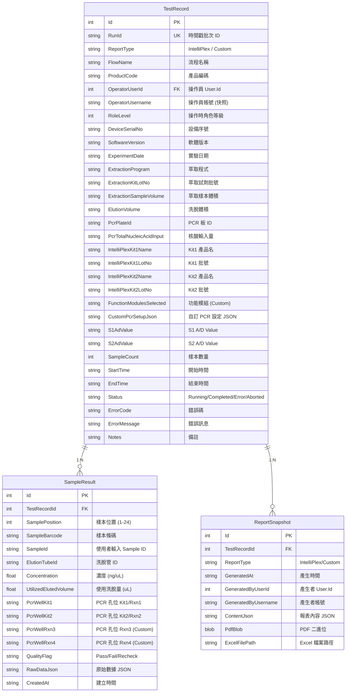

# 實驗數據落地 DB + 報告按需生成

## 背景
TRIO2026 是舊 TRIO 機台的重構專案。舊系統在每次實驗結束後**直接產出 Excel 報告**（存放於 `trio_data/` 目錄），報告即為唯一的數據記錄。新系統目標：

1. **數據優先落地 DB**（`data.db`） — 實驗完成時將所有量測數據、實驗參數、操作人員資訊寫入資料庫
2. **報告按需生成** — 使用者需要時才從 DB 查詢數據，組裝產出 Excel 報告
3. **帳號權限整合** — 記錄操作人員 ID、角色，報告生成時也須記錄由誰產出

---

## 舊報告結構分析

從 37 個 Excel 樣本分析出 **兩種報告類型**：

### 1. IntelliPlex Report
| 區域 | 欄位 | 說明 |
|------|------|------|
| Header (R1) | Report Title | `IntelliPlex Report` |
| Meta (R3-R15) | Experiment Date | 實驗日期 |
| | Extraction Program | 萃取程式名稱 |
| | Extraction Kit Lot. No. | 萃取試劑批號 |
| | Extraction Sample Volume | 萃取樣本體積 |
| | Elution Volume | 洗脫體積 |
| | PCR Total Nucleic Acid Input | PCR 核酸輸入量 |
| | IntelliPlex Kit 1/2 Product Name | 試劑盒產品名稱 |
| | IntelliPlex Kit 1/2 Lot No. | 試劑盒批號 |
| | PCR Plate ID | PCR 板 ID |
| | S1/S2 A/D Value | 光學感測器 A/D 值 |
| Data (R20+) | Sample Position | 樣本位置 (1-24) |
| | Concentration (ng/μL) | 濃度值 |
| | Utilized Eluted Sample (μL) | 使用的洗脫量 |
| | PCR Plate Well Position | PCR 板孔位 (Kit1/Kit2) |
| | Sample ID | 使用者輸入的樣本 ID |
| | Elution Tube ID | 洗脫管 ID |

### 2. Custom Program Report
| 區域 | 欄位 | 說明 |
|------|------|------|
| Header (R1) | Report Title | `Custom Program Report` |
| Meta (R3-R17) | 同 IntelliPlex + 以下: | |
| | Function Modules Selected | 選取的功能模組 (Extraction/PCR/...) |
| | Custom PCR Setup (Rxn1-4) | 自訂 PCR 設定 |
| | Control 1/2 Assignment (Rxn1-4) | 控制組指派 |
| | PCR Total Nucleic Acid Input (Rxn1-4) | 各 Rxn 核酸輸入量 |
| | PCR Sample Volume (Rxn1-4) | 各 Rxn 樣本體積 |
| | PCR Master Mix Volume (Rxn1-4) | 各 Rxn Master Mix 體積 |
| Data (R22+) | 同 IntelliPlex + PCR Well 分4組 (Rxn1-4) | |

> [!IMPORTANT]
> 舊報告**完全沒有**記錄：操作員 ID、登入帳號、角色權限、設備序號、軟體版本。新系統需要補齊這些審計資訊。

---

## 現有 Entity 分析

### 已定義（可複用）
| Entity | 位置 | 狀態 |
|--------|------|------|
| `TestRecord` | [TestRecord.cs](file:///d:/TRIO2026/src/TRIO2026.Core/Entities/TestRecord.cs) | ⚠️ 缺少報告所需的實驗參數欄位 |
| `SampleResult` | [SampleResult.cs](file:///d:/TRIO2026/src/TRIO2026.Core/Entities/SampleResult.cs) | ⚠️ 缺少 PCR Well、Sample ID、Elution Tube ID |
| `ReportSnapshot` | [ReportSnapshot.cs](file:///d:/TRIO2026/src/TRIO2026.Core/Entities/ReportSnapshot.cs) | ✅ 可用於報告生成記錄 |
| `DataDbContext` | [DataDbContext.cs](file:///d:/TRIO2026/src/TRIO2026.Data/Contexts/DataDbContext.cs) | ✅ 架構已就緒 |

---

## 提案的 DB Schema 設計

> [!IMPORTANT]
> **以下設計需要您的確認**，尤其是欄位的命名和分類方式。

### 方案：擴充現有 Entity + 新增 ExperimentParameter

---

## Open Questions

> [!IMPORTANT]
> **請確認以下問題，會影響實作方向：**

1. **Custom PCR Setup 欄位**：Custom Report 的 Rxn1-4 多組控制參數（Control Assignment、Nucleic Acid Input、Sample Volume、Master Mix Volume），是否用 **JSON 欄位**一次存儲（彈性高），還是要展開為獨立欄位？
   - **建議**: JSON（`CustomPcrSetupJson`），因為 Rxn 數量可能變化

2. **data.db 命名**：目前 DataDbContext 仍指向 `trio240plus_data.db`。是否要重新命名為 `data.db`？

3. **報告匯出格式**：除了 Excel，是否也需要 PDF 匯出？目前 `ReportSnapshot` 已預留 `PdfBlob` 欄位。

4. **歷史資料遷移**：舊 `trio_data/` 中的 37 份 Excel 是否需要匯入到新 DB？或僅作為歷史參考？

5. **哪些欄位必填 vs. 選填**：例如 `ExtractionKitLotNo` 在多數報告中為 `N/A`，是否設為 nullable？

6. **報告生成觸發**：是由 Admin 在帳號管理介面手動觸發？還是在完成實驗的頁面上提供「匯出報告」按鈕？

7. **權限控制**：哪些角色可以查詢歷史數據？哪些角色可以匯出報告？
   - 建議：Operator 可查看自己的實驗、Admin 可查看所有

---

## Proposed Changes

### Phase 1: Entity & Schema 擴充

#### [MODIFY] [TestRecord.cs](file:///d:/TRIO2026/src/TRIO2026.Core/Entities/TestRecord.cs)
- 新增實驗參數欄位（ExperimentDate, ExtractionProgram, Kit info...）
- 新增操作員審計欄位（OperatorUserId, OperatorUsername, RoleLevel）
- 新增設備資訊（DeviceSerialNo, SoftwareVersion）

#### [MODIFY] [SampleResult.cs](file:///d:/TRIO2026/src/TRIO2026.Core/Entities/SampleResult.cs)
- 新增 SampleId, ElutionTubeId, UtilizedElutedVolume
- 新增 PCR Well 欄位（PcrWellKit1/Kit2/Rxn3/Rxn4）

#### [MODIFY] [ReportSnapshot.cs](file:///d:/TRIO2026/src/TRIO2026.Core/Entities/ReportSnapshot.cs)
- 新增 GeneratedByUserId, GeneratedByUsername
- 新增 ExcelFilePath

#### [MODIFY] [DataDbContext.cs](file:///d:/TRIO2026/src/TRIO2026.Data/Contexts/DataDbContext.cs)
- 更新 OnModelCreating 加入新欄位的約束和索引

---

### Phase 2: 數據寫入 Service

#### [NEW] ExperimentDataService.cs
- `SaveExperimentAsync(TestRecord, List<SampleResult>)` — 實驗完成時寫入 DB
- 自動填入操作員資訊（從 SessionService 取得）
- 自動填入設備資訊和軟體版本

---

### Phase 3: 報告生成 Service

#### [NEW] ReportExportService.cs
- `ExportExcelAsync(int testRecordId, string outputPath)` — 從 DB 讀取數據生成 Excel
- 根據 ReportType 選擇 IntelliPlex 或 Custom 模板
- 記錄到 ReportSnapshot 表

---

## Verification Plan

### Automated Tests
- 單元測試驗證 Entity 欄位完整性
- `dotnet build` 確認無編譯錯誤
- DbInitializer 測試 migration 成功

### Manual Verification
- 將舊 Excel 資料手動比對 DB 新 schema 的欄位對應
- 驗證報告生成 Excel 與舊格式一致
