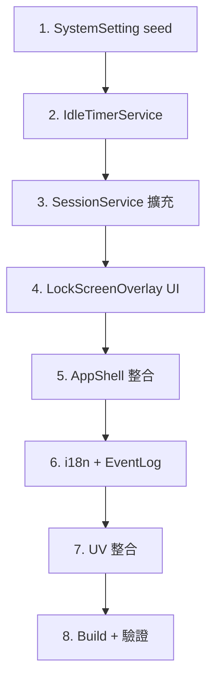

# Session Timeout + Lock Screen 實作方案

閒置超時鎖定機制 — 符合 FDA 21 CFR Part 11 要求的 session 管理。
使用者閒置超過設定時間後，系統自動鎖定畫面，需輸入密碼解鎖才能繼續操作。

## User Review Required

> [!IMPORTANT]
> **超時行為選擇**：建議 `session_timeout_action` 預設為 `lock`（鎖定畫面），不是 `logout`（登出）。鎖定畫面可保留進行中的工作狀態，操作員只需輸入密碼即可恢復。是否同意此設計？

> [!IMPORTANT]
> **預設超時時間**：目前 `session_timeout_minutes` seed 值為 `30`。醫療實驗室建議 **15 分鐘**。是否調整？

> [!WARNING]
> **UV 消毒進行中**：建議 UV 流程進行中**暫停 idle timer**（不鎖定），流程結束後恢復計時。否則操作員在 UV 期間離開會導致鎖定，回來後需先解鎖才能看到 UV 狀態。是否同意？

## Open Questions

> [!IMPORTANT]
> **鎖定畫面是否顯示進行中的工作狀態**（如「UV 消毒中 剩餘 12:30」）？這需要跨頁面狀態傳遞，會增加實作複雜度。

> [!IMPORTANT]
> **「切換使用者」按鈕**：鎖定畫面上是否需要「切換使用者」功能（完整登出回到 LoginPage）？適用於換班場景。

## Proposed Changes

### 系統設定 (SystemSetting Seed)

#### [MODIFY] [SystemSettingSeed.cs](file:///d:/TRIO2026/src/TRIO2026.Data/Seeding/SystemSettingSeed.cs)

新增 2 筆設定：

| Category | Key | 預設值 | 說明 |
|----------|-----|--------|------|
| LoginUI | `session_timeout_minutes` | `15` | 閒置超時分鐘（0=停用）— **已存在，修改預設值** |
| LoginUI | `session_timeout_action` | `lock` | 超時動作：`lock` / `logout` |
| LoginUI | `session_timeout_warning_seconds` | `60` | 鎖定前倒數警告秒數 |

---

### IdleTimerService（新建）

#### [NEW] [IdleTimerService.cs](file:///d:/TRIO2026/src/TRIO2026.App/Services/IdleTimerService.cs)

全域閒置計時器，監聽 WPF 輸入事件：

```
職責：
├─ 監聽 Window 層級的 Mouse/Touch/Keyboard 事件 → 重置 timer
├─ 到達 warning 門檻 → 觸發 WarningTriggered 事件
├─ 到達 timeout 門檻 → 觸發 TimeoutTriggered 事件
├─ Pause() / Resume() → 程序進行中暫停計時
└─ 排除 Guest / GuestMode → 不計時
```

**關鍵設計**：
- 使用 `DispatcherTimer` (1 秒精度)
- 透過 `InputManager.Current.PreProcessInput` 掛載全域輸入監聽
- `IsRunning` / `IsPaused` 狀態管理
- `RemainingSeconds` 供 UI 顯示倒數

---

### SessionService 擴充

#### [MODIFY] [SessionService.cs](file:///d:/TRIO2026/src/TRIO2026.App/Services/SessionService.cs)

新增鎖定狀態管理：

```csharp
public bool IsLocked { get; private set; }
public DateTime? LockedAt { get; private set; }
public event EventHandler? SessionLocked;
public event EventHandler? SessionUnlocked;

public void LockSession();     // 設定 IsLocked=true + 觸發事件
public void UnlockSession();   // 設定 IsLocked=false + 觸發事件
```

---

### LockScreenOverlay（新建）

#### [NEW] [LockScreenOverlay.xaml](file:///d:/TRIO2026/src/TRIO2026.App/Controls/LockScreenOverlay.xaml)
#### [NEW] [LockScreenOverlay.xaml.cs](file:///d:/TRIO2026/src/TRIO2026.App/Controls/LockScreenOverlay.xaml.cs)

覆蓋式鎖定畫面（與現有 Overlay 模式一致）：

```
┌──────────────────────────────────┐
│         半透明黑色遮罩            │
│                                  │
│    ┌────────────────────────┐    │
│    │         🔒             │    │
│    │    螢幕已鎖定           │    │
│    │                        │    │
│    │  👤 Dr. Wang (operator) │    │
│    │  鎖定時間：16:15        │    │
│    │                        │    │
│    │  ┌──────────────────┐  │    │
│    │  │  請輸入密碼        │  │    │
│    │  └──────────────────┘  │    │
│    │                        │    │
│    │  [ 解鎖 ] [切換使用者]  │    │
│    │                        │    │
│    └────────────────────────┘    │
│                                  │
└──────────────────────────────────┘
```

**功能**：
- `ShowAsync()` → 顯示鎖定畫面，回傳 `LockScreenResult`
- 只需密碼（帳號已知，從 `SessionService.CurrentUser` 取得）
- 密碼驗證失敗 → 紅色錯誤提示 + 記錄 EventLog
- 「切換使用者」→ 回傳特殊結果，由 AppShell 處理完整登出
- ESC / 觸控無法關閉
- 進場/退場動畫（與 LoginOverlay 一致）
- 支援觸控鍵盤（NumericKeypad / TouchKeyboard）
- **所有文字多語系**

---

### AppShell 整合

#### [MODIFY] [AppShell.xaml](file:///d:/TRIO2026/src/TRIO2026.App/Views/AppShell.xaml)

在 Overlay 區域新增 `LockScreenOverlay`：

```xml
<controls:LockScreenOverlay x:Name="LockScreenHost" />
```

#### [MODIFY] [AppShell.xaml.cs](file:///d:/TRIO2026/src/TRIO2026.App/Views/AppShell.xaml.cs)

```
整合邏輯：
├─ 登入成功後啟動 IdleTimerService（排除 Guest）
├─ IdleTimer.WarningTriggered → 顯示倒數提示 toast
├─ IdleTimer.TimeoutTriggered →
│   ├─ action=lock  → LockScreenOverlay.ShowAsync()
│   └─ action=logout → 完整登出流程
├─ LockScreen 解鎖成功 → IdleTimer.Reset()
├─ LockScreen 切換使用者 → 完整登出
├─ 登出時停止 IdleTimer
└─ UV 進行中 → IdleTimer.Pause()
```

---

### 多語系字串

#### [MODIFY] [LocalizedStringSeed.cs](file:///d:/TRIO2026/src/TRIO2026.Data/Seeding/LocalizedStringSeed.cs)

新增 `Lock` 模組：

| Key | EN | 繁中 |
|-----|-----|------|
| Lock.Title | Screen Locked | 螢幕已鎖定 |
| Lock.Subtitle | Enter password to unlock | 請輸入密碼解鎖 |
| Lock.LockedAt | Locked at {0} | 鎖定時間：{0} |
| Lock.Unlock | Unlock | 解鎖 |
| Lock.SwitchUser | Switch User | 切換使用者 |
| Lock.InvalidPassword | Incorrect password. | 密碼錯誤。 |
| Lock.TimeoutWarning | Session will lock in {0}s | 閒置超時，{0} 秒後將鎖定 |

---

### EventLog 埋點

#### [MODIFY] [ErrorCodes.cs](file:///d:/TRIO2026/src/TRIO2026.Core/ErrorCodes.cs)

新增事件代碼：

| Code | 說明 |
|------|------|
| `INF-9006` | Session Locked (idle timeout) |
| `INF-9007` | Session Unlocked (password verified) |
| `WRN-9008` | Lock Screen - Invalid Password |
| `INF-9009` | Lock Screen - Switch User |

#### [MODIFY] [EventCodeDefinitionSeed.cs](file:///d:/TRIO2026/src/TRIO2026.Data/Seeding/EventCodeDefinitionSeed.cs)

對應新增 4 筆事件代碼定義。

---

### UV 整合

#### [MODIFY] [UvDecontaminationPage.xaml.cs](file:///d:/TRIO2026/src/TRIO2026.App/Views/Pages/UvDecontaminationPage.xaml.cs)

UV 流程啟動/結束時呼叫 `IdleTimerService.Pause()` / `Resume()`。

---

## 實作順序



## Verification Plan

### Automated Tests
- `dotnet build` 確認編譯通過

### Manual Verification
1. 設定 `session_timeout_minutes=2` 進行快速測試
2. 驗證閒置 2 分鐘後自動鎖定
3. 驗證正確密碼解鎖
4. 驗證錯誤密碼被拒絕 + EventLog 記錄
5. 驗證「切換使用者」→ 完整登出
6. 驗證 Guest 帳號不觸發 timeout
7. 驗證 `session_timeout_minutes=0` 停用功能
8. 驗證多語系文字正確顯示
