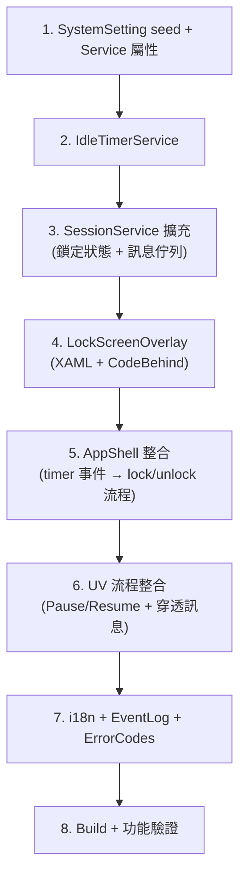

# Session Timeout + Lock Screen 實作方案

閒置超時鎖定機制 — 符合 FDA 21 CFR Part 11 要求的 session 管理。
使用者閒置超過設定時間後，系統自動鎖定畫面，需輸入密碼解鎖才能繼續操作。

## 設計決策（已確認）

| 項目 | 決策 |
|------|------|
| 超時動作 | **lock**（鎖定畫面，不登出） |
| 預設超時 | **15 分鐘** |
| Guest 帳號 | 不觸發 timeout |
| UV 進行中 | **暫停 idle timer**，流程繼續執行 |
| 鎖定時工作狀態 | **顯示**進行中的工作狀態 |
| 鎖定時系統訊息 | **穿透顯示**不需使用者介入的訊息（如門板警告） |
| 切換使用者 | **設定值控制**，啟用時顯示切換按鈕 |

---

## 核心設計：鎖定畫面的訊息穿透機制

```
┌───────────────────────────────────────────────┐
│                 正常狀態                        │
│  ┌─────────────────────────────────────────┐  │
│  │           PageHost (當前頁面)             │  │
│  │                                         │  │
│  │  ┌───────────────────────────────────┐  │  │
│  │  │  系統訊息 Overlay（門板警告等）     │  │  │  ← Layer 1: 系統訊息
│  │  └───────────────────────────────────┘  │  │
│  └─────────────────────────────────────────┘  │
│  ┌─────────────────────────────────────────┐  │
│  │       LockScreenOverlay                  │  │  ← Layer 2: 鎖定畫面
│  │  ┌───────────────────────────────────┐  │  │
│  │  │  穿透訊息區域（高優先級訊息）       │  │  │  ← Layer 3: 穿透訊息
│  │  └───────────────────────────────────┘  │  │
│  └─────────────────────────────────────────┘  │
│  ┌─────────────────────────────────────────┐  │
│  │       DialogOverlay                      │  │  ← Layer 4: 最頂層對話框
│  └─────────────────────────────────────────┘  │
└───────────────────────────────────────────────┘
```

### UV 門板事件 × 鎖定畫面行為矩陣

| 事件 | 未鎖定 | 已鎖定 |
|------|--------|--------|
| UV 啟動 | 正常顯示 + IdleTimer.Pause() | — |
| 門板開啟 | 暫停 UV + 警告 Overlay | 暫停 UV + **穿透訊息顯示在鎖定畫面上** |
| 門板關閉 | 自動關閉警告 + 繼續 UV | **自動關閉穿透訊息** + 繼續 UV + **持續鎖定** |
| UV 完成 | 完成訊息 Overlay | 完成訊息**排隊等待** → 解鎖後才顯示 |

---

## Proposed Changes

### 1. 系統設定 (SystemSetting)

#### [MODIFY] [SystemSettingSeed.cs](file:///d:/TRIO2026/src/TRIO2026.Data/Seeding/SystemSettingSeed.cs)

| Category | Key | 預設值 | 說明 |
|----------|-----|--------|------|
| LoginUI | `session_timeout_minutes` | `15` | 閒置超時分鐘（0=停用）— **修改現有預設值 30→15** |
| LoginUI | `session_timeout_action` | `lock` | 超時動作：`lock` / `logout` |
| LoginUI | `session_timeout_warning_seconds` | `60` | 鎖定前倒數警告秒數 |
| LoginUI | `lock_screen_switch_user_enabled` | `0` | 鎖定畫面是否允許切換使用者（0=不顯示, 1=顯示） |

#### [MODIFY] [SystemSettingService.cs](file:///d:/TRIO2026/src/TRIO2026.App/Services/SystemSettingService.cs)

新增便利屬性：

```csharp
public string SessionTimeoutAction
    => GetLiveString("LoginUI", "session_timeout_action", "lock");

public int SessionTimeoutWarningSeconds
    => GetLiveInt("LoginUI", "session_timeout_warning_seconds", 60);

public bool LockScreenSwitchUserEnabled
    => GetLiveString("LoginUI", "lock_screen_switch_user_enabled", "0") == "1";
```

---

### 2. IdleTimerService（新建）

#### [NEW] [IdleTimerService.cs](file:///d:/TRIO2026/src/TRIO2026.App/Services/IdleTimerService.cs)

全域閒置計時器，監聽 WPF 輸入事件重置 timer：

```csharp
public class IdleTimerService : IDisposable
{
    // 狀態
    public bool IsRunning { get; }
    public bool IsPaused { get; }
    public int RemainingSeconds { get; }   // 供 UI 顯示倒數

    // 事件
    public event EventHandler? WarningTriggered;    // 進入警告倒數
    public event EventHandler? TimeoutTriggered;    // 超時觸發
    public event EventHandler? TimerReset;          // 使用者活動重置

    // 控制
    public void Start(int timeoutMinutes, int warningSeconds);
    public void Stop();
    public void Reset();           // 使用者活動時呼叫
    public void Pause();           // UV 進行中暫停
    public void Resume();          // UV 結束後恢復
}
```

**技術實作**：
- `DispatcherTimer` 每秒 tick
- `InputManager.Current.PreProcessInput` 掛載全域輸入監聽（Mouse/Touch/Keyboard）
- 任何輸入事件 → `Reset()`
- 排除條件：`SessionService.IsGuestLogin || SessionService.IsGuestMode`

---

### 3. SessionService 擴充

#### [MODIFY] [SessionService.cs](file:///d:/TRIO2026/src/TRIO2026.App/Services/SessionService.cs)

新增鎖定狀態 + 待處理訊息佇列：

```csharp
// 鎖定狀態
public bool IsLocked { get; private set; }
public DateTime? LockedAt { get; private set; }
public event EventHandler? SessionLocked;
public event EventHandler? SessionUnlocked;

public void LockSession();
public void UnlockSession();

// 訊息佇列（鎖定期間累積，解鎖後依序顯示）
private readonly Queue<PendingMessage> _pendingMessages = new();
public void EnqueueMessage(string title, string message, string icon);
public bool HasPendingMessages { get; }
public PendingMessage? DequeueMessage();
```

---

### 4. LockScreenOverlay（新建）

#### [NEW] [LockScreenOverlay.xaml](file:///d:/TRIO2026/src/TRIO2026.App/Controls/LockScreenOverlay.xaml)
#### [NEW] [LockScreenOverlay.xaml.cs](file:///d:/TRIO2026/src/TRIO2026.App/Controls/LockScreenOverlay.xaml.cs)

```
┌──────────────────────────────────┐
│       半透明深色遮罩 (#CC0F1B2D)  │
│                                  │
│   ┌────────────────────────┐     │
│   │         🔒              │     │
│   │     螢幕已鎖定          │     │
│   │                         │     │
│   │  👤 Dr. Wang (operator)  │     │
│   │  鎖定時間：16:15         │     │
│   │                         │     │
│   │  ┌──────────────────┐   │     │
│   │  │ ●●●●●●            │   │     │  ← 密碼輸入（觸控鍵盤整合）
│   │  └──────────────────┘   │     │
│   │  ❌ 密碼錯誤             │     │  ← 錯誤提示（Shake 動畫）
│   │                         │     │
│   │  ┌────────┐ ┌────────┐  │     │
│   │  │ 解鎖    │ │切換使用│  │     │  ← 切換使用者由設定控制
│   │  └────────┘ └────────┘  │     │
│   │                         │     │
│   │  ─────────────────────  │     │
│   │  ⚡ UV 消毒中 12:30     │     │  ← 進行中工作狀態
│   └────────────────────────┘     │
│                                  │
│   ┌────────────────────────┐     │
│   │ ⚠️ 門板已開啟！          │     │  ← 穿透訊息區域（高優先級）
│   │   UV 照射已暫停          │     │
│   └────────────────────────┘     │
│                                  │
└──────────────────────────────────┘
```

**功能**：

```csharp
public class LockScreenOverlay : UserControl
{
    // 顯示/隱藏
    public Task<LockScreenResult> ShowAsync(User lockedUser, DateTime lockedAt);

    // 進行中工作狀態（外部更新）
    public void UpdateWorkStatus(string? statusText);  // null = 隱藏

    // 穿透訊息（高優先級，不需使用者操作）
    public void ShowPassthroughMessage(string title, string message, string icon);
    public void HidePassthroughMessage();

    // 結果
    public enum LockScreenResult { Unlocked, SwitchUser }
}
```

**設計要點**：
- ESC / 觸控無法關閉，必須密碼驗證
- 密碼錯誤 → Shake 動畫 + EventLog
- 「切換使用者」按鈕受 `lock_screen_switch_user_enabled` 設定控制
- 進場/退場動畫與現有 Overlay 一致
- 密碼輸入框支援 NumericKeypad / TouchKeyboard
- **穿透訊息區**：獨立於鎖定卡片之外，用於顯示門板警告等系統級訊息

---

### 5. AppShell 整合

#### [MODIFY] [AppShell.xaml](file:///d:/TRIO2026/src/TRIO2026.App/Views/AppShell.xaml)

```xml
<!-- Overlay 層級順序 -->
<controls:OverlayDialog x:Name="DialogOverlay" />
<controls:LoginOverlay x:Name="LoginOverlayHost" />
<controls:ChangePasswordOverlay x:Name="ChangePasswordOverlayHost" />
<controls:LockScreenOverlay x:Name="LockScreenHost" />   <!-- 新增 -->
```

#### [MODIFY] [AppShell.xaml.cs](file:///d:/TRIO2026/src/TRIO2026.App/Views/AppShell.xaml.cs)

```
整合邏輯：

登入成功後：
├─ IsGuestLogin / IsGuestMode → 不啟動 timer
├─ session_timeout_minutes == 0 → 不啟動 timer
└─ 其他 → IdleTimerService.Start()

IdleTimer 事件處理：
├─ WarningTriggered → Toast 倒數提示（非阻塞）
└─ TimeoutTriggered →
    ├─ action="lock"   → HandleLockScreen()
    └─ action="logout" → HandleLogout()

HandleLockScreen()：
├─ SessionService.LockSession()
├─ var result = await LockScreenHost.ShowAsync(user, lockedAt)
├─ result == Unlocked →
│   ├─ SessionService.UnlockSession()
│   ├─ IdleTimerService.Reset()
│   └─ 處理 pending messages
└─ result == SwitchUser →
    ├─ SessionService.UnlockSession()
    └─ HandleLogout()

登出時：
└─ IdleTimerService.Stop()
```

---

### 6. UV 流程整合

#### [MODIFY] [UvDecontaminationPage.xaml.cs](file:///d:/TRIO2026/src/TRIO2026.App/Views/Pages/UvDecontaminationPage.xaml.cs)

```
UV 啟動：
└─ IdleTimerService.Pause()

UV 門板開啟事件（已鎖定時）：
├─ UV 暫停（現有邏輯）
└─ LockScreenHost.ShowPassthroughMessage("⚠️ 門板已開啟", "UV 照射已暫停")

UV 門板關閉事件（已鎖定時）：
├─ LockScreenHost.HidePassthroughMessage()  ← 自動關閉
└─ UV 繼續（現有邏輯）

UV 完成：
├─ IdleTimerService.Resume()
├─ if (SessionService.IsLocked)
│   └─ SessionService.EnqueueMessage("UV 消毒完成", ...)  ← 排隊等解鎖
└─ else
    └─ 正常顯示完成訊息
```

---

### 7. 多語系字串

#### [MODIFY] [LocalizedStringSeed.cs](file:///d:/TRIO2026/src/TRIO2026.Data/Seeding/LocalizedStringSeed.cs)

新增 `Lock` 模組：

| Key | EN | 繁中 | 簡中 | 日文 |
|-----|-----|------|------|------|
| Lock.Title | Screen Locked | 螢幕已鎖定 | 屏幕已锁定 | 画面ロック中 |
| Lock.Subtitle | Enter password to unlock | 請輸入密碼解鎖 | 请输入密码解锁 | パスワードを入力してロック解除 |
| Lock.LockedAt | Locked at {0} | 鎖定時間：{0} | 锁定时间：{0} | ロック時刻：{0} |
| Lock.Unlock | Unlock | 解鎖 | 解锁 | ロック解除 |
| Lock.SwitchUser | Switch User | 切換使用者 | 切换用户 | ユーザー切替 |
| Lock.InvalidPassword | Incorrect password. | 密碼錯誤。 | 密码错误。 | パスワードが正しくありません。 |
| Lock.TimeoutWarning | Locking in {0}s... | {0} 秒後鎖定... | {0} 秒后锁定... | {0}秒後にロック... |
| Lock.WorkStatus | In Progress | 進行中 | 进行中 | 実行中 |

---

### 8. EventLog 埋點

#### [MODIFY] [ErrorCodes.cs](file:///d:/TRIO2026/src/TRIO2026.Core/ErrorCodes.cs)

```csharp
// 9xxx Guest / Access Control（續）
public const string SessionLocked       = "INF-9006";
public const string SessionUnlocked     = "INF-9007";
public const string LockInvalidPassword = "WRN-9008";
public const string LockSwitchUser      = "INF-9009";
public const string LockPassthroughMsg  = "INF-9010";
```

#### [MODIFY] [EventCodeDefinitionSeed.cs](file:///d:/TRIO2026/src/TRIO2026.Data/Seeding/EventCodeDefinitionSeed.cs)

對應新增 5 筆事件代碼定義（Id=82~86）。

---

## 實作順序



## Verification Plan

### Automated Tests
- `dotnet build` 確認編譯通過

### Manual Verification

| # | 測試項目 | 預期結果 |
|---|---------|---------|
| 1 | 設定 `session_timeout_minutes=2` | 閒置 2 分鐘後自動鎖定 |
| 2 | 鎖定中輸入正確密碼 | 解鎖成功 + EventLog INF-9007 |
| 3 | 鎖定中輸入錯誤密碼 | Shake + 紅色提示 + EventLog WRN-9008 |
| 4 | `lock_screen_switch_user_enabled=1` | 顯示「切換使用者」按鈕 |
| 5 | `lock_screen_switch_user_enabled=0` | 不顯示「切換使用者」按鈕 |
| 6 | 點擊「切換使用者」 | 完整登出回到 LoginPage |
| 7 | Guest 帳號登入 | 不觸發 timeout |
| 8 | `session_timeout_minutes=0` | 功能停用 |
| 9 | UV 進行中閒置 | Timer 暫停，不鎖定 |
| 10 | UV 進行中 + 手動鎖定 | UV 繼續，鎖定畫面顯示 UV 狀態 |
| 11 | 鎖定中門板開啟 | 穿透訊息顯示「門板已開啟」 |
| 12 | 鎖定中門板關閉 | 穿透訊息自動消失，UV 繼續 |
| 13 | UV 完成（鎖定中） | 完成訊息排隊，解鎖後顯示 |
| 14 | 多語系切換 | 鎖定畫面所有文字正確切換 |
| 15 | 警告倒數 60 秒 | 非阻塞 toast 提示顯示倒數 |
