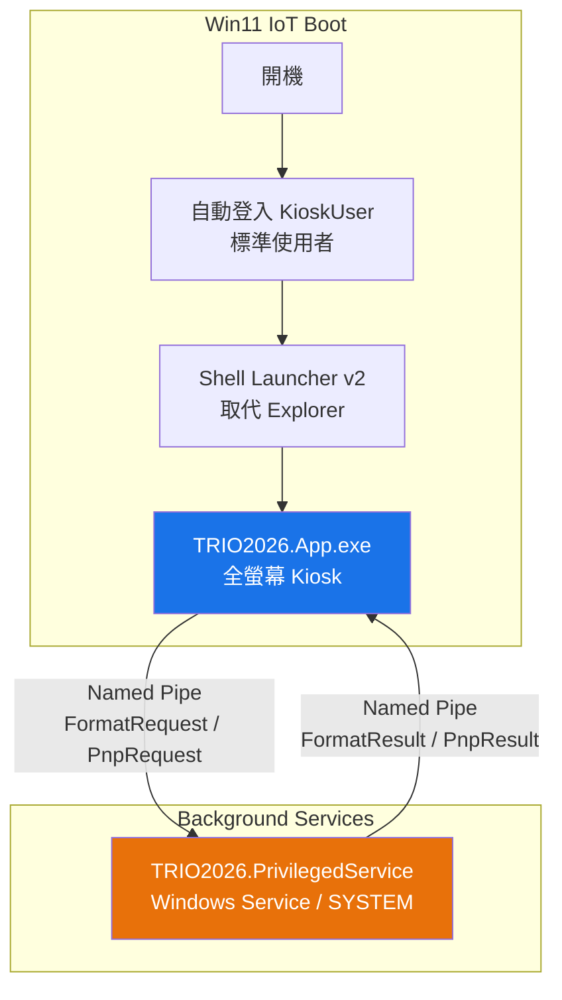

# Win11 IoT Kiosk 部署架構 — 最小權限 + 特權服務分離

## 背景與目標

TRIO2026 將部署至 Win11 IoT Enterprise 環境，開機後自動啟動全螢幕 Kiosk 模式。
基於資安最小權限原則，App 本身**不應以管理員身分執行**，而是將需要特權的操作（USB Format、PnP 控制等）隔離至獨立的 Windows Service。

### 核心需求
1. **靜默開機**：Win11 IoT 自動登入 → 直接進入 TRIO2026 全畫面，不顯示任何 Windows UI
2. **最小權限**：TRIO2026.App 以標準使用者執行，不具管理員權限
3. **特權隔離**：USB Format、PnP 等操作由背景 Windows Service 執行
4. **無 UAC 彈窗**：生產環境中任何操作都不會跳出 OS 層級的提示

---

## User Review Required

> [!IMPORTANT]
> **Windows Service 的安裝與管理**：Service 需要在部署階段以管理員身分安裝一次（`sc.exe create`），後續開機自動啟動。請確認 IoT 設備的部署流程中是否有此權限。

> [!WARNING]
> **Named Pipe 安全性**：App ↔ Service 之間使用 Named Pipe 通訊，需設定 ACL 限制只允許本機 KioskUser 連線。若有其他安全規範（如加密通訊），請提出。

## Open Questions

1. **IoT 裝置型號**：是否已確定 Win11 IoT Enterprise 的具體版本？（LTSC 2024 / 2021？）Shell Launcher v2 需要 Enterprise 版本。
2. **UV Firmware 通訊**：未來 `RealUvHardwareService` 的串口通訊是否也需要特權？如果是，可一併整合進同一個 Service。
3. **遠端維護**：IoT 設備是否需要保留遠端桌面或 SSH 存取能力供維護人員使用？

---

## 架構總覽



---

## Proposed Changes

### Phase 1: TRIO2026.PrivilegedService（特權 Windows Service）

新建一個獨立的 .NET 8 Worker Service 專案，負責執行所有需要特權的操作。

---

#### [NEW] [TRIO2026.PrivilegedService.csproj](file:///d:/TRIO2026/src/TRIO2026.PrivilegedService/TRIO2026.PrivilegedService.csproj)

- .NET 8 Worker Service 專案
- 依賴 `TRIO2026.Core`（共用 ErrorCodes、Models）
- NuGet: `Microsoft.Extensions.Hosting.WindowsServices`

#### [NEW] [PrivilegedServiceWorker.cs](file:///d:/TRIO2026/src/TRIO2026.PrivilegedService/PrivilegedServiceWorker.cs)

- 繼承 `BackgroundService`，啟動 Named Pipe Server
- 監聽來自 App 的請求，執行對應的特權操作
- 支援的操作類型：
  - `FormatDrive` — 執行 `cmd.exe /c format X: /FS:exFAT /Q /Y`
  - `RestartPnpDevice` — 執行 `Disable-PnpDevice` / `Enable-PnpDevice`
  - `Ping` — 健康檢查

#### [NEW] [PipeProtocol.cs](file:///d:/TRIO2026/src/TRIO2026.Core/IPC/PipeProtocol.cs)

放在 `TRIO2026.Core` 中，App 和 Service 共用：

```csharp
public static class PipeProtocol
{
    public const string PipeName = "TRIO2026_PrivilegedService";
}

public class PipeRequest
{
    public string Command { get; set; }   // "FormatDrive", "RestartPnp", "Ping"
    public string DriveLetter { get; set; }
    public string FileSystem { get; set; }
    public string InstanceId { get; set; } // PnP 用
}

public class PipeResponse
{
    public bool Success { get; set; }
    public string Output { get; set; }
    public string Error { get; set; }
}
```

#### [NEW] [PipeClient.cs](file:///d:/TRIO2026/src/TRIO2026.Core/IPC/PipeClient.cs)

App 端使用的 Named Pipe Client：

```csharp
public static class PipeClient
{
    public static async Task<PipeResponse> SendRequestAsync(PipeRequest request, int timeoutMs = 30000);
    public static async Task<bool> IsServiceAvailableAsync();
}
```

---

### Phase 2: UsbSecurityService 整合 Named Pipe

---

#### [MODIFY] [UsbSecurityService.cs](file:///d:/TRIO2026/src/TRIO2026.App/Services/UsbSecurityService.cs)

修改 `RunFormatCommandAsync` 的三路分流邏輯：

```csharp
if (isElevated)
    return RunFormatDirect(driveLetter, fileSystem);       // 已提權（測試）
else if (await PipeClient.IsServiceAvailableAsync())
    return await RunFormatViaService(driveLetter, fileSystem); // IoT 生產環境
else
    return RunFormatElevated(driveLetter, fileSystem);      // 開發環境 fallback
```

新增 `RunFormatViaService` 方法：透過 Named Pipe 將格式化請求傳送給 PrivilegedService。

#### [MODIFY] [SimulatorWindow.xaml.cs](file:///d:/TRIO2026/tools/Simulator/SimulatorWindow.xaml.cs)

模擬器的 PnP 重啟也改為透過 Named Pipe（若 Service 可用），fallback 為現有 `runas` 機制。

---

### Phase 3: Win11 IoT 部署配置

---

#### [NEW] [deploy/setup_kiosk.ps1](file:///d:/TRIO2026/deploy/setup_kiosk.ps1)

一鍵部署腳本，包含：

```powershell
# 1. 建立 KioskUser（標準使用者，自動登入）
New-LocalUser -Name "KioskUser" -Password $pwd -PasswordNeverExpires
# 不加入 Administrators 群組

# 2. 設定自動登入（無密碼提示）
Set-ItemProperty -Path "HKLM:\SOFTWARE\Microsoft\Windows NT\CurrentVersion\Winlogon" `
    -Name "AutoAdminLogon" -Value "1"
Set-ItemProperty -Path "..." -Name "DefaultUserName" -Value "KioskUser"

# 3. Shell Launcher v2 — 取代 Explorer
# 將 KioskUser 的 Shell 設為 TRIO2026.App.exe

# 4. 隱藏 Windows UI
# - Custom Logon: 隱藏開機 Logo / 歡迎畫面
# - Keyboard Filter: 停用 Ctrl+Alt+Del, Win 鍵, Alt+Tab
# - Unified Write Filter (UWF): 可選，保護系統磁碟

# 5. 安裝 PrivilegedService
sc.exe create TRIO2026.PrivilegedService `
    binPath= "C:\TRIO2026\Service\TRIO2026.PrivilegedService.exe" `
    start= auto obj= "LocalSystem"

# 6. 停用 UAC（IoT 環境）
Set-ItemProperty -Path "HKLM:\SOFTWARE\Microsoft\Windows\CurrentVersion\Policies\System" `
    -Name "EnableLUA" -Value 0
```

#### [NEW] [deploy/install_service.bat](file:///d:/TRIO2026/deploy/install_service.bat)

Service 安裝/解除安裝的簡易批次檔。

#### [NEW] [deploy/README_IoT_Deployment.md](file:///d:/TRIO2026/deploy/README_IoT_Deployment.md)

完整的 IoT 部署指南文件。

---

### Phase 4: App Manifest（防護層）

---

#### [MODIFY] [TRIO2026.App.csproj](file:///d:/TRIO2026/src/TRIO2026.App/TRIO2026.App.csproj)

嵌入 Application Manifest，宣告 `asInvoker`（以呼叫者權限執行，不請求提權）：

```xml
<PropertyGroup>
    <ApplicationManifest>app.manifest</ApplicationManifest>
</PropertyGroup>
```

#### [NEW] [app.manifest](file:///d:/TRIO2026/src/TRIO2026.App/app.manifest)

```xml
<requestedExecutionLevel level="asInvoker" uiAccess="false" />
```

明確宣告 App 不需要管理員權限，防止意外提權。

---

## 安全性設計摘要

| 層面 | 設計 |
|------|------|
| **App 權限** | 標準使用者（`asInvoker`），無 Admin 權限 |
| **Service 權限** | `LOCAL SYSTEM`，僅透過 Named Pipe 接受請求 |
| **IPC 安全** | Named Pipe ACL 限制只允許本機使用者連線 |
| **Command Injection** | Service 端也做 Regex 白名單驗證（雙重防護） |
| **輸入驗證** | driveLetter: `^[A-Za-z]:$`、fileSystem: `exFAT/FAT32/NTFS` |
| **日誌稽核** | App 端 + Service 端雙重記錄，含完整指令字串 |
| **UAC** | 完全不觸發（App 不提權，Service 已是 SYSTEM） |
| **物理存取** | Keyboard Filter 禁用 OS 快捷鍵 |

---

## 實作優先順序

| 順序 | 項目 | 預估工作量 | 依賴 |
|------|------|-----------|------|
| 1 | `PipeProtocol.cs` + `PipeClient.cs`（Core 共用） | 小 | 無 |
| 2 | `TRIO2026.PrivilegedService` 專案 | 中 | Phase 1 |
| 3 | `UsbSecurityService` 整合 Named Pipe | 小 | Phase 1, 2 |
| 4 | 部署腳本 + 文件 | 中 | Phase 1-3 |
| 5 | App Manifest | 小 | 無 |

---

## Verification Plan

### Automated Tests
- 啟動 `TRIO2026.PrivilegedService`，使用獨立的測試程式透過 Named Pipe 發送 `Ping`、`FormatDrive` 請求，驗證回應正確性
- 在非 Admin 環境下執行 TRIO2026.App，驗證 format 操作透過 Service 成功完成
- 驗證 Command Injection 防護：發送惡意 driveLetter/fileSystem 至 Service，確認被攔截

### Manual Verification
- 在 VM 中設定 Win11 IoT Kiosk 模式，驗證開機 → 自動登入 → TRIO2026 全畫面的完整流程
- 驗證 USB 插入 → Format 面板 → 點擊 Format → 成功格式化（無 UAC 彈窗）
- 驗證 `Ctrl+Alt+Del`、`Win 鍵` 等快捷鍵已被禁用
