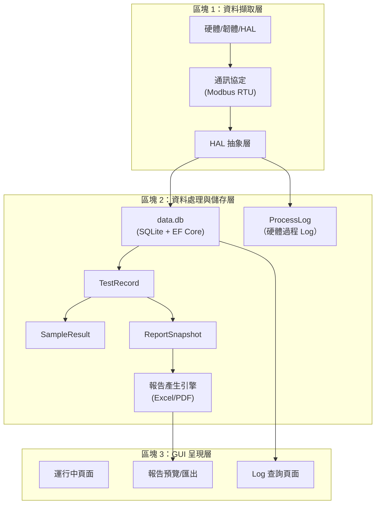

# TRIO2026 儀器報告系統 — 架構分析與初步規劃

> **本文件為迭代式文件**，隨討論深入逐次更新。
> 製作者: Office of William

---

## 一、舊系統（一代機）現況分析

### 1.1 資料結構

一代機每次檢測在 `trio_data/` 下產生一個以時間戳命名的資料夾：

```
trio_data/
├── 20260317_135504_log/          ← 一次檢測 = 一個資料夾
│   ├── runinfo.ini               ← 運行設定 + 最終結果（~3KB）
│   ├── processinfo.ini           ← 硬體過程 log，疑似 Modbus 封包（~548KB）
│   └── processinfo.xlsx          ← 同上的 Excel 版（~285KB）
└── 20260507_142025_log/
    ├── runinfo.ini               ← 較簡單的運行（~1.5KB）
    ├── processinfo.ini           ← 較短的過程 log（~169KB）
    └── processinfo.xlsx          ← Excel 版（~90KB）
```

> [!WARNING]
> **舊系統問題**：
> 1. **無資安保護**：INI 檔案為明文，任何人可修改、刪除
> 2. **無稽核追蹤**：不知道誰執行、何時修改
> 3. **無資料完整性**：檔案可被竄改而不留痕跡
> 4. **個資暴露**：Sample ID 等可能含受測者資訊，以明文儲存
> 5. **無集中管理**：散落的資料夾結構不利查詢

### 1.2 runinfo.ini 資料映射分析

#### [RunInfo] — 運行主設定

| INI 欄位 | 含義 | 二代機對應 Entity | 備註 |
|----------|------|------------------|------|
| `mode` | 運行模式（1=IntelliPlex, 2=Custom） | `TestRecord.ReportType` | ✅ 已有 |
| `flow` | 流程名稱 | `TestRecord.FlowName` | ✅ 已有 |
| `StartTime` / `StopTime` | 運行時間 | `TestRecord.StartTime/EndTime` | ✅ 已有 |
| `Sample_NUM` | 樣本數 | `TestRecord.SampleCount` | ✅ 已有 |
| `triocode` | QR Code 讀取的資訊串 | 🔲 **待設計** | 含 PLCoding, LotNo, SmpType |
| `trio_PLCoding` | 產品代碼 | `TestRecord.ProductCode` | ✅ 已有 |
| `trio_Lot_NO` | 批號 | `TestRecord.ExtractionKitLotNo` | ✅ 已有 |
| `Reagent_Num` | 試劑組數（0/1/2） | 🔲 **待確認** | 影響 Kit1/Kit2 |
| `Reag0` / `Reag1` | 試劑詳細設定（複雜字串） | 🔲 **需解析** | 含多層參數 |
| `nucleicacid_total` | 核酸總輸入量 | `TestRecord.PcrTotalNucleicAcidInput` | ✅ 已有 |
| `mastermixvol` / `pcrsampvol` | PCR 體積設定 | `TestRecord.CustomPcrSetupJson` | ✅ 已有 |
| `PCRPLID` | PCR 板 ID | `TestRecord.PcrPlateId` | ✅ 已有 |
| `extracttiro` | 是否萃取 | `TestRecord.FunctionModulesSelected` | ✅ 已有 |
| `Quantification` / `Dilution` / `PCRconfect` | 功能模組開關 | `TestRecord.FunctionModulesSelected` | 合併存 |
| `OPT_Smpvol` | 光學樣本體積選項 | 🔲 **待確認** | |
| `placehintreminder` | 耗材放置提示 | 🔲 **待設計** | |
| `Sample` | 樣本位圖（hex） | 🔲 **待確認** | 位元對應孔位 |

#### [SMPID] / [TubeID] — 樣本識別

| INI 欄位 | 含義 | 二代機對應 | 備註 |
|----------|------|-----------|------|
| `Hole2`~`Hole24` (SMPID) | 每孔的 Sample ID | `SampleResult.SampleId` | ✅ 已有 |
| `Hole2`~`Hole24` (TubeID) | 每孔的 Elution Tube ID | `SampleResult.ElutionTubeId` | ✅ 已有 |

> [!IMPORTANT]
> **個資議題**：`SampleId` 可能包含受測者 ID 或醫院病歷號。二代機需在 DB 層加密或權限控制。

#### [RunTime] — 各階段耗時

| INI 欄位 | 含義 | 二代機對應 | 備註 |
|----------|------|-----------|------|
| `extraction_time` | 萃取耗時（秒） | 🔲 **需新增** | 用於效能追蹤 |
| `Quantification_time` | 定量耗時 | 🔲 **需新增** | |
| `PCR_time` | PCR 耗時 | 🔲 **需新增** | |

#### [Consumable] — 耗材用量

| INI 欄位 | 含義 | 二代機對應 | 備註 |
|----------|------|-----------|------|
| `Need50ulTip` / `Need200ulTip` | 吸頭用量 | 🔲 **需新增** | 耗材追蹤 |
| `reag0` / `reag1` | 試劑耗用明細 | 🔲 **需新增** | |
| `qbtube` | 定量管數 | 🔲 **需新增** | |

#### [SMPInfo] — 攝影機偵測

| INI 欄位 | 含義 | 二代機對應 | 備註 |
|----------|------|-----------|------|
| `CAM_AREA1`~`CAM_AREA9` | 攝影機偵測各區位圖 | 🔲 **待設計** | 硬體偵測結果 |

#### [DATA] — 光學原始數據

| INI 欄位 | 含義 | 二代機對應 | 備註 |
|----------|------|-----------|------|
| `arg0`~`arg6` | 不同量測通道的原始值陣列 | `SampleResult.RawDataJson` | ✅ 已有欄位，需定義 JSON Schema |

#### [Result] — 最終計算結果

| INI 欄位 | 含義 | 二代機對應 | 備註 |
|----------|------|-----------|------|
| `data1`~`data26` | 「位置,濃度,體積,Kit1孔,Kit2孔,SmpID,TubeID」 | `SampleResult.*` | ✅ 已有各欄位 |

### 1.3 processinfo.ini — 硬體過程 Log

```
[PROCESS]
step0=0103809bdc0001000401...（268 bytes hex）
step1=0103809bdc0001000401...
...
step580=...（超過 500 個 step）
```

> [!NOTE]
> **關鍵觀察**：
> - 每個 step 是一條固定長度的 **hex 編碼二進位資料**
> - 開頭 `0103` 疑似 Modbus Function Code 03 (Read Holding Registers)
> - 每筆約 268 hex chars = 134 bytes
> - 一次完整運行可能有 **500+ 筆**
> - 同時也產生了 `.xlsx` 版本，可能是人可讀的解碼版

### 1.4 應用程式 Log（`log/*.txt`）

一代機在 `log/` 資料夾產生以時間戳命名的文字 log，格式統一：

```
2026-04-09 10:51:01.710 : CCommsetWidget,start system
2026-04-09 10:51:05.978 : MasterThread,发送数据->0106c2ec03e87539
2026-04-09 10:51:07.368 : MasterThread,接收数据->0106c2ec00007587
2026-04-09 10:51:07.351 : StaticTextButton,点击按键->entersetbutton
```

#### 識別出的三類訊息

| 類型 | 來源 | 用途 |
|------|------|------|
| **UI 操作** | `StaticTextButton`, `CMenuWidget` 等 | 操作追蹤 |
| **Modbus 通訊** | `MasterThread` | 硬體過程 log |
| **系統事件** | `CCommsetWidget`, `CCommshowWidget` | 系統狀態 |

#### 通訊協定確認：**Modbus RTU**

```
發送: 0106c2ec03e87539
       │ │  │    │    └─ CRC16
       │ │  │    └───── Data (03E8 = 1000)
       │ │  └────────── Register Address (C2EC)
       │ └───────────── Function Code 06 (Write Single Register)
       └─────────────── Slave ID (01)
```

- 輪詢週期約 **1 秒**
- 單次完整實驗 log 可達 **30MB～296MB**
- 一代機使用 **Qt/C++**（從 Widget 命名判斷）

> [!WARNING]
> **一代機 log 的問題**：
> 1. 無操作員識別
> 2. UI 訊息為簡體中文，不適合國際化
> 3. 通訊原始資料與 UI 操作混雜
> 4. 連線重試無上限（COM5 每 3 秒重試，無超時機制）
> 5. 日誌檔案無大小控制（最大達 296MB）

### 1.5 Excel 報告模板分析

一代機最終產出的報告為 Excel 檔案，有 **兩種格式**：

#### 格式 A：IntelliPlex Report（mode=1）

| 列 | 欄位 | 對應 Entity | 狀態 |
|----|------|------------|------|
| A1 | `IntelliPlex Report`（標題） | `TestRecord.ReportType` | ✅ |
| A3-B3 | Experiment Date | `TestRecord.StartTime` | ✅ |
| A4-B4 | Extraction Program | `TestRecord.FlowName` | ✅ |
| A5-B5 | Extraction Kit Lot. No. | `TestRecord.ExtractionKitLotNo` | ✅ |
| A6-B6 | Extraction Sample Volume | `TestRecord.ExtractionSampleVolume` | ✅ |
| A7-B7 | Elution Volume | `TestRecord.ElutionVolume` | ✅ |
| A8-B8 | PCR Total Nucleic Acid Input | `TestRecord.PcrTotalNucleicAcidInput` | ✅ |
| A9-B9 | IntelliPlex Kit 1 Product Name | `TestRecord.Kit1ProductName` | ✅ |
| A10-B10 | IntelliPlex Kit 1 Lot No. | `TestRecord.Kit1LotNo` | ✅ |
| A11-B11 | IntelliPlex Kit 2 Product Name | `TestRecord.Kit2ProductName` | ✅ |
| A12-B12 | IntelliPlex Kit 2 Lot No. | `TestRecord.Kit2LotNo` | ✅ |
| A13-B13 | PCR Plate ID | `TestRecord.PcrPlateId` | ✅ |
| A14-B14 | S1 A/D Value | `TestRecord.S1AdValue` | ✅ |
| A15-B15 | S2 A/D Value | `TestRecord.S2AdValue` | ✅ |

**資料表格**（Row 20 起）：

| 欄 | 標題 | 對應 Entity | 狀態 |
|----|------|------------|------|
| A | Sample Position | `SampleResult.WellPosition` | ✅ |
| B | Concentration (ng/μL) | `SampleResult.Concentration` | ✅ |
| C | Utilized Eluted Sample (μL) | `SampleResult.UtilizedElutedSample` | ✅ |
| D | PCR Kit 1 Well Position | `SampleResult.PcrKit1WellPosition` | ✅ |
| E | PCR Kit 2 Well Position | `SampleResult.PcrKit2WellPosition` | ✅ |
| F | Sample ID | `SampleResult.SampleId` | ✅ |
| G | Elution Tube ID | `SampleResult.ElutionTubeId` | ✅ |

含 NC/PC 控制樣本列，最多 24 個樣本 + 2 個控制。

#### 格式 B：Custom Program Report（mode=2）

與 IntelliPlex 不同之處：

| 差異 | IntelliPlex | Custom |
|------|------------|--------|
| 標題 | `IntelliPlex Report` | `Custom Program Report` |
| 試劑資訊 | Kit 1/Kit 2 | 無 |
| 功能模組 | 無顯示 | 顯示 `Function Modules Selected`（如 PCR Setup） |
| PCR 設定 | 單一 | 多 Rxn（Rxn1~Rxn4），含 Control Assignment、Volume 等 |
| PCR Well | Kit 1 / Kit 2 | Rxn 1 / Rxn 2 / Rxn 3 / Rxn 4 |
| 欄數 | 7 欄 (A-G) | 9 欄 (A-I) |
| 控制樣本 | NC / PC | Ctrl1 / Ctrl2 |

> [!NOTE]
> **覆蓋率結論**：現有的 `TestRecord` + `SampleResult` Entity 已能覆蓋 Excel 報告中的 **絕大部分欄位**。報告產生引擎只需要從 DB 讀取並格式化即可。

---

## 二、二代機架構方向

### 2.1 三大區塊概覽



### 2.2 資安與個資設計原則

| 需求 | 做法 |
|------|------|
| **資料保護** | 所有資料存入 SQLite DB，不再使用 INI 明文 |
| **個資保護** | SampleId 等受測者資訊需加密或權限隔離 |
| **稽核追蹤** | 每筆 TestRecord 綁定 OperatorUserId + 時間戳 |
| **權限分級** | Operator 僅能查閱自己的 log/report；Admin 可查全部 |
| **資料完整性** | DB 層使用 FK + CASCADE；考慮 HMAC 簽章防竄改 |
| **設備識別** | 每筆 TestRecord 攜帶 `installation_uuid`（已完成） |
| **匯出安全** | LIS 傳輸加密；USB 匯出需授權 |

---

## 三、待確認事項

> [!IMPORTANT]
> 以下問題需要您提供方向，才能進一步細化設計：

### 3.1 硬體/韌體層（區塊 1）

1. **通訊協定**：二代機是否沿用 Modbus RTU？若使用自訂協定，是否有類似的 Register Map 文件？
2. **processinfo byte layout**：128-byte 回應封包中各 byte offset 代表什麼？（需向韌體團隊索取 Register Map）
3. **processinfo.xlsx**：這份 Excel 是否是 processinfo.ini 的人可讀解碼版？能否提供讓我分析？
4. **HAL 介面規格**：設備廠制定的 HAL 層有初步規格了嗎？還是尚在討論中？

### 3.2 報告內容（區塊 2）

5. ~~**報告模板**~~ ✅ **已取得並分析完成**（IntelliPlex + Custom 兩種格式）
6. **Reag0/Reag1 字串格式**：如 `"QC001;QC001;26275878;TEST,1;2;20;2,0.5,0,50;4,..."` — 各段代表什麼？
7. **CAM_AREA**：攝影機偵測區域位圖代表什麼邏輯？二代機是否保留？

### 3.3 GUI（區塊 3）

8. **Log 查詢需求**：End User 需要哪些查詢條件？（日期範圍、操作員、狀態、錯誤碼？）
9. **報告匯出格式**：只需 Excel，還是同時要 PDF？
10. **LIS 整合**：是否有 LIS 的傳輸規格（HL7、ASTM）需要支援？

### 3.4 硬體過程 Log 存儲策略

11. **二代機是否需要像一代機一樣紀錄每秒的 Modbus 封包？** 若是，一次實驗約 500+ 筆，是否全部存 DB？
12. **processinfo 是否需要在 GUI 上呈現？** 還是僅供工程團隊事後分析用？
13. **硬體通訊部分是否需要獨立的 `CommunicationLog` 表？**（UI 操作已有 `SystemEvent` 表）
14. **Log 匯出**：故障時 End User 提交 log 給公司分析，是匯出 DB 檔案、還是匯出特定時間區間的 CSV/JSON？

---

## 四、目前 Entity 覆蓋率評估

| 資料源 | Entity 對應 | 覆蓋率 |
|--------|------------|--------|
| runinfo.ini → **TestRecord** | 運行設定、Kit 資訊、時間 | ✅ ~85% |
| runinfo.ini [Result] → **SampleResult** | 濃度、孔位、SampleId | ✅ ~90% |
| Excel 報告 → **ReportSnapshot** | 報表快照 + 產生引擎 | ✅ 已設計 |
| runinfo.ini [RunTime] | 各階段耗時 | 🔲 需新增 |
| runinfo.ini [Consumable] | 耗材追蹤 | 🔲 需新增 |
| processinfo.ini → **ProcessLog** | 硬體過程 Log | 🔲 **需新設計** |
| app log → **SystemEvent** + **CommunicationLog** | 操作 + 通訊紀錄 | 🔲 需確認 |
| runinfo.ini [SMPInfo] | 攝影機偵測 | 🔲 需確認 |

**結論**：報告核心欄位覆蓋率約 **85%**，主要缺口在硬體過程 Log 和耗材追蹤，需待 HAL 規格確認後再細化。

---

*此文件將隨討論進展持續更新。*

