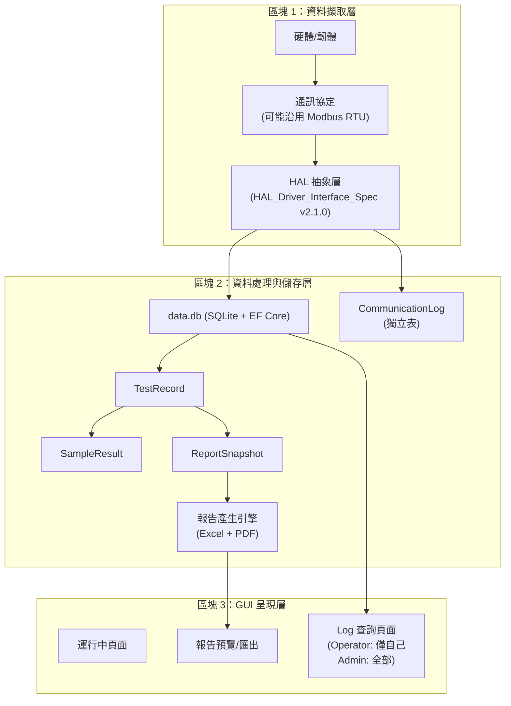

# TRIO2026 儀器報告系統 — 架構分析與實作規劃

> **本文件為迭代式文件**，隨討論深入逐次更新。
> 製作者: Office of William
> 最後更新: 2026-06-11 v3

---

## 一、舊系統（一代機）完整分析

### 1.1 資料結構

一代機每次檢測在 `trio_data/` 下產生一個以時間戳命名的資料夾：

```
trio_data/
├── 20260317_135504_log/
│   ├── runinfo.ini         ← 運行設定 + 最終結果（~3KB）
│   ├── processinfo.ini     ← 硬體過程 log, Modbus 封包（~548KB）
│   └── processinfo.xlsx    ← 同上的解碼版（~285KB）
└── 20260507_142025_log/
    ├── runinfo.ini          ← 較簡單的運行
    ├── processinfo.ini
    └── processinfo.xlsx
```

> [!WARNING]
> **舊系統問題**：
> 1. 無資安保護：INI 為明文，任何人可修改/刪除
> 2. 無稽核追蹤：不知道誰執行、何時修改
> 3. 無資料完整性：可被竄改而不留痕跡
> 4. 個資暴露：Sample ID 等可能含受測者資訊
> 5. 無集中管理：散落資料夾不利查詢

### 1.2 runinfo.ini 完整欄位映射

#### [RunInfo] — 運行主設定

| INI 欄位 | 含義 | 二代機 Entity | 狀態 |
|----------|------|-------------|------|
| `mode` | 1=IntelliPlex, 2=Custom | `TestRecord.ReportType` | ✅ |
| `flow` | 流程名稱 | `TestRecord.FlowName` | ✅ |
| `StartTime`/`StopTime` | 運行時間 | `TestRecord.StartTime/EndTime` | ✅ |
| `Sample_NUM` | 樣本數 | `TestRecord.SampleCount` | ✅ |
| `trio_PLCoding` | 產品代碼 | `TestRecord.ProductCode` | ✅ |
| `trio_Lot_NO` | 批號 | `TestRecord.ExtractionKitLotNo` | ✅ |
| `nucleicacid_total` | 核酸總輸入量 | `TestRecord.PcrTotalNucleicAcidInput` | ✅ |
| `mastermixvol`/`pcrsampvol` | PCR 體積 | `TestRecord.CustomPcrSetupJson` | ✅ |
| `PCRPLID` | PCR 板 ID | `TestRecord.PcrPlateId` | ✅ |
| `extracttiro`/`Quantification`/`Dilution`/`PCRconfect` | 功能模組 | `TestRecord.FunctionModulesSelected` | ✅ |
| `Reagent_Num` | 試劑組數 | 🔲 需確認 | |
| `Reag0`/`Reag1` | 試劑 QR Code（複雜字串） | 🔲 待二代機規格 | |
| `OPT_Smpvol` | 光學檢測體積（預設 2μL） | 🔲 待確認 | |
| `Sample` | 樣本位圖（hex） | 🔲 待確認 | |

#### [DATA] — 原始量測數據（✅ 已從原始碼完全解碼）

| 陣列 | 含義 | 每值處理 |
|------|------|---------|
| `arg0[0..23]` | 各孔原始螢光 A/D 值 | raw uint16 |
| `arg0[30]` | S1 標準品 A/D 值 | 直接用 |
| `arg0[31]` | S2 標準品 A/D 值 | 直接用 |
| `arg2[0..23]` | 各孔濃度 × 100 | ÷100 = ng/μL |
| `arg3[0..23]` | 第一次取樣體積 × 100 | ÷100 = μL |
| `arg5[0..23]` | 第二次取樣體積 × 100 | ÷100 × Kit數 = μL |

#### [Result] — 計算邏輯（✅ 已從原始碼驗證）

```
Concentration = arg2[i] / 100.0

Utilized Eluted Sample:
  if (arg3[i]/100 > 0): Utilized = arg3[i]/100 + OPT_Smpvol
  else:                  Utilized = arg5[i]/100 × Kit數 + OPT_Smpvol

Concentration Range Check (Excel output):
  max_t = 100 / OPT_Smpvol   → "> 50.00"
  min_t = 2 / OPT_Smpvol     → "< 1.00" or "N/A"

PCR Total Nucleic Acid Input = Reag0[6][1] × (Reag0[5] - Reag0[7][1])
```

### 1.3 processinfo — 硬體過程 Log（✅ 完整 Register Map 已解碼）

128-byte Modbus RTU 回應封包，42 個欄位：

| Byte Offset | Excel 欄位 | 含義 | 格式 |
|-------------|-----------|------|------|
| 2 | 初始化 | 初始化狀態 | uint8 |
| 3 | 運行狀態 | 機器運行狀態 | uint8 |
| 4-5 | 運行步數 | 當前步驟 | uint16 BE |
| 6-7 | 總步數 | 流程總步數 | uint16 BE |
| 8-14 | 50100~50106 | 配置暫存器 | uint8×7 |
| 16 | 開關輸出 | I/O 輸出位元 | binary 8-bit |
| 17 | 檢測輸入 | I/O 輸入位元 | binary 8-bit |
| 20 | 當前段 | 流程段號 | uint8 |
| 22-23 | 總運行時間 | 秒數 | uint16 BE |
| 24-25 | 溫度1 | 萃取區溫度 | uint16/100 °C |
| 26-27 | 溫度2 | 試劑座溫度 | uint16/100 °C |
| 40-41 | UV 剩餘時間 | 秒數 | uint16 BE |
| 42-43 | 壓力值 | 液壓感測 | uint16 |
| 44-45 | 液位高度 | 液面偵測 | uint16/100 |
| 46-47 | 移入孔位 | 當前孔位索引 | uint16 |
| 48 | 工程步驟 | 步驟碼 | uint8 |
| 50-51 | 電機運行狀態 | 各軸狀態位元 | binary 16-bit |
| 52-55 | 移液臂狀態 | 複合狀態 | uint32 hex |
| 56 | 攝像頭到位 | 是否到位 | uint8 |
| 57 | 一維碼狀態 | barcode 狀態 | uint8 |
| 58-59 | 攝像頭識別進度 | 進度碼 | uint16 hex |
| 60-83 | 當前流程內容 | 流程+參數 | 複合格式 |
| 92-93 | 翻蓋電機 | 位置/10 | uint16/10 |
| 94-95 | px | X 軸位置/10 | uint16/10 |
| 96-97 | y0 | Y0 軸位置/10 | uint16/10 |
| 98-99 | y1 | Y1 軸位置/10 | uint16/10 |
| 100-101 | z0 | Z0 軸位置/10 | uint16/10 |
| 102-103 | pst | 活塞位置/10 | uint16/10 |
| 104-105 | py | PY 軸位置/10 | uint16/10 |
| 120-123 | 主故障碼 | 錯誤碼 | uint32 hex |
| 124-127 | 輔故障碼 | 輔助錯誤碼 | uint32 hex |

### 1.4 應用程式 Log（`log/*.txt`）

一代機 log 三類訊息：UI 操作、Modbus 通訊（TX/RX）、系統事件。
- 通訊確認為 **Modbus RTU**（FC03/FC06, Slave ID=01）
- 輪詢週期 ~1秒，單次實驗 log 可達 30MB~296MB
- 一代機使用 **Qt/C++**

### 1.5 Excel 報告（✅ 兩種格式已完全解碼）

- **IntelliPlex Report**（mode=1）：14 列 metadata + 24 樣本 + NC/PC，7 欄
- **Custom Program Report**（mode=2）：含 Function Modules、Rxn1~4，9 欄，Ctrl1/Ctrl2

> [!NOTE]
> Excel 生成邏輯確認：`[Result]` → Excel 為 **1:1 直接搬運**，濃度加上範圍檢查（`> max_t` 或 `< min_t`）。

---

## 二、二代機架構方向

### 2.1 三大區塊概覽



### 2.2 資安與個資設計原則

| 需求 | 做法 |
|------|------|
| **資料保護** | 所有資料存入 SQLite DB，不再使用 INI 明文 |
| **個資保護** | SampleId 等受測者資訊需加密或權限隔離 |
| **稽核追蹤** | 每筆 TestRecord 綁定 OperatorUserId + 時間戳 |
| **權限分級** | Operator 僅查閱/下載自己的 log/report；Admin 可查全部 |
| **資料完整性** | DB 層 FK + CASCADE；考慮 HMAC 簽章防竄改 |
| **設備識別** | 每筆 TestRecord 攜帶 `installation_uuid`（已完成） |
| **匯出安全** | USB 匯出需授權 |

### 2.3 HAL 層整合

已取得 **HAL_Driver_Interface_Spec v2.1.0**（軟體層出發的規格，與韌體團隊討論中）。關鍵觀察：

- 所有 HAL 指令為**同步 blocking call**
- 提供三類事件回報：`OnError`、`OnStatusChange`、`OnStatusTimer`（建議 500ms 間隔）
- `OnStatusTimer` 事件是未來 `CommunicationLog` 的最佳資料來源
- 運動控制 9 軸（ExPst, ExZ, ExHolderY, ExMagY, PiPst, PiZ, PiX, PiY, OpR）
- 液體處理指令含完整的 Aspirate/Dispense/Mix/Transfer
- 溫控與感測器完整定義
- 光學讀取結果有結構化回傳 `OpticalReadResult`（含 Concentrations Dict + R²）

---

## 三、已解決與待確認事項

### ✅ 已解決

| # | 問題 | 結論 |
|---|------|------|
| 1 | 通訊協定 | 可能沿用 Modbus RTU，但二代機尚無足夠資訊 |
| 2 | processinfo byte layout | ✅ 已從原始碼完整逆向解碼 42 欄位 Register Map |
| 3 | processinfo.xlsx | ✅ 是人可讀的解碼版，設備工程師用於問題分析 |
| 4 | HAL 介面規格 | ✅ 已取得 v2.1.0，與韌體團隊討論中 |
| 5 | 報告模板 | ✅ IntelliPlex + Custom 兩種格式已完整分析 |
| 8 | Log 查詢 | Operator 僅看自己的、Admin 看全部。具體 UI 待螢幕規格確定 |
| 9 | 報告匯出格式 | Excel + PDF（未來） |
| 11 | 硬體 Log 存 DB | ✅ 確認需要存，待韌體團隊提供新格式 |
| 12 | processinfo GUI 呈現 | 僅供工程團隊事後分析，需有配套分析工具/報表 |
| 13 | CommunicationLog 獨立表 | ✅ 需要 |
| 14 | Log 匯出方式 | DB 檔 + 特定區間 CSV/JSON 都需要，待規格確定 |

### 🔲 待確認（非阻塞，可後續提供）

| # | 問題 | 狀態 |
|---|------|------|
| 6 | Reag0/Reag1 字串格式 | 參考 A09-023 軟體設計規格書 p.35，二代機規格未定 |
| 7 | CAM_AREA | 96孔盤光學偵測結果，hex→binary 01 值，二代機可能變動 |
| 10 | LIS 整合 | 尚無具體規格 |

---

## 四、Entity 覆蓋率評估

| 資料源 | Entity 對應 | 覆蓋率 |
|--------|------------|--------|
| runinfo.ini → **TestRecord** | 運行設定、Kit 資訊、時間 | ✅ ~85% |
| runinfo.ini [Result] → **SampleResult** | 濃度、孔位、SampleId | ✅ ~90% |
| Excel 報告 → **ReportSnapshot** | 報表快照 + 產生引擎 | ✅ 已設計 |
| processinfo → **CommunicationLog** | 硬體過程 Log（42 欄位） | 🔲 需新設計 |
| app log → **SystemEvent** | UI 操作紀錄 | ✅ 已有 |
| runinfo [RunTime] | 各階段耗時 | 🔲 需新增 |
| runinfo [Consumable] | 耗材追蹤 | 🔲 需新增 |

**結論**：報告核心欄位覆蓋率約 **85%**。主要缺口為 `CommunicationLog`（獨立表）及耗材追蹤，需待二代機 HAL/韌體規格確認後細化。

---

## 五、下一步工作方向

### 5.1 可立即進行（不依賴韌體規格）

1. **報告產生引擎** — 從 DB 讀取 TestRecord + SampleResult 生成 Excel（沿用一代機格式）
2. **PDF 報告支援** — 擴充報告引擎支援 PDF 輸出
3. **RunTime / Consumable 欄位** — 擴充 TestRecord 或新增獨立表
4. **Log 匯出基礎架構** — DB 匯出 + 區間 CSV/JSON 匯出框架

### 5.2 需等待規格（韌體/硬體相關）

1. **CommunicationLog 表設計** — 待韌體團隊確認新的通訊格式
2. **HAL 事件整合** — 待 HAL spec 與韌體團隊確認完畢
3. **CAM_AREA 新格式** — 待二代機光學模組規格
4. **processinfo 分析工具** — 可基於已解碼的 Register Map 先做一代機版本

---

*此文件將隨討論進展持續更新。*
