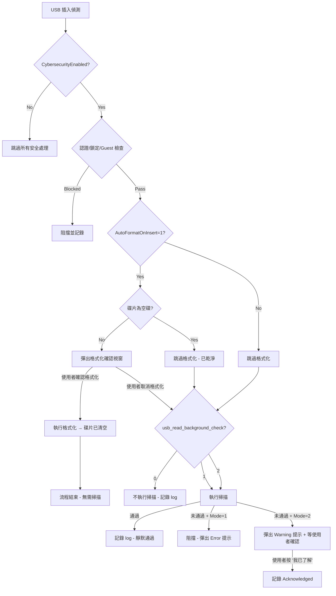

# USB 讀取背景檢查（usb_read_background_check）策略重構

**分析者 / 製作者：Office of William**

## 背景

`usb_read_background_check` 的定位是：**當 GUI 需要從 USB 讀取內容時（如軟體版本更新、韌體匯入等操作場景），在背景執行檔案安全掃描**。此機制的目的是防止操作人員不慎將帶有惡意執行檔的隨身碟插入儀器。

**不適用的場景**：Data Detail Page 的「下載/匯出」流程是系統**寫入**至 USB，而非從 USB 讀取資料，因此無需此檢查。

## 設定值重新定義

```
usb_read_background_check（int）
├── 0 = 不執行檢查（完全關閉）
├── 1 = 是，檢查非法格式檔案 → 發現威脅時阻擋後續使用
└── 2 = 是，僅跳出提示訊息 → 由使用者點選按鈕確認有收到檢查提醒
```

## 觸發時機與流程順序

> [!IMPORTANT]
> **核心設計邏輯**：USB 實體插入 → 先執行 Format Check（非空碟詢問是否格式化）→ 使用者選擇「取消格式化」後 → 才依照 SystemSetting 中的 `usb_read_background_check` 值執行背景掃描。
>
> **理由**：如果使用者選擇了格式化，碟片內容已被清除，不存在需要掃描的風險檔案；只有在使用者選擇保留碟片原有內容（取消格式化）時，才需要掃描碟片中是否有危險檔案。

### ProcessQueueAsync 完整流程



> [!NOTE]
> 已格式化成功的碟（路徑 I）**直接結束**，不再進入 Read Background Check — 因為碟片內容已被清除，掃描無意義。

---

## Proposed Changes

### SystemSettingService

#### [MODIFY] [SystemSettingService.cs](file:///d:/TRIO2026/src/TRIO2026.App/Services/SystemSettingService.cs)

- 將 `UsbReadBackgroundCheck` 屬性從 `bool` 改為 `int`（0/1/2）。

```diff
-    /// <summary>GUI 讀取隨身碟時背景檢查非法格式檔案（預留）</summary>
-    public bool UsbReadBackgroundCheck
-        => GetLiveString("UsbSecurity", "usb_read_background_check", "0") == "1";
+    /// <summary>GUI 讀取隨身碟時背景檢查非法格式檔案（0=否, 1=是並阻擋, 2=是僅提示）</summary>
+    public int UsbReadBackgroundCheck
+        => int.TryParse(GetLiveString("UsbSecurity", "usb_read_background_check", "0"), out var v) ? v : 0;
```

---

### SystemSettingSeed

#### [MODIFY] [SystemSettingSeed.cs](file:///d:/TRIO2026/src/TRIO2026.Data/Seeding/SystemSettingSeed.cs)

- 更新 Id=48 的 Description 與 Remark。

```diff
-    Description = "GUI 讀取隨身碟時，背景檢查是否有非法格式檔案（0=否, 1=是）",
-    Remark = "✅ 設定已預留 — 供後續 GUI 讀取模組介接"
+    Description = "GUI 讀取隨身碟時，背景檢查是否有非法格式檔案（0=否, 1=是並阻擋後續使用, 2=是僅跳出提示訊息由使用者確認）",
+    Remark = "✅ 已實作 — USB 插入時依此值決定掃描模式，於 UsbSecurityService.ProcessQueueAsync 觸發"
```

---

### ErrorCodes

#### [MODIFY] [ErrorCodes.cs](file:///d:/TRIO2026/src/TRIO2026.Core/ErrorCodes.cs)

新增以下代碼（4025 ~ 4028）：

| 代碼 | 常數名稱 | Level | 用途 |
|------|----------|-------|------|
| INF-4025 | `UsbReadCheckStarted` | Info | 背景讀取檢查開始（記錄檢查模式 1/2） |
| INF-4026 | `UsbReadCheckPassed` | Info | 背景讀取檢查通過（無威脅） |
| WRN-4027 | `UsbReadCheckBlocked` | Warning | 模式 1：偵測到威脅 → 阻擋使用 |
| INF-4028 | `UsbReadCheckUserAcknowledged` | Info | 模式 2：使用者已確認收到安全提醒 |

---

### IUsbSecurityService

#### [MODIFY] [IUsbSecurityService.cs](file:///d:/TRIO2026/src/TRIO2026.App/Services/IUsbSecurityService.cs)

新增：
- `event EventHandler<(UsbDeviceInfo Info, int Mode, bool HasThreat)> ReadCheckCompleted` — 供 AppShell 訂閱以決定是否彈窗
- `Task ReportReadCheckAcknowledgedAsync(UsbDeviceInfo info)` — 供 UI 在模式 2 回報使用者已確認

---

### UsbSecurityService

#### [MODIFY] [UsbSecurityService.cs](file:///d:/TRIO2026/src/TRIO2026.App/Services/UsbSecurityService.cs)

**ProcessQueueAsync 調整流程**：

在 Auto Format 段落之後，新增 Read Background Check 段落：

```csharp
// ── Read Background Check ──
// 僅在「未執行格式化」（使用者取消 或 AutoFormat=0 或 空碟跳過）時才掃描
// 已格式化成功 → 碟片內容已清除，不需掃描
if (!formatExecuted)
{
    int readCheckMode = _settings.UsbReadBackgroundCheck;
    if (readCheckMode > 0 && _settings.UsbCybersecurityEnabled)
    {
        // INF-4025: 記錄掃描開始
        var scanPassed = await ScanDeviceContentAsync(info);
        
        if (scanPassed)
        {
            // INF-4026: 掃描通過
            ReadCheckCompleted?.Invoke(this, (info, readCheckMode, false));
        }
        else
        {
            if (readCheckMode == 1)
            {
                // WRN-4027: 模式1 — 阻擋
                ReadCheckCompleted?.Invoke(this, (info, readCheckMode, true));
            }
            else // readCheckMode == 2
            {
                // WRN-4027: 模式2 — 等待使用者確認
                _currentReadCheckTcs = new TaskCompletionSource<bool>();
                ReadCheckCompleted?.Invoke(this, (info, readCheckMode, true));
                await _currentReadCheckTcs.Task;
                // INF-4028: 使用者已確認（由 ReportReadCheckAcknowledgedAsync 觸發）
            }
        }
    }
}
```

需追蹤的新欄位：
- `bool formatExecuted` — 在 Auto Format 段落中，格式化成功時設為 `true`
- `TaskCompletionSource<bool>? _currentReadCheckTcs` — 模式 2 等待使用者確認

---

### AppShell

#### [MODIFY] [AppShell.xaml.cs](file:///d:/TRIO2026/src/TRIO2026.App/Views/AppShell.xaml.cs)

訂閱 `ReadCheckCompleted` 事件：

```csharp
usbSecurityService.ReadCheckCompleted += (s, args) =>
{
    Dispatcher.Invoke(async () =>
    {
        var (info, mode, hasThreat) = args;
        if (!hasThreat) return;  // 通過 → 不彈窗

        if (mode == 1)
        {
            // 阻擋模式：顯示 Error 提示（僅「確定」按鈕）
            await _dialogOverlay.ShowAsync(
                loc["UsbSecurity.ReadCheckBlocked.Title"],
                loc["UsbSecurity.ReadCheckBlocked"],
                loc["Common.OK"],
                OverlayDialogIcon.Error);
        }
        else if (mode == 2)
        {
            // 提示模式：顯示 Warning + 「我已了解」按鈕
            await _dialogOverlay.ShowAsync(
                loc["UsbSecurity.ReadCheckWarning.Title"],
                loc["UsbSecurity.ReadCheckWarning"],
                loc["UsbSecurity.ReadCheckAcknowledged"],
                OverlayDialogIcon.Warning);
            // 按下後回報
            usbSecurityService.ReportReadCheckAcknowledgedAsync(info);
        }
    });
};
```

---

### DataListPage / DataDetailPage

#### [MODIFY] [DataListPage.xaml.cs](file:///d:/TRIO2026/src/TRIO2026.App/Views/Pages/DataListPage.xaml.cs)

- **移除** Step 3「Cybersecurity 讀取背景掃描」整段邏輯（第 1192~1217 行）。
- 重新編號後續步驟（原 Step 4 格式化判斷 → Step 3）。

#### [MODIFY] [DataDetailPage.xaml.cs](file:///d:/TRIO2026/src/TRIO2026.App/Views/Pages/DataDetailPage.xaml.cs)

- **移除** Step 2「Cybersecurity 讀取背景掃描」整段邏輯（第 415~435 行）。
- 重新編號後續步驟（原 Step 3 格式化判斷 → Step 2）。

---

### LocalizedStringSeed

#### [MODIFY] [LocalizedStringSeed.cs](file:///d:/TRIO2026/src/TRIO2026.Data/Seeding/LocalizedStringSeed.cs)

新增翻譯字串：

| Key | EN | 繁中 |
|-----|----|----|
| `UsbSecurity.ReadCheckBlocked.Title` | Security Alert | 安全性警告 |
| `UsbSecurity.ReadCheckBlocked` | This USB drive contains potentially dangerous files. Access has been blocked for security reasons. | 此 USB 隨身碟包含潛在危險檔案，基於安全考量已阻擋後續操作。 |
| `UsbSecurity.ReadCheckWarning.Title` | Security Notice | 安全性提醒 |
| `UsbSecurity.ReadCheckWarning` | This USB drive contains files that may pose a security risk. Please confirm you have been notified of this warning. | 此 USB 隨身碟可能包含有安全風險的檔案，請確認已收到此安全提醒。 |
| `UsbSecurity.ReadCheckAcknowledged` | I Understand | 我已了解 |

可移除既有但不再使用的：
- `Data.UsbReadBlocked`（原本在 DataListPage/DataDetailPage 使用，已移除）

---

## 完整日誌埋點表

### USB 插入 → Read Background Check 鏈條

| 步驟 | ErrorCode | Level | 日誌摘要 | 詳細記錄內容 |
|------|-----------|-------|----------|-------------|
| ① 插入偵測 | INF-4010 | Info | USB Device Inserted | DeviceInfo, CybersecurityEnabled, AutoFormat, User |
| ② Format 提示彈出 | INF-4020 | Info | USB Format Prompt Shown | DeviceInfo, WaitingUserResponse |
| ③a 使用者確認格式化 | INF-4021 | Info | USB Format User Confirmed | DeviceInfo, TargetFS=exFAT |
| ③b 使用者取消格式化 | INF-4013 | Info | USB Format Cancelled | DeviceInfo, Decision=Cancelled |
| ④ 掃描開始 | INF-4025 | Info | USB Read Check Started | DeviceInfo, Mode=1\|2, User |
| ⑤a 掃描通過 | INF-4026 | Info | USB Read Check Passed | DeviceInfo, Mode, FileCount, User |
| ⑤b 模式1 威脅偵測 | WRN-4027 | Warning | USB Read Check Blocked | DeviceInfo, Mode=1, ThreatFiles, Action=Blocked |
| ⑤c 模式2 威脅偵測 | WRN-4027 | Warning | USB Read Check Threat Found | DeviceInfo, Mode=2, ThreatFiles, Action=WaitingAck |
| ⑥ 使用者確認收到提醒 | INF-4028 | Info | USB Read Check Acknowledged | DeviceInfo, Mode=2, User, AckTimestamp |

### 排查範例

> **場景：操作員插入含 .exe 的隨身碟，設定為 Mode=2**
> 
> ```
> 14:50:01 INF-4010 USB Device Inserted | Drive=F:, Serial=xxx, User=operator1
> 14:50:01 INF-4020 USB Format Prompt Shown | Drive=F:, WaitingUserResponse
> 14:50:05 INF-4013 USB Format Cancelled | Drive=F:, Decision=Cancelled
> 14:50:05 INF-4025 USB Read Check Started | Drive=F:, Mode=2, User=operator1
> 14:50:06 WRN-4016 USB Threat Detected | File=malware.exe, Ext=.exe, Verdict=Blocked
> 14:50:06 WRN-4027 USB Read Check Threat Found | Mode=2, Action=WaitingAck
> 14:50:12 INF-4028 USB Read Check Acknowledged | Mode=2, User=operator1
> ```
> 
> 從此鏈條可完整判斷：使用者選擇不格式化 → 系統掃描發現 .exe → 已彈出提醒 → 使用者 6 秒後確認收到提醒。

---

## Verification Plan

### Automated Tests
1. `dotnet build` 確認 0 錯誤

### Manual Verification（模擬器測試矩陣）

| # | AutoFormat | ReadCheck | 碟片狀態 | 使用者操作 | 預期行為 |
|---|------------|-----------|----------|-----------|----------|
| 1 | 0 | 0 | 有檔案 | — | 無彈窗、無掃描 |
| 2 | 1 | 0 | 有 .exe | 取消格式化 | 格式化彈窗 → 取消 → 無掃描 |
| 3 | 1 | 1 | 有 .exe | 取消格式化 | 格式化彈窗 → 取消 → 掃描 → 阻擋警告 |
| 4 | 1 | 2 | 有 .exe | 取消格式化 → 我已了解 | 格式化彈窗 → 取消 → 掃描 → 提示 → 確認 |
| 5 | 1 | 1 | 有 .exe | 確認格式化 | 格式化成功 → **不掃描** |
| 6 | 1 | 1 | 空碟 | — | 空碟跳過格式化 → 掃描（空碟必通過） |
| 7 | — | — | — | — | DataListPage/DataDetailPage 下載流程不再有 read check |
