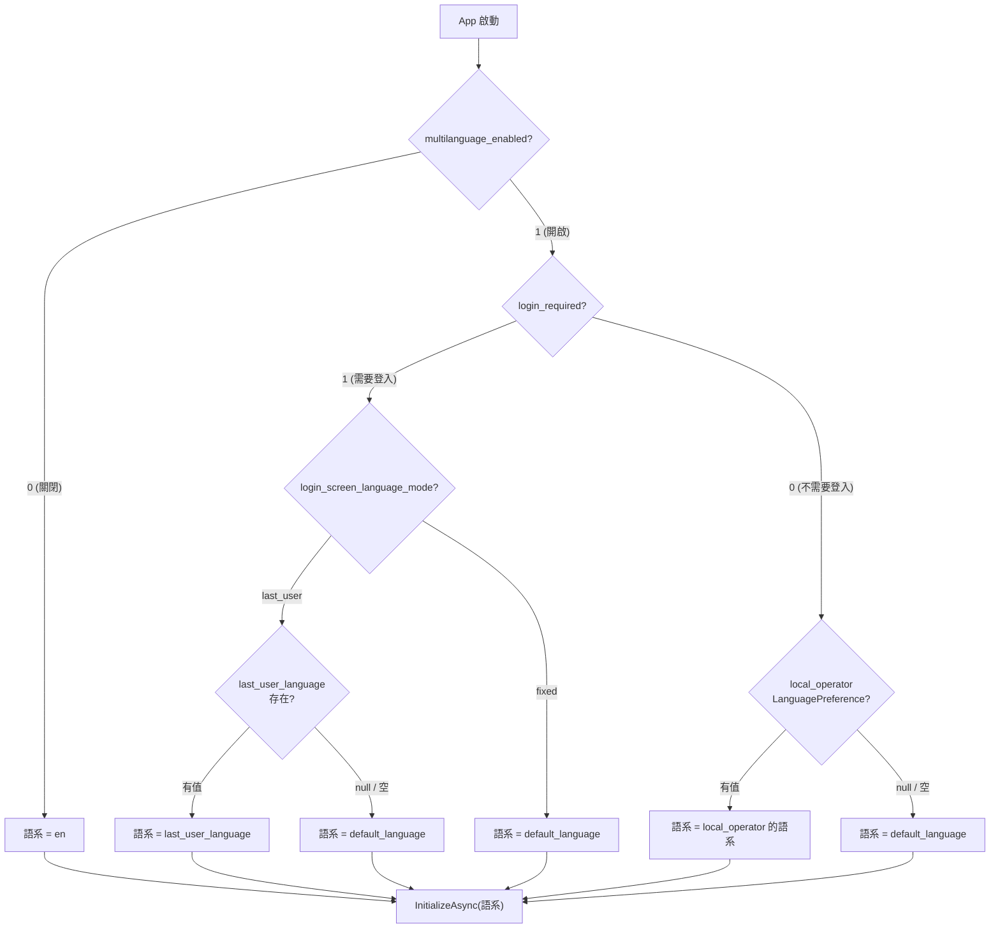
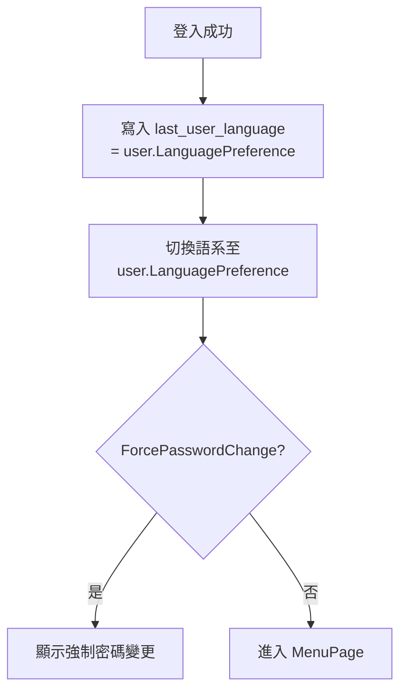
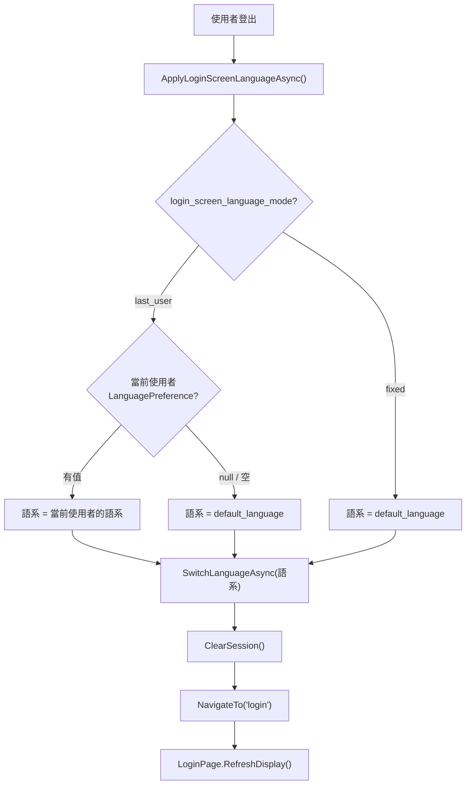

# TRIO2026 登入頁語系判斷流程

> 製作者：Office of William

## DB 設定一覽

| DB | Table | Category | Key | 說明 | 預設值 |
|----|-------|----------|-----|------|--------|
| system_config.db | SystemSetting | System | `multilanguage_enabled` | 多語系總開關 | `1` |
| system_config.db | SystemSetting | System | `default_language` | 系統預設語系 | `en` |
| system_config.db | SystemSetting | System | `login_screen_language_mode` | 登入頁語系模式 | `last_user` |
| system_config.db | SystemSetting | System | `last_user_language` | 最後登入使用者的語系 | *(動態寫入)* |
| system_config.db | SystemSetting | Auth | `login_required` | 是否需要登入 | `0` |
| main.db | User | — | `LanguagePreference` | 各使用者的語系偏好 | *(per user)* |

---

## 場景一：App 啟動

**實作位置**：[App.xaml.cs](file:///d:/TRIO2026/src/TRIO2026.App/App.xaml.cs#L135-L159)

---

## 場景二：使用者登入成功

**寫入時機**（兩處）：

| 時機 | 實作位置 |
|------|----------|
| 登入成功 | [AppShell.OnLoginSucceeded](file:///d:/TRIO2026/src/TRIO2026.App/Views/AppShell.xaml.cs#L207-L208) |
| 使用中切換語系 | [UserMenuControl.OnLangSelected](file:///d:/TRIO2026/src/TRIO2026.App/Controls/UserMenuControl.xaml.cs#L406-L409) |

---

## 場景三：登出回到登入頁

> [!IMPORTANT]
> `ApplyLoginScreenLanguageAsync()` **必須在 `ClearSession()` 之前**呼叫，否則無法取得當前使用者的語系偏好。

**實作位置**：[AppShell.ApplyLoginScreenLanguageAsync](file:///d:/TRIO2026/src/TRIO2026.App/Views/AppShell.xaml.cs#L321-L343)

**呼叫點**（共 4 處）：

| 場景 | 位置 |
|------|------|
| UserMenu → 僅登出 | [UserMenuControl L449](file:///d:/TRIO2026/src/TRIO2026.App/Controls/UserMenuControl.xaml.cs#L449) |
| UserMenu → 一般登出 | [UserMenuControl L472](file:///d:/TRIO2026/src/TRIO2026.App/Controls/UserMenuControl.xaml.cs#L472) |
| 強制密碼變更完成後 | [AppShell L228](file:///d:/TRIO2026/src/TRIO2026.App/Views/AppShell.xaml.cs#L228) |
| 強制密碼變更取消後 | [AppShell L236](file:///d:/TRIO2026/src/TRIO2026.App/Views/AppShell.xaml.cs#L236) |

---

## LoginPage 多語系刷新

LoginPage 是快取實例（`_loginPage ??= CreateLoginPage()`），不會每次重建。

語系文字由 `RefreshDisplay()` → `ApplyLocalization()` 動態填入：

| UI 元素 | i18n Key | en | zh-TW |
|---------|----------|-----|-------|
| 帳號標籤 | `Login.Username` | Username | 帳號 |
| 密碼標籤 | `Login.Password` | Password | 密碼 |
| 記住密碼 | `Login.RememberPassword` | Remember Password | 記住密碼 |
| 登入按鈕 | `Login.Submit` | Login | 登　入 |
| 關閉提示 | `Login.Close` | Close Application | 關閉應用程式 |
| 帳密錯誤 | `Login.InvalidCredentials` | Invalid username or password. | 帳號或密碼錯誤。 |
| 帳號停用 | `Login.AccountDisabled` | This account has been disabled... | 此帳號已停用... |
| 帳號鎖定 | `Login.AccountLocked` | Account is locked... | 帳號已鎖定... |
| 系統錯誤 | `Login.SystemError` | System error | 系統錯誤 |

**實作位置**：[LoginPage.ApplyLocalization](file:///d:/TRIO2026/src/TRIO2026.App/Views/Pages/LoginPage.xaml.cs#L88-L95)

---

## 模式比較表

| 設定 | `last_user` 模式 | `fixed` 模式 |
|------|:---:|:---:|
| App 啟動 | 讀取 `last_user_language` → fallback `default_language` | 固定 `default_language` |
| 登出回到登入頁 | 保持當前使用者的語系 | 切回 `default_language` |
| 跨重啟記憶 | ✅ 透過 DB 持久化 `last_user_language` | ❌ 永遠固定 |
| 適用場景 | 多人輪班、各有語系偏好 | 統一語系環境 |
