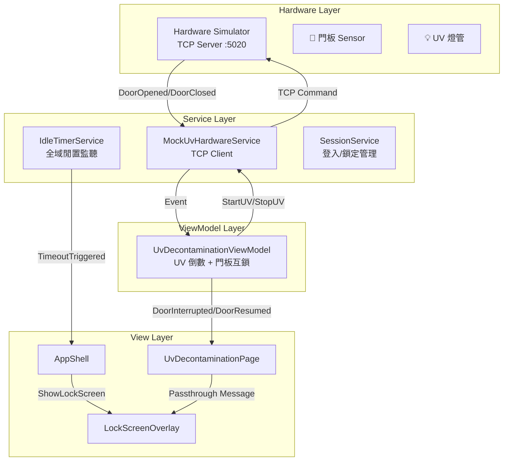
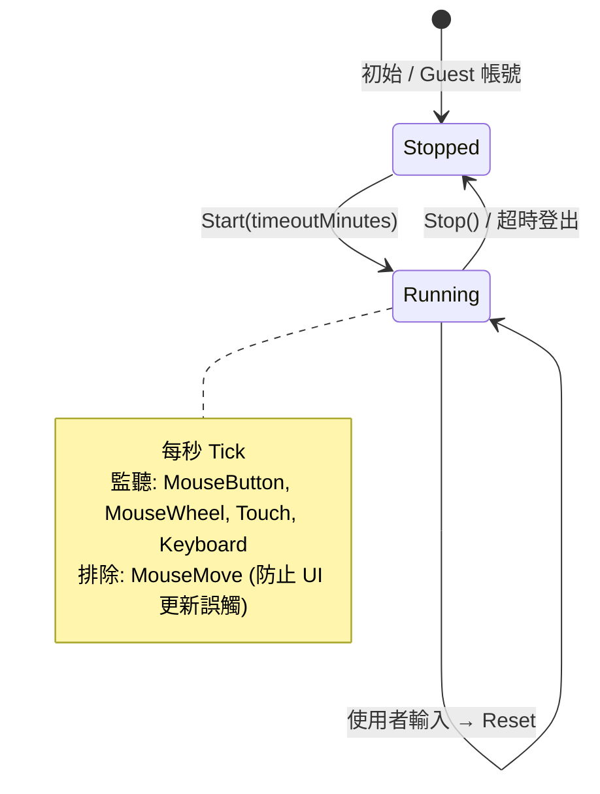
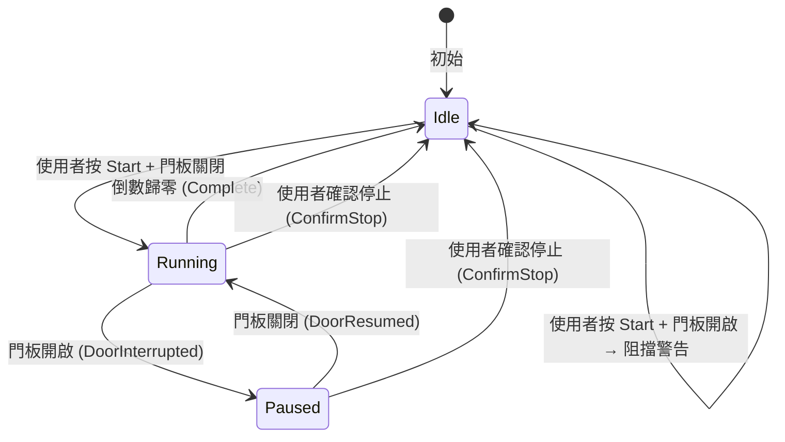
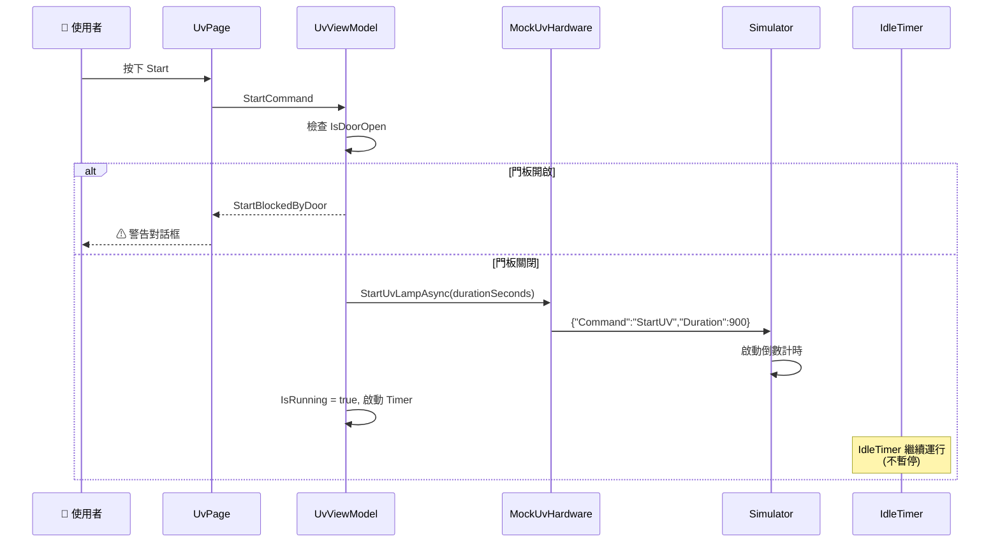
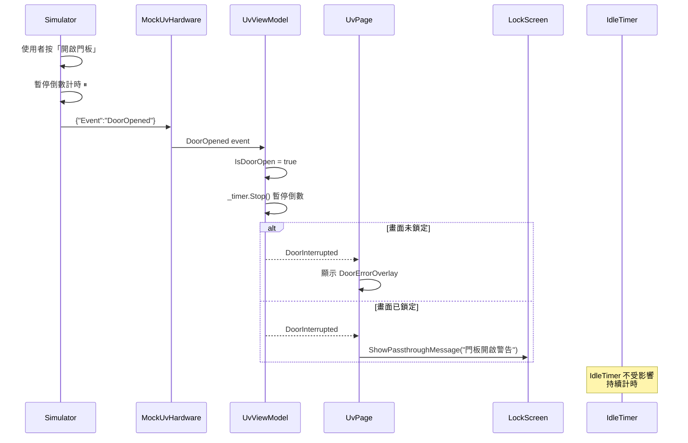
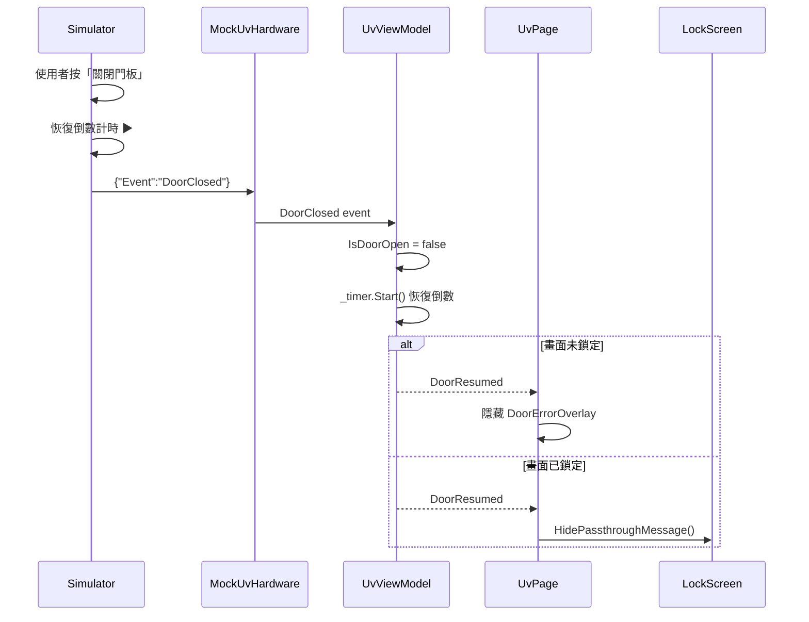
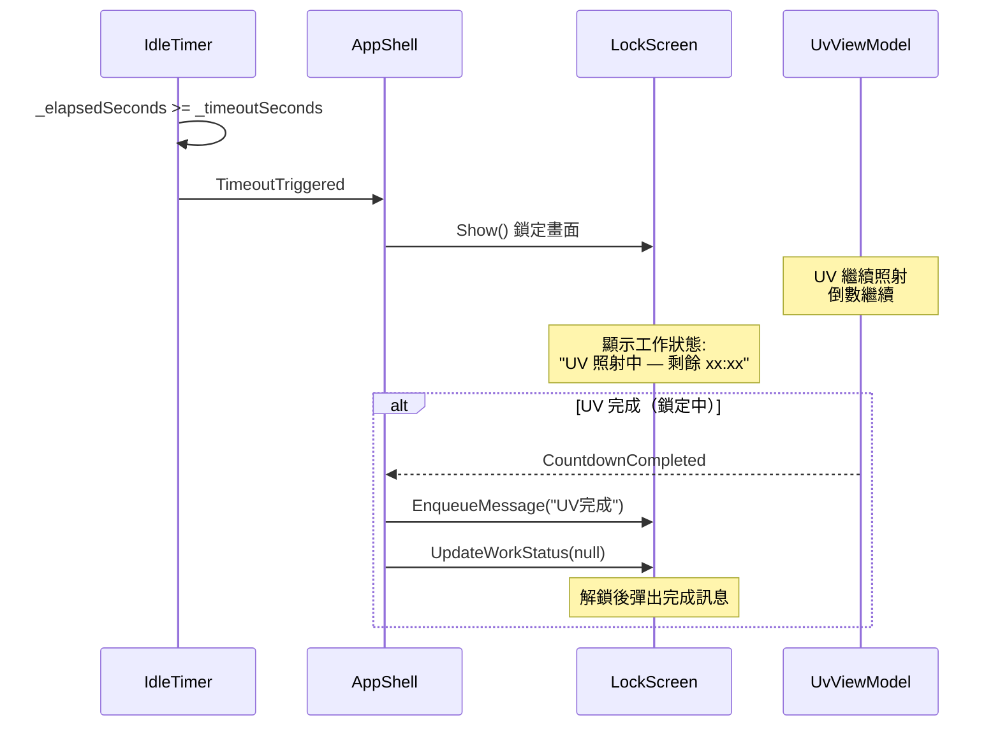

# Session Timeout × UV 照射 × 門板 × IdleTimer 邏輯關係

> 製作者：Office of William | 更新日期：2026-06-02

---

## 一、系統架構總覽

---

## 二、核心狀態機

### 2.1 IdleTimer 狀態

> [!IMPORTANT]
> **UV 執行中不暫停 IdleTimer** — 安全考量：防止使用者離開後被未授權人員接管操作。

### 2.2 UV 照射狀態

---

## 三、事件流程圖

### 3.1 UV 啟動流程

### 3.2 門板開啟中斷流程

### 3.3 門板關閉恢復流程

### 3.4 Session Timeout 鎖定流程（UV 執行中）

---

## 四、三層同步對照表

### 4.1 UV 照射狀態同步

| 事件 | App ViewModel | App UI (Page) | Simulator |
|------|--------------|---------------|-----------|
| **啟動 UV** | `IsRunning=true`, `_timer.Start()` | 顯示倒數 UI | `🟣 照射中 — 剩餘 14:59` |
| **門板開啟** | `_timer.Stop()`, `DoorInterrupted` | 顯示 DoorErrorOverlay | `⏸ 暫停（門板開啟）— 剩餘 xx:xx` |
| **門板關閉** | `_timer.Start()`, `DoorResumed` | 隱藏 DoorErrorOverlay | `🟣 照射中 — 剩餘 xx:xx` |
| **倒數歸零** | `IsRunning=false`, `StopUvLampAsync()` | 顯示完成對話框 | `⚫ 關閉` |
| **手動停止** | `IsRunning=false`, `StopUvLampAsync()` | 隱藏倒數 UI | `⚫ 關閉` |

### 4.2 IdleTimer 在各情境下的行為

| 情境 | IdleTimer 狀態 | 說明 |
|------|---------------|------|
| 一般操作 | ▶ 運行中 | 使用者互動重置計時器 |
| UV 照射中（使用者不操作） | ▶ **繼續運行** | 超時仍會鎖定畫面 |
| UV 照射中 + 門板開啟 | ▶ 繼續運行 | 不受門板事件影響 |
| 畫面已鎖定 | ⏹ 已停止 | 鎖定後 Stop()，解鎖後重新 Start() |
| Guest 帳號 | ⏹ 不啟動 | Guest 不受 session timeout 限制 |

### 4.3 鎖定畫面穿透機制

| 情境 | 穿透行為 |
|------|---------|
| UV 照射中鎖定 | 鎖定畫面顯示工作狀態 `"UV 照射中"` |
| 鎖定中門板開啟 | `ShowPassthroughMessage()` 在鎖定畫面顯示警告 |
| 鎖定中門板關閉 | `HidePassthroughMessage()` 自動清除警告 |
| 鎖定中 UV 完成 | `EnqueueMessage()` 排隊，解鎖後彈出完成訊息 |

---

## 五、輸入事件過濾規則

[IdleTimerService.cs](file:///d:/TRIO2026/src/TRIO2026.App/Services/IdleTimerService.cs#L138-L162) `OnPreProcessInput`：

| 事件類型 | 是否重置計時器 | 說明 |
|---------|-------------|------|
| `MouseButtonEventArgs` | ✅ 重置 | 滑鼠點擊 |
| `MouseWheelEventArgs` | ✅ 重置 | 滑鼠滾輪 |
| `TouchEventArgs` | ✅ 重置 | 觸控操作 |
| `KeyEventArgs` | ✅ 重置 | 鍵盤輸入 |
| `MouseMoveEventArgs` | ❌ **排除** | UI 動畫/Binding 更新產生的內部事件 |
| 其他 `InputEventArgs` | ❌ 忽略 | Stylus 等非常見事件 |

> [!WARNING]
> `MouseMoveEventArgs` 被排除的原因：UV 倒數計時每秒更新 `RemainingSeconds` → WPF Binding → Layout 更新 → 內部產生 `MouseMove` 事件 → 導致計時器永遠被重置。

---

## 六、關鍵檔案參考

| 檔案 | 職責 |
|------|------|
| [IdleTimerService.cs](file:///d:/TRIO2026/src/TRIO2026.App/Services/IdleTimerService.cs) | 全域閒置計時器，監聽輸入事件 |
| [UvDecontaminationViewModel.cs](file:///d:/TRIO2026/src/TRIO2026.App/ViewModels/UvDecontaminationViewModel.cs) | UV 倒數邏輯 + 門板互鎖 |
| [UvDecontaminationPage.xaml.cs](file:///d:/TRIO2026/src/TRIO2026.App/Views/Pages/UvDecontaminationPage.xaml.cs) | UV 頁面 UI 事件 + 鎖定穿透 |
| [LockScreenOverlay.xaml.cs](file:///d:/TRIO2026/src/TRIO2026.App/Controls/LockScreenOverlay.xaml.cs) | 鎖定畫面 + 穿透訊息 + 工作狀態 |
| [MockUvHardwareService.cs](file:///d:/TRIO2026/src/TRIO2026.App/Services/MockUvHardwareService.cs) | TCP Client → Simulator 通訊 |
| [SimulatorWindow.xaml.cs](file:///d:/TRIO2026/tools/Simulator/SimulatorWindow.xaml.cs) | 硬體模擬器：門板/UV 狀態模擬 |
| [IUvHardwareService.cs](file:///d:/TRIO2026/src/TRIO2026.Core/Interfaces/IUvHardwareService.cs) | 硬體抽象介面 |
