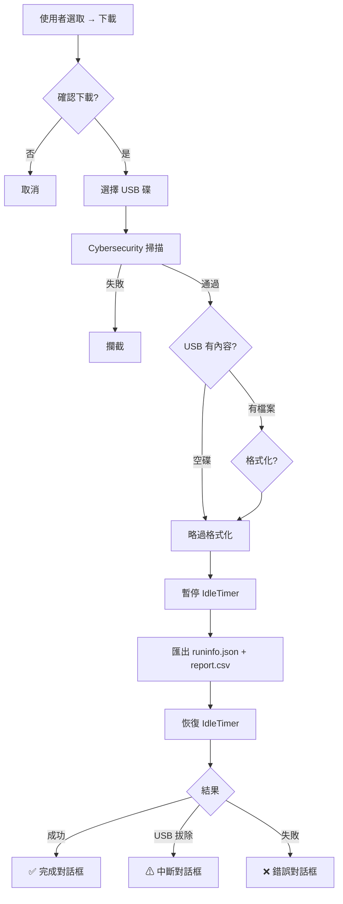

# Data Page 開發 Walkthrough

## 變更總覽

完成 TRIO2026 報表系統 Data 頁面的現代化開發，包含 6 個階段的所有核心功能。

---

## 新增檔案

| 檔案 | 用途 |
|------|------|
| `DataListPage.xaml` / `.cs` | 數據清單頁 — Card/Compact 版面、多選模式、權限篩選 |
| `DataDetailPage.xaml` / `.cs` | 詳情頁 — 摺疊式 Section（實驗設定/樣本結果/操作紀錄） |
| `UsbDriveSelector.xaml` / `.cs` | USB 多碟選擇器 Overlay |
| `DataExportService.cs` | 匯出引擎 — runinfo.json + report.csv |

## 修改檔案

| 檔案 | 變更 |
|------|------|
| `SystemSettingSeed.cs` | 新增 DataPage.data_list_layout (Id=51) |
| `SystemSettingService.cs` | 新增 DataListLayout / SetDataListLayout |
| `LocalizedStringSeed.cs` | 新增 38 組多語系 key × 4 語系 (152 筆) |
| `ErrorCodes.cs` | 新增 10xxx Data 系列 + 0xxx 通用代碼 |
| `AppShell.xaml` | 嵌入 UsbDriveSelectorHost |
| `AppShell.xaml.cs` | 註冊 data 路由 + 工廠 + UsbDriveSelector accessor + Admin 代理解鎖後續 |
| `MenuPage.xaml.cs` | Data 按鈕從 placeholder 改為實際導航 |

---

## 下載流程（7 步驟）

## Session Timeout 安全邏輯

| 狀態 | IdleTimer | 行為 |
|------|-----------|------|
| 清單瀏覽/篩選 | 正常運作 | lock → LockScreenOverlay |
| USB 選擇中 | 正常運作 | lock → ForceClose 選擇器 |
| 匯出寫檔中 | **暫停** | 寫完才恢復 |
| Admin 代理解鎖 | 重新啟動 | 關閉中途對話框、返回清單頁 |

## 驗證

- ✅ 全部編譯通過（0 錯誤）
- ✅ 所有 warning 均為非破壞性（CS0649 未使用欄位、CS4014 未 await）
